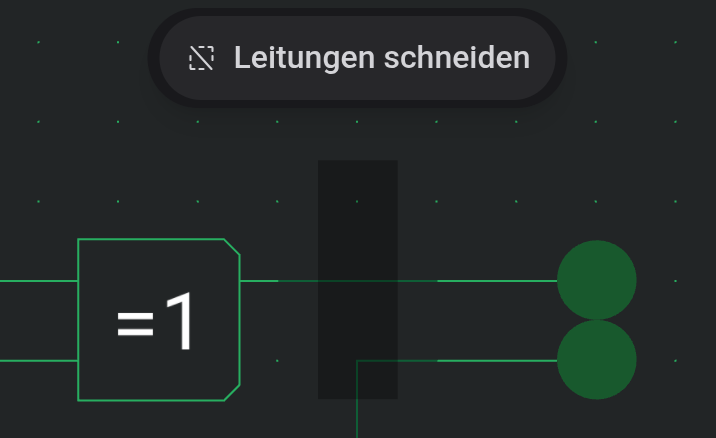

# Arbeitsfläche und Werkzeuge

Die Arbeitsfläche ist das Raster, auf dem du baust. Komponenten und Leitungen rasten darauf ein, und die Statusleiste unten zeigt die Rasterposition unter dem Cursor.

## Bewegen

Das Mausrad zoomt an der Zeigerposition, ebenso ein Wischen mit zwei Fingern oder Aufziehen auf dem Trackpad. Die Zoom-Schaltflächen in der Werkzeugleiste und Ansicht → Einzoomen, Auszoomen und Zoom 100% tun dasselbe in festen Stufen.

Zum Verschieben der Ansicht ziehst du mit der rechten oder mittleren Maustaste. Das funktioniert in jedem Werkzeug. Ist das Werkzeug „Schwenken“ aktiv, verschiebt auch Ziehen mit der linken Taste.

Die Minimap in der rechten unteren Ecke zeigt die ganze Schaltung mit einem Rahmen um den sichtbaren Ausschnitt. Klicke oder ziehe darin, um die Ansicht dorthin zu bewegen. „Minimap ausblenden“ klappt sie ein, und der Editor merkt sich das.

## Werkzeuge

Es ist immer ein Werkzeug aktiv. Jedes hat eine Schaltfläche in der Werkzeugleiste und ein Kürzel mit einer Taste.

| Werkzeug         | Taste | Was Ziehen bewirkt                                                                     |
| ---------------- | ----- | -------------------------------------------------------------------------------------- |
| Schwenken        | `P`   | Verschiebt die Ansicht, oder die Auswahl, wenn du in ihr beginnst                      |
| Leitungswerkzeug | `W`   | Zeichnet eine Leitung (siehe [Leitungen und Verbindungen](docs:wires-and-connections)) |
| Auswählen        | `S`   | Zieht einen Auswahlrahmen auf, oder verschiebt die Auswahl, wenn du in ihr beginnst    |
| Radiergummi      | `E`   | Löscht alles, worüber es fährt                                                         |
| Text             | `T`   | Setzt eine Textbeschriftung (ein Klick genügt)                                         |

Ein Klick ohne Ziehen wählt in Schwenken, Leitungswerkzeug und Auswählen das Element unter dem Zeiger aus. Das Leitungswerkzeug prüft vorher, ob du einen Anschluss oder eine Leitungskreuzung getroffen hast, denn ein Tippen darauf negiert oder verbindet stattdessen.

## Komponenten platzieren

Klicke eine Komponente in der Palette an, und sie folgt dem Cursor als Vorschau. Ein Klick auf die Arbeitsfläche setzt sie ab. Die Vorschau bleibt danach am Cursor, sodass du mehrere hintereinander setzen kannst. `R` und `Shift+R` drehen die Vorschau vor dem Absetzen, und die nächste Komponente behält diese Richtung.

Wo die Vorschau eine andere Komponente überlappt, wird nichts platziert. Mit `Escape` oder einem anderen Werkzeug hörst du auf zu platzieren.

## Auswählen und verschieben

Ziehe mit „Auswählen“ einen Rahmen über die gewünschten Elemente. Jede Komponente und jede Leitung, die der Rahmen berührt, wird ausgewählt. Halte `Ctrl` (`⌘` auf dem Mac), um die Auswahl zu ändern statt sie zu ersetzen: Ein Klick fügt ein Element hinzu oder entfernt es, ein Rahmen fügt hinzu, was er abdeckt. Das funktioniert auch in Schwenken und im Leitungswerkzeug.

Ziehe die Auswahl, um sie zu verschieben. `R` dreht sie im Uhrzeigersinn, `Shift+R` dagegen, und die Pfeiltasten verschieben sie um einen Rasterschritt. Landet die Auswahl auf etwas anderem, bleibt sie angehoben und folgt deinen nächsten Bewegungen, bis sie auf einem freien Platz liegt.

`Escape` wirkt in Stufen: Es bricht ein laufendes Ziehen ab, sonst hebt es die Auswahl auf, sonst wechselt es zu Schwenken.

## Leitungen an der Auswahlkante schneiden

Normalerweise erfasst ein Auswahlrahmen ganze Leitungen. Im Schneidemodus schneidet er jede Leitung, die seine Kante kreuzt, und wählt nur die Stücke innerhalb aus. So hebst du einen Abschnitt aus der Mitte eines Busses heraus.

Solange „Auswählen“ aktiv ist, schwebt oben auf der Arbeitsfläche die Schaltfläche „Leitungen schneiden“, die den Modus ein- und ausschaltet. Mit Tastatur kannst du auch `Alt` gedrückt halten, während du den Rahmen loslässt, um nur dieses eine Mal zu schneiden.

## Kopieren, Einfügen und Löschen

Kopieren (`Ctrl+C`), Ausschneiden (`Ctrl+X`), Einfügen (`Ctrl+V`) und Löschen (`Delete`) findest du in der Werkzeugleiste und im Menü Bearbeiten. Eingefügte Elemente erscheinen als Vorschau unter dem Cursor, oder in der Mitte der Ansicht, wenn der Zeiger nicht über der Arbeitsfläche ist. Ziehe die Vorschau auf einen freien Platz und lass los, um sie abzusetzen. `Escape` oder ein Klick außerhalb der Vorschau bricht ab.

Rückgängig (`Ctrl+Z`) und Wiederholen (`Ctrl+Shift+Z`) gelten für jede Bearbeitung.

## Radieren

Klicke mit dem Radiergummi ein Element an, um es zu löschen, oder ziehe über mehrere. Drückst du `Escape`, bevor du loslässt, kommt alles zurück, was dieses Ziehen gelöscht hat.

## Siehe auch

- [Leitungen und Verbindungen](docs:wires-and-connections): Leitungen zeichnen und Kreuzungen verbinden
- [Komponenten und Optionen](docs:components-and-options): die Bauteile, die du platzierst
- [Smartphones und Tablets](docs:phones-and-tablets): dieselben Werkzeuge in der Touch-Ansicht
- [Tastaturbefehle](docs:shortcuts): die hier verwendeten Tasten ändern
