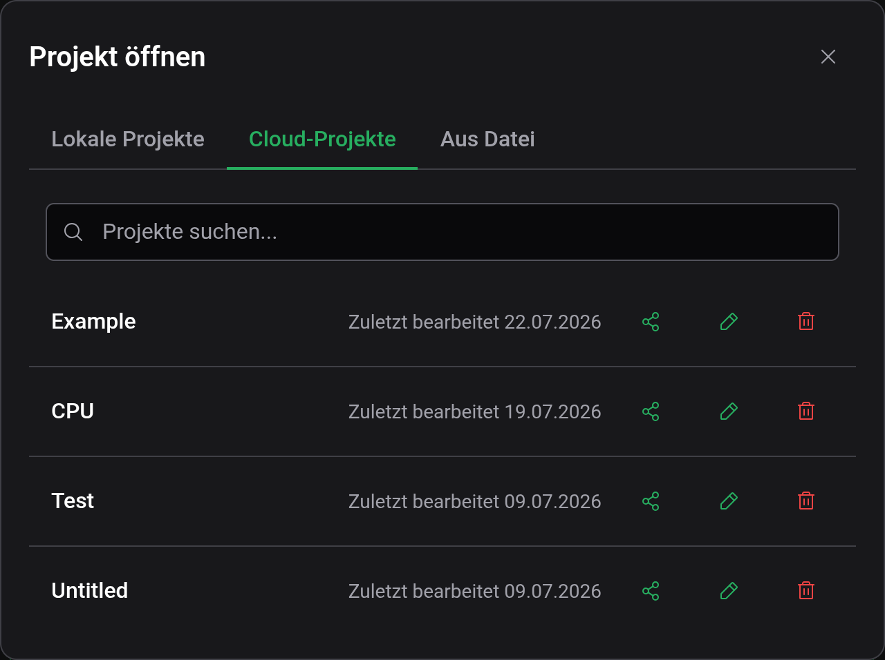
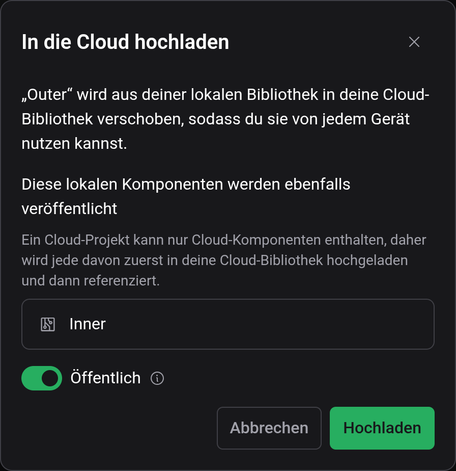
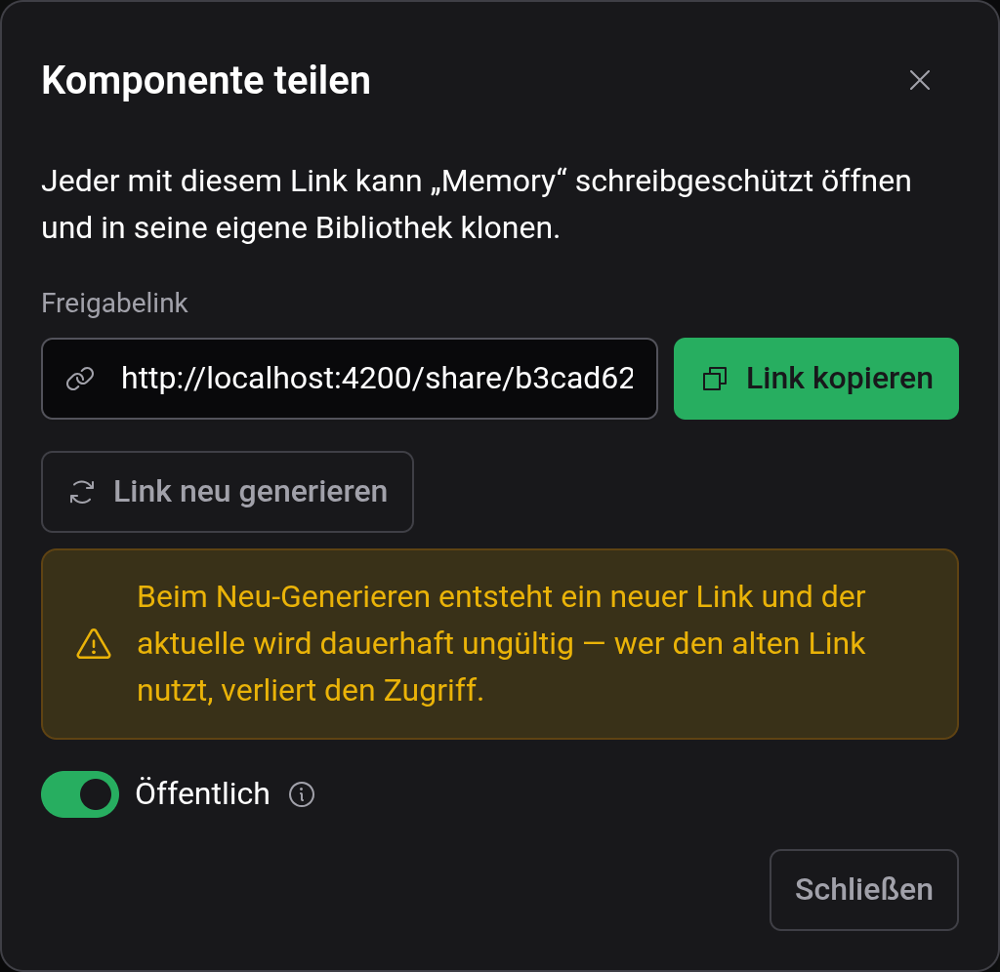

# Cloud & Teilen

Dein Logigator-Account bewahrt Projekte und Komponenten in der Cloud auf, von jedem Gerät erreichbar — und lässt dich sie mit einem Link teilen. Alles im Editor funktioniert ohne Account; das Anmelden fügt Cloud-Speicher und das Teilen hinzu.

## Anmelden und dein Account

Öffne das Account-Menü in der oberen rechten Ecke. Wenn abgemeldet, bietet es **Anmelden**; wenn angemeldet, zeigt es deinen **Account** und eine **Abmelden**-Option, neben den Einstellungen **Design** und **Sprache** (siehe [Einstellungen & Darstellung](docs:settings)).

Das Anmelden gibt dir:

- **Cloud-Speicher** für Projekte und benutzerdefinierte Komponenten, verfügbar auf jedem Gerät, von dem aus du dich anmeldest.
- **Freigabelinks** für deine Cloud-Projekte und -Komponenten.

Das Abmelden räumt deine Cloud-Bibliothek aus dieser Sitzung; deine lokalen (Browser-)Projekte bleiben, wo sie sind.

## Lokaler vs. Cloud-Speicher

Jedes Projekt und jede benutzerdefinierte Komponente lebt an einem von zwei Orten:

- **Lokal** — im Browser gespeichert, den du gerade verwendest. Schnell und ohne Account, aber an diesen einen Browser gebunden und nicht gesichert.
- **Cloud** — in deinem Account gespeichert. Von jedem Gerät erreichbar, sobald du dich anmeldest.

Das Kennzeichen neben dem Projektnamen zeigt, welchen von beiden das offene Projekt verwendet (**Lokal**, **Cloud** oder **Entwurf**, falls es noch nicht gespeichert wurde). Siehe [Speichern & Dateien](docs:saving-and-files) für den Speicherablauf.

Der Dialog **Datei → Öffnen** hält die beiden in getrennten Tabs auseinander — **Lokale Projekte** und **Cloud-Projekte** — plus einem Tab **Aus Datei** zum Importieren einer Schaltungsdatei. Wenn du abgemeldet bist, fordert der Tab „Cloud-Projekte“ dich zum Anmelden auf.

## Arbeit in die Cloud verschieben

Es gibt zwei Wege, ein Projekt in deine Cloud-Bibliothek zu bekommen:

1. **Einen Entwurf direkt in die Cloud speichern** — wenn du ein neues Projekt zum ersten Mal speicherst, wähle im Speicherdialog **Speicherort: Cloud**.
2. **Ein bestehendes lokales Projekt hochladen** — mit einem geöffneten, gespeicherten lokalen Projekt wähle **Datei → In die Cloud hochladen**. Du kannst ein Projekt auch aus der Liste im Dialog **Öffnen** hochladen.

Das Hochladen _verschiebt_ das Projekt aus dem lokalen Speicher in deine Cloud-Bibliothek. Wenn das Projekt lokale benutzerdefinierte Komponenten verwendet, werden diese gemeinsam damit in deine Cloud-Bibliothek veröffentlicht — ein Cloud-Projekt kann nur Cloud-Komponenten enthalten, daher wird jede zuerst hochgeladen und dann referenziert. Der Upload-Dialog listet genau auf, welche Komponenten veröffentlicht werden, bevor du bestätigst.

Benutzerdefinierte Komponenten können auf dieselbe Weise in die Cloud verschoben werden, über ihre Aktion im Einstellungs-Panel.

## Ein Projekt teilen

Sobald ein Projekt in der Cloud ist, öffnet **Datei → Teilen** den Teilen-Dialog. (Das Teilen ist nur für Cloud-Projekte verfügbar; lade zuerst ein lokales Projekt hoch.)

- **Freigabelink** — jeder mit dem Link kann dein Projekt **schreibgeschützt** öffnen und **es in seine eigene Bibliothek klonen**, um darauf aufzubauen. Nutze **Link kopieren**, um ihn zu greifen.
- **Öffentlich** — ein öffentliches Projekt wird zusätzlich auf deinem Profil veröffentlicht und ist für alle auffindbar. Ein privates Projekt ist **nur** über seinen Freigabelink erreichbar.
- **Link neu generieren** — erzeugt einen frischen Link und macht den alten dauerhaft ungültig; wer den alten Link noch nutzt, verliert den Zugriff.

Benutzerdefinierte Cloud-Komponenten können auf dieselbe Weise aus dem Einstellungs-Panel geteilt werden.

### Was der Empfänger sieht

Wer deinen Freigabelink öffnet, erhält eine **schreibgeschützte** Kopie — das Kennzeichen liest **Geteilt** und er kann keine Änderungen über deine speichern oder es in eine Datei exportieren. Um es zu seinem eigenen zu machen, **klont** er es in seine Bibliothek, was ihm eine vollständige, bearbeitbare Kopie gibt, die er frei speichern und bearbeiten kann. Sein Klon ist unabhängig; spätere Bearbeitungen auf einer Seite berühren die andere nicht.

## Cookie- & Einwilligungseinstellungen

Wenn Logigator mit seinem Einwilligungsbanner ausgeliefert wird, kannst du deine Cookie- und Einwilligungseinstellungen jederzeit über **Hilfe → Cookie-Einstellungen** erneut aufrufen. (Dieser Eintrag erscheint nur dort, wo das Einwilligungsbanner verfügbar ist.)

## Siehe auch

- [Speichern & Dateien](docs:saving-and-files) — lokal speichern, `.lgix`-Dateien und Bildexport
- [Benutzerdefinierte Komponenten](docs:custom-components) — die wiederverwendbaren Bauteile, die mit einem geteilten Projekt reisen
- [Einstellungen & Darstellung](docs:settings) — Design-, Sprach- und Account-Einstellungen
