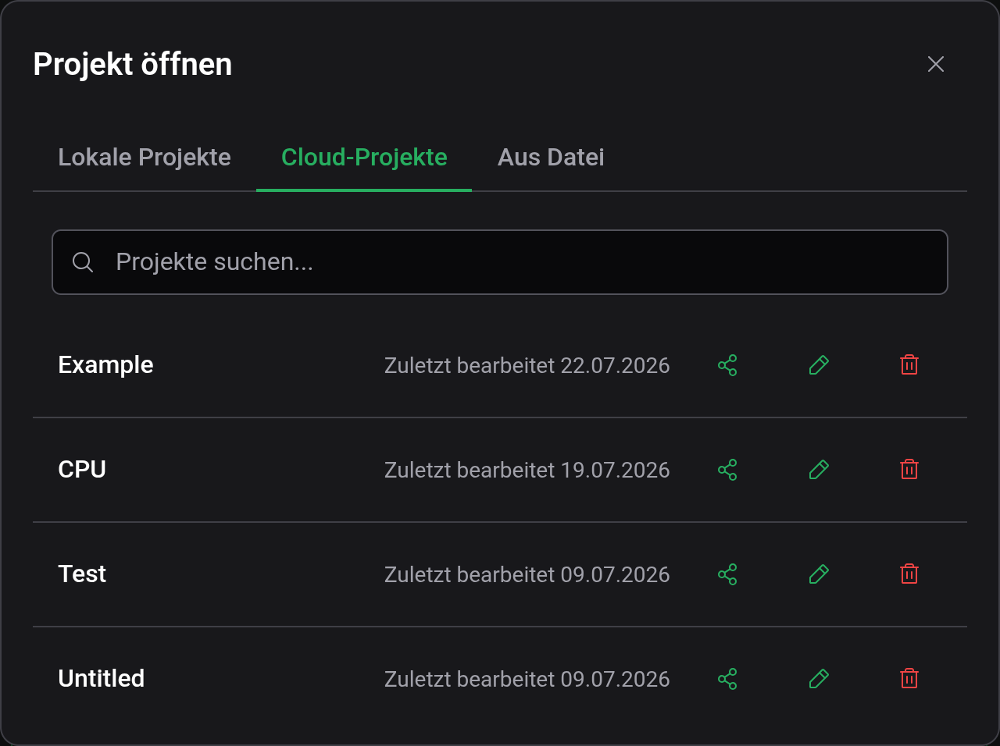
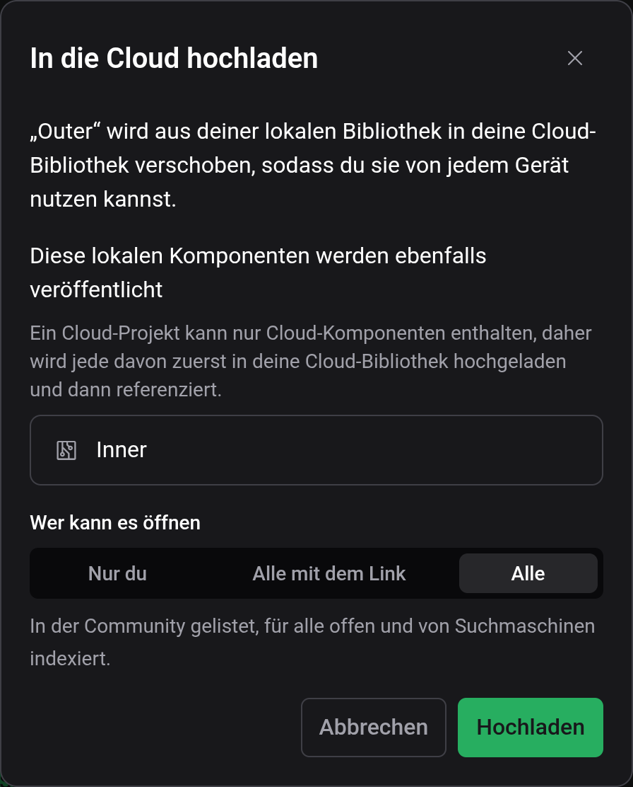
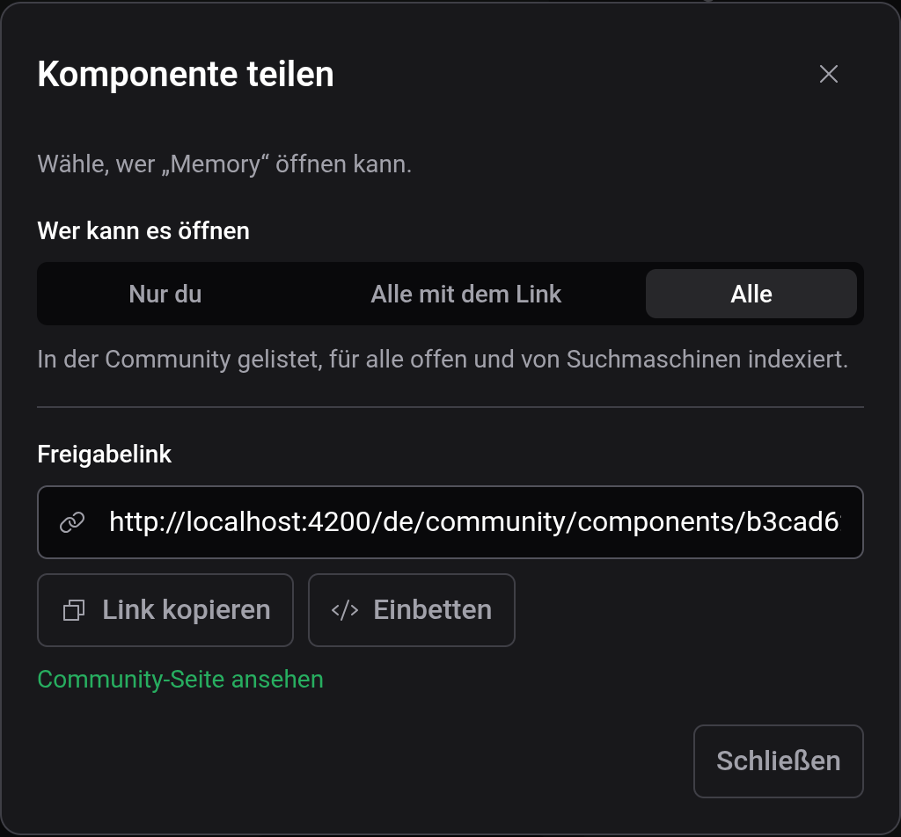

# Cloud und Teilen

Mit einem Logigator-Account liegen Projekte und benutzerdefinierte Komponenten in der Cloud und öffnen auf jedem Gerät, an dem du dich anmeldest. Cloud-Dokumente lassen sich per Link teilen oder in der Community auf der Logigator-Website veröffentlichen. Alles andere im Editor funktioniert ohne Account.

## An- und abmelden

Das Account-Menü am rechten Ende der Titelleiste zeigt „Anmelden“ und „Registrieren“, solange du abgemeldet bist. Beide öffnen die Logigator-Website in einem neuen Tab, und der Editor bemerkt von selbst, wenn du dich dort angemeldet hast. Angemeldet zeigt das Menü „Account“, das deine Account-Seite auf der Website öffnet, und „Abmelden“.

Hat ein Cloud-Projekt oder eine Cloud-Komponente beim Abmelden ungespeicherte Änderungen, fragt der Editor, ob du vorher speichern willst: „Speichern & Abmelden“, „Ohne Speichern abmelden“ oder „Abbrechen“. Nach dem Abmelden wird ein offenes Cloud-Projekt durch einen leeren Entwurf ersetzt, und die Tabs von Cloud-Komponenten schließen sich. Lokale Projekte und Komponenten bleiben unberührt.

## Lokal und Cloud

Lokale Dokumente liegen in diesem Browser und sind weg, wenn seine Website-Daten gelöscht werden. Cloud-Dokumente liegen in deinem Account. Das Kennzeichen neben dem Projektnamen sagt, was für das offene Projekt gilt, und Datei → Öffnen listet beide in getrennten Tabs, Lokale Projekte und Cloud-Projekte. Bist du angemeldet, öffnet der Dialog mit den Cloud-Projekten.

Auf der Website listen Meine Projekte und Meine Komponenten deine Cloud-Dokumente ebenfalls. Du kannst sie dort anlegen, umbenennen, teilen und löschen und im Editor öffnen.

## In die Cloud hochladen

Um ein gespeichertes lokales Projekt in deinen Account zu verschieben, wähle Datei → In die Cloud hochladen oder die Hochladen-Schaltfläche in seiner Zeile im Dialog „Projekt öffnen“. Einen Entwurf speicherst du direkt in der Cloud, indem du im Dialog „Speichern“ Cloud wählst. Für eine lokale benutzerdefinierte Komponente nimmst du „In die Cloud hochladen“ in ihrer Einstellungskarte.

Ein Cloud-Projekt kann nur Cloud-Komponenten verwenden. Verwendet deines lokale, listet der Dialog sie auf und lädt sie mit hoch. Er fragt auch, wer das Hochgeladene öffnen kann, mit Alle als Vorauswahl, und dieselbe Wahl gilt für die hochgeladenen Komponenten. Hochladen verschiebt die Dokumente: Die lokalen Kopien werden gelöscht.

## Teilen

Datei → Teilen öffnet den Teilen-Dialog für ein Cloud-Projekt. Die Schaltfläche „Teilen“ in einer Zeile des Tabs Cloud-Projekte tut dasselbe, und eine Cloud-Komponente hat „Teilen“ in ihrer Einstellungskarte. Lokale Dokumente musst du zuerst hochladen.

„Wer kann es öffnen“ hat drei Möglichkeiten, und jede Änderung gilt sofort:

| Auswahl           | Wer es öffnen kann                                                                                     |
| ----------------- | ------------------------------------------------------------------------------------------------------ |
| Nur du            | Niemand sonst. Der Link wird nicht angezeigt.                                                          |
| Alle mit dem Link | Wer den Link hat. Es bleibt aus den Community-Listen und aus Suchmaschinen heraus.                     |
| Alle              | Alle. Das Dokument steht in der Community und ist über Suchmaschinen auffindbar, sobald es Inhalt hat. |

Der Freigabelink führt zur Seite des Dokuments auf der Logigator-Website. Die Schaltfläche „Teilen“ übergibt ihn an das Teilen-Menü deines Geräts oder kopiert ihn, wo es keines gibt. „Einbetten“ liefert einen Schnipsel in Markdown, HTML oder BBCode mit einem Bild der Schaltung, das auf ihre Seite verlinkt, zum Einfügen in einen Forenbeitrag oder ein Wiki. „Community-Seite ansehen“ öffnet diese Seite.

„Link neu generieren“ ersetzt den Link, und der alte hört sofort für alle auf zu funktionieren, die ihn haben. Das gibt es nur bei „Alle mit dem Link“: Die Adresse eines veröffentlichten Dokuments ist sein Link, und ein privates zeigt keinen Link an. Stellst du ein Dokument von „Alle mit dem Link“ auf „Nur du“ und zurück, bleibt der Link derselbe.

## Einen fremden Link öffnen

Ein Freigabelink öffnet die Seite des Dokuments auf der Website, mit „Im Editor öffnen“ und „Kopie speichern“. „Kopie speichern“ bittet dich, dich anzumelden, kopiert das Dokument in deine Cloud-Bibliothek und öffnet die Kopie. Bei Dokumenten mit der Einstellung Alle kannst du auf der Seite auch einen Stern geben.

Im Editor trägt ein geteiltes Dokument das Kennzeichen Geteilt. Du kannst es ändern und ausprobieren, aber nicht speichern oder exportieren. Datei → In meine Projekte klonen, bei einer Komponente In meine Komponenten klonen, speichert eine Kopie in deiner Cloud-Bibliothek. Die Kopie entsteht aus der Version, die der Besitzer gespeichert hat, ohne deine Änderungen, und beginnt mit „Alle mit dem Link“. Spätere Änderungen auf einer Seite berühren die andere nicht.

## Siehe auch

- [Speichern und Dateien](docs:saving-and-files): Speichern, Dateien und Bildexport
- [Benutzerdefinierte Komponenten](docs:custom-components): Komponenten, die mit einem Projekt mitreisen
- [Einstellungen](docs:settings): das Account-Menü
