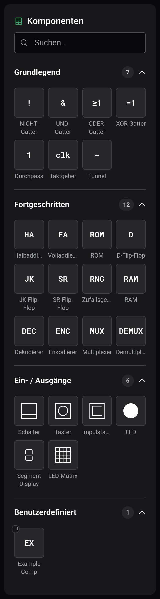
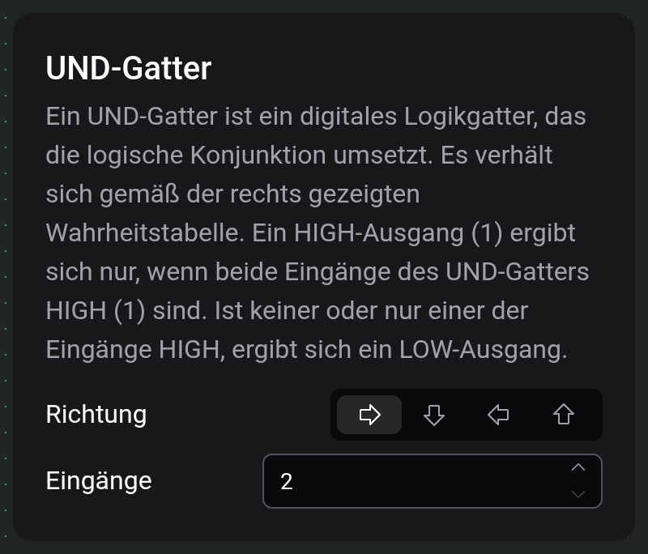

# Komponenten und Optionen

Komponenten sind die Bauteile, aus denen eine Schaltung besteht: Gatter, Speicher, Eingaben und Anzeigen. Du wählst sie in der Palette links aus und stellst ihre Optionen in der Einstellungskarte ein.

## Die Palette

Das Suchfeld oben filtert die Palette nach Namen. Die Kategorien sind Grundlegend, Fortgeschritten und Ein- / Ausgänge, dazu Benutzerdefiniert, sobald du eine [benutzerdefinierte Komponente](docs:custom-components) gebaut hast. Ein Klick auf eine Kategorie klappt sie zu. Wie das Platzieren funktioniert, steht unter [Arbeitsfläche und Werkzeuge](docs:board-and-tools).

Jede Komponente braucht einen Tick, um eine Änderung an ihren Ausgang weiterzugeben. Die Tabellen nennen die Optionen jeder Komponente außer Richtung, die alle haben.

### Grundlegend

| Komponente   | Was sie tut                                                                                                                                      | Optionen                     |
| ------------ | ------------------------------------------------------------------------------------------------------------------------------------------------ | ---------------------------- |
| NICHT-Gatter | Invertiert seinen Eingang.                                                                                                                       |                              |
| UND-Gatter   | Gibt 1 aus, wenn alle Eingänge 1 sind.                                                                                                           | Eingänge, 2 bis 64           |
| ODER-Gatter  | Gibt 1 aus, wenn mindestens ein Eingang 1 ist.                                                                                                   | Eingänge, 2 bis 64           |
| XOR-Gatter   | Gibt 1 aus, wenn eine ungerade Anzahl von Eingängen 1 ist.                                                                                       | Eingänge, 2 bis 64           |
| Durchpass    | Gibt seinen Eingang unverändert weiter, einen Tick später.                                                                                       |                              |
| Taktgeber    | Sendet einen Impuls von einem Tick, bleibt dann für Verzögerung Ticks auf 0 und wiederholt das. Solange sein Eingang STP 1 ist, bleibt er auf 0. | Verzögerung, ab 1            |
| Tunnel       | Ist ohne Leitung mit jedem anderen Tunnel gleicher Beschriftung verbunden. Siehe [Leitungen und Verbindungen](docs:wires-and-connections).       | Beschriftung, bis 10 Zeichen |

### Fortgeschritten

| Komponente       | Was sie tut                                                                                                                                | Optionen                                                     |
| ---------------- | ------------------------------------------------------------------------------------------------------------------------------------------ | ------------------------------------------------------------ |
| Halbaddierer     | Addiert A und B. S ist das Summenbit, C der Übertrag.                                                                                      |                                                              |
| Volladdierer     | Addiert A, B und den Übertragseingang Cin. S ist das Summenbit, C der Übertrag.                                                            |                                                              |
| ROM              | Gibt das gespeicherte Wort an der Adresse an seinen Eingängen aus. Es hat keinen Takt.                                                     | Wortbreite 1 bis 64, Adressgröße 1 bis 11, Inhalt bearbeiten |
| D-Flip-Flop      | Speichert D bei der steigenden Flanke von CLK. Q ist das gespeicherte Bit, !Q sein Gegenteil.                                              |                                                              |
| JK-Flip-Flop     | Bei der steigenden Flanke von CLK setzt J das Bit, K setzt es zurück, beide zusammen kippen es.                                            |                                                              |
| SR-Flip-Flop     | Bei der steigenden Flanke von CLK setzt S das Bit und R setzt es zurück.                                                                   |                                                              |
| Zufallsgenerator | Legt bei jeder steigenden Flanke von CLK einen neuen Zufallswert an seine Ausgänge.                                                        | Ausgänge, 1 bis 64                                           |
| RAM              | Liest bei der steigenden Flanke von CLK das Wort an der Adresse auf die Ausgänge, oder speichert dort die Dateneingänge, solange WE 1 ist. | Wortbreite 1 bis 64, Adressgröße 1 bis 16                    |
| Dekodierer       | Schaltet den einen Ausgang ein, dessen Nummer dem Binärwert an den Eingängen entspricht.                                                   | Eingänge, 1 bis 6                                            |
| Enkodierer       | Gibt die Nummer des höchsten Eingangs aus, der 1 ist.                                                                                      | Ausgänge, 1 bis 6                                            |
| Multiplexer      | Gibt den Dateneingang, den die Auswahlleitungen wählen, an seinen Ausgang weiter. Bei n Auswahlleitungen gibt es 2ⁿ Dateneingänge.         | Auswahlleitungen, 1 bis 6                                    |
| Demultiplexer    | Gibt Eingang I an den Ausgang weiter, den die Auswahlleitungen wählen.                                                                     | Auswahlleitungen, 1 bis 6                                    |

### Ein- / Ausgänge

| Komponente      | Was sie tut                                                                                                                                                                                           | Optionen                                                 |
| --------------- | ----------------------------------------------------------------------------------------------------------------------------------------------------------------------------------------------------- | -------------------------------------------------------- |
| Schalter        | Wechselt während einer Simulation mit jedem Klick zwischen 0 und 1.                                                                                                                                   |                                                          |
| Taster          | Gibt 1 aus, solange du ihn gedrückt hältst.                                                                                                                                                           |                                                          |
| Impulstaster    | Gibt pro Klick einen Impuls von einem Tick aus.                                                                                                                                                       |                                                          |
| LED             | Leuchtet, solange ihr Eingang 1 ist.                                                                                                                                                                  |                                                          |
| Segment Display | Zeigt die Binärzahl an seinen Eingängen, Eingang 0 ist das niedrigste Bit.                                                                                                                            | Eingänge 1 bis 16, Basis dezimal, hexadezimal oder oktal |
| LED-Matrix      | Ein quadratisches LED-Raster. Bei der steigenden Flanke von CLK werden die Dateneingänge in die Zeile geschrieben, die die Adresseingänge wählen. Bei 16 × 16 deckt jede Adresse eine halbe Zeile ab. | Breite/Höhe 4, 8 oder 16                                 |

## Die Einstellungskarte

Wählst du genau eine Komponente aus oder nimmst eine zum Platzieren, erscheint neben der Arbeitsfläche ihre Einstellungskarte: Name, Beschreibung und Optionen. Richtung hat vier Pfeil-Schaltflächen, die die Komponente drehen. Eine beim Platzieren gewählte Richtung bleibt für die nächste Komponente desselben Typs erhalten. Während einer Simulation ist die Karte ausgeblendet.

Änderst du Eingänge, Ausgänge oder eine Größenoption, ändert sich die Zahl der Anschlüsse sofort.

Bei einem ROM öffnet „Inhalt bearbeiten“ einen Hex-Editor für die gespeicherten Wörter. Wortbreite legt fest, wie viele Bits ein Wort hat, Adressgröße, wie viele Adresseingänge es gibt. Ein ROM mit Adressgröße 4 hält also 16 Wörter. Der Inhalt wird mit der Schaltung gespeichert.

## Einen Anschluss negieren

Tippe mit dem Leitungswerkzeug auf einen Ein- oder Ausgang, um einen Negationskreis hinzuzufügen. Das Signal durch diesen Anschluss wird dann invertiert, ohne zusätzliche Verzögerung. Tippe erneut auf den Kreis, um ihn zu entfernen. Fährst du über einen Anschluss, zeigt das Leitungswerkzeug, was ein Tippen bewirken würde. Ein Kreis am CLK-Eingang eines Flip-Flops lässt es auf die fallende Flanke reagieren.

Tunnel, Eingangs- und Ausgangsstecker und die Anschlüsse einer platzierten benutzerdefinierten Komponente lassen sich nicht negieren.

## Textbeschriftungen

Text steht nicht in der Palette. Klicke mit dem Werkzeug Text (`T`) auf die Arbeitsfläche, um eine Beschriftung „[insert text]“ zu setzen. „Text bearbeiten“ in ihrer Einstellungskarte öffnet einen Dialog für den Text, der über mehrere Zeilen gehen kann, und die Schriftgröße reicht von 2 bis 128. Leitungen laufen durch Beschriftungen, ohne sich mit ihnen zu verbinden. Ein Klick auf eine Leitung unter einer Beschriftung wählt die Leitung aus.

## Siehe auch

- [Leitungen und Verbindungen](docs:wires-and-connections): Anschlüsse verbinden
- [Benutzerdefinierte Komponenten](docs:custom-components): eigene Bauteile bauen
- [Simulation](docs:simulation): Schalter und Taster bedienen
- [Arbeitsfläche und Werkzeuge](docs:board-and-tools): platzieren, verschieben und drehen
