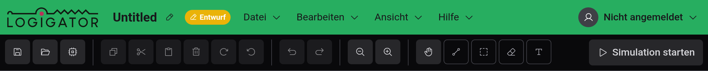

# Einstieg

Willkommen bei Logigator — einem Open-Source-Editor und -Simulator für digitale Logikschaltungen, der vollständig in deinem Browser läuft.

## Was ist Logigator?

Mit Logigator zeichnest du digitale Logikschaltungen — vom einzelnen UND-Gatter bis zum vollständigen Prozessor — und lässt sie dann laufen, um die Signale fließen zu sehen. Du platzierst Komponenten auf einem Raster, verdrahtest ihre Anschlüsse miteinander und drückst auf Start, um zu simulieren.

Du kannst:

- Schaltungen aus Logikgattern, Flip-Flops, Speichern, Multiplexern, Anzeigen und mehr bauen
- Komponenten zu Netzen verdrahten und während der Simulation zusehen, wie unter Strom stehende Leitungen aufleuchten
- Eine fertige Schaltung in deine eigene wiederverwendbare [benutzerdefinierte Komponente](docs:custom-components) verpacken
- Deine Arbeit in diesem Browser speichern, sie [in eine Datei exportieren](docs:saving-and-files) oder sie in deinem [Logigator-Account in der Cloud](docs:cloud) behalten

Alles funktioniert ohne Account. Das Anmelden fügt Cloud-Speicher und Freigabelinks hinzu.

## Ein Rundgang durch den Editor

Der Editor ist in einige feste Bereiche rund um die zentrale Arbeitsfläche gegliedert:

- **Die Arbeitsfläche** — das Raster in der Mitte, auf dem du Komponenten platzierst und Leitungen zeichnest. Scrollen zum Zoomen, ziehen zum Schwenken.
- **Die Werkzeugleiste** (oben) — schnelle Aktionen links (Speichern, Öffnen, Kopieren/Einfügen, Rückgängig/Wiederholen, Zoom) und die Zeichenwerkzeuge rechts (Schwenken, Leitung, Auswahl, Radieren, Text). Die Schaltfläche **Simulation starten** sitzt ganz rechts.
- **Die Menüleiste** (oben links) — die Menüs **Datei**, **Bearbeiten**, **Ansicht** und **Hilfe**. Jeder Befehl liegt hier, die meisten mit einem daneben angezeigten Tastenkürzel.
- **Die Komponentenpalette** (linkes Panel) — alle Komponenten, die du platzieren kannst, in Kategorien gruppiert. Siehe [Komponenten & Optionen](docs:components-and-options).
- **Die Statusleiste** (unten) — ein einzeiliger Hinweis zum aktiven Werkzeug, deine Cursorposition auf dem Raster, ob das Projekt ungespeicherte Änderungen hat und wie viele Elemente ausgewählt sind.
- **Die Minimap** (unten rechts) — eine kleine Übersicht der gesamten Schaltung, die du einklappen kannst.

Der Name des Projekts steht oben neben den Menüs; klicke ihn an, um das Projekt umzubenennen, und das Kennzeichen daneben zeigt, wo das Projekt gespeichert ist (**Lokal**, **Cloud**, **Entwurf** oder **Geteilt**).

## Das geführte Tutorial

Der schnellste Weg, die Grundlagen zu lernen, ist das eingebaute Tutorial, das dich in etwa einer Minute durch den Bau einer kleinen, funktionierenden Schaltung führt.

Beim ersten Öffnen des Editors erscheint eine Karte nahe dem oberen Rand der Arbeitsfläche: **„Neu hier? Bau deine erste Schaltung in einem kurzen Tutorial.“** Wähle **Tutorial starten**, um zu beginnen, oder **Ausblenden**, um es zu überspringen. Du kannst das Tutorial jederzeit überspringen, sobald es begonnen hat.

Um es später erneut auszuführen — oder die unten beschriebenen kontextbezogenen Tipps zurückzuholen — öffne **Hilfe → Tipps erneut anzeigen**.

## Just-in-Time-Tipps

Sobald du zum ersten Mal zu einem Werkzeug greifst, zeigt Logigator einen kurzen Tipp, der erklärt, wie es funktioniert — zum Beispiel, wie das [Leitungswerkzeug](docs:wires-and-connections) zeichnet und Verbindungen umschaltet oder was die Schneide-Auswahl tut. Jeder Tipp lässt sich ausblenden und kehrt nicht zurück, sobald du ihn gesehen hast.

Um Tipps ganz auszuschalten, öffne das Account-Menü oben rechts und deaktiviere **Einführungstipps anzeigen** unter **Editor-Einstellungen**, oder wähle **Alle Tipps deaktivieren** in einem beliebigen Tipp. Siehe [Einstellungen & Darstellung](docs:settings).

## Über Änderungen auf dem Laufenden bleiben

Logigator wird regelmäßig aktualisiert. Öffne **Hilfe → Neuigkeiten**, um eine Zusammenfassung dessen zu sehen, was sich in den jüngsten Veröffentlichungen geändert hat. Beim ersten Mal, wenn eine neue Version etwas Wissenswertes einführt, erscheint dies automatisch.

## Ein Problem melden

Einen Fehler gefunden? Nutze die Schaltfläche **Fehler melden** in der unteren rechten Ecke der Arbeitsfläche. Beschreibe, was du getan hast, als er auftrat — dein aktuelles Projekt, Browser-Details und die jüngste Aktivität werden angehängt, um das Problem einzugrenzen. Sollte dich je ein unerwarteter Fehler unterbrechen, öffnet sich dasselbe Meldefenster von selbst.

## Versions- & Lizenzinfo

**Hilfe → Über** zeigt die genaue Version, die du ausführst, zusammen mit den Build-Details, der Lizenz (Logigator ist freie Software unter der **GNU AGPL v3**) und Links zum Quell-Repository und zur Datenschutzerklärung.

## Siehe auch

- [Arbeitsfläche & Werkzeuge](docs:board-and-tools) — bewegen, Komponenten platzieren, auswählen und radieren
- [Komponenten & Optionen](docs:components-and-options) — die Bausteine und wie man sie konfiguriert
- [Leitungen & Verbindungen](docs:wires-and-connections) — Komponenten zu funktionierenden Schaltungen verbinden
- [Simulation](docs:simulation) — deine Schaltung laufen lassen und mit ihr interagieren
- [Tastaturbefehle](docs:shortcuts) — jede Belegung und wie man sie ändert
