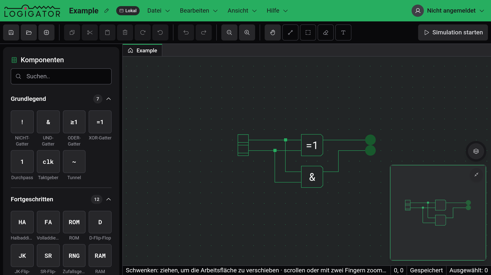

# Einstieg

Logigator ist ein Logiksimulator, der im Browser läuft. Du setzt Gatter auf ein Raster, ziehst Leitungen zwischen ihnen und startest mit „Simulation starten“, um zu sehen, wie die Signale durch die Schaltung laufen. Eine fertige Schaltung lässt sich als [benutzerdefinierte Komponente](docs:custom-components) speichern und in einer größeren als ein einzelner Baustein verwenden.

Ein Account ist nicht nötig. Ohne Account speicherst du Projekte im Browser oder [exportierst sie als Datei](docs:saving-and-files). Mit Anmeldung kommen [Cloud-Speicher und Freigabelinks](docs:cloud) dazu.

## Das Editorfenster

- Die Arbeitsfläche in der Mitte ist das Raster, auf dem du baust. Das Mausrad zoomt, Ziehen mit der rechten oder mittleren Maustaste verschiebt die Ansicht.
- Die Titelleiste zeigt den Namen des Projekts und wo es gespeichert ist (Entwurf, Lokal, Cloud oder Geteilt), danach die Menüs Datei, Bearbeiten, Ansicht und Hilfe. Mit dem Stift neben dem Namen benennst du das Projekt um.
- Die Werkzeugleiste enthält Schaltflächen zum Speichern und Öffnen, für die Zwischenablage, zum Drehen, Rückgängigmachen und Zoomen, dann die fünf [Werkzeuge](docs:board-and-tools) und ganz rechts „Simulation starten“.
- Die Komponentenpalette links listet alle Bauteile, die du platzieren kannst.
- Die Statusleiste unten zeigt einen Hinweis zum aktiven Werkzeug, die Rasterposition des Cursors, „Gespeichert“ oder „Ungespeicherte Änderungen“ und wie viele Elemente ausgewählt sind.
- Die Minimap und die Schaltfläche „Fehler melden“ liegen in der rechten unteren Ecke der Arbeitsfläche.

Wenn du eine benutzerdefinierte Komponente bearbeitest, erscheint über der Arbeitsfläche eine Tab-Leiste mit dem Hauptprojekt und je einem Tab pro geöffneter Komponente.

In einem Fenster mit 1024 px Breite oder weniger wechselt der Editor zu einer Touch-Ansicht mit anderen Bedienelementen. Siehe [Smartphones und Tablets](docs:phones-and-tablets).

## Tutorial und Tipps

Beim ersten Besuch bietet eine Karte über der Arbeitsfläche ein Tutorial an, in dem du ein UND-Gatter mit zwei Schaltern und einer LED baust. Es dauert etwa eine Minute. „Tutorial starten“ beginnt es, das ✕ schließt die Karte, und „Tutorial überspringen“ beendet das Tutorial bei jedem Schritt.

Wenn du bestimmte Werkzeuge zum ersten Mal benutzt, etwa das Leitungswerkzeug oder das Schneiden an der Auswahlkante, erklärt ein kurzer Tipp sie. Jeder Tipp erscheint einmal. „Alle Tipps deaktivieren“ in einem Tipp oder die Einstellung „Einführungstipps anzeigen“ schaltet sie ab. Hilfe → Tipps erneut anzeigen schaltet sie wieder ein, zeigt auch die schon gesehenen noch einmal und bringt die Tutorial-Karte zurück.

## Das Hilfe-Menü

- Neuigkeiten listet die Änderungen jeder Version. Nach einem Update öffnet es sich einmal von selbst.
- Dokumentation öffnet diese Seiten im Editor.
- Über zeigt die laufende Version, die Lizenz (GNU AGPL v3) und Links zum Quellcode, zur Datenschutzerklärung und zum Impressum.
- Cookie-Einstellungen öffnet den Einwilligungsdialog erneut. Den Eintrag gibt es nur, wenn der Editor mit dem Cookie-Banner läuft.

## Ein Problem melden

Die Käfer-Schaltfläche in der rechten unteren Ecke öffnet „Problem melden“. Beschreibe, was du getan hast, bevor der Fehler auftrat. Dein aktuelles Projekt, Browserdetails und die letzten Aktivitäten werden dem Bericht angehängt. Tritt im Editor ein unerwarteter Fehler auf, öffnet sich dasselbe Formular von selbst, mit den Fehlerdetails.

## Siehe auch

- [Arbeitsfläche und Werkzeuge](docs:board-and-tools): bewegen, platzieren, auswählen und radieren
- [Komponenten und Optionen](docs:components-and-options): alle Bauteile und ihre Optionen
- [Simulation](docs:simulation): eine Schaltung laufen lassen
- [Tastaturbefehle](docs:shortcuts): alle Tastenkürzel und wie du sie änderst
