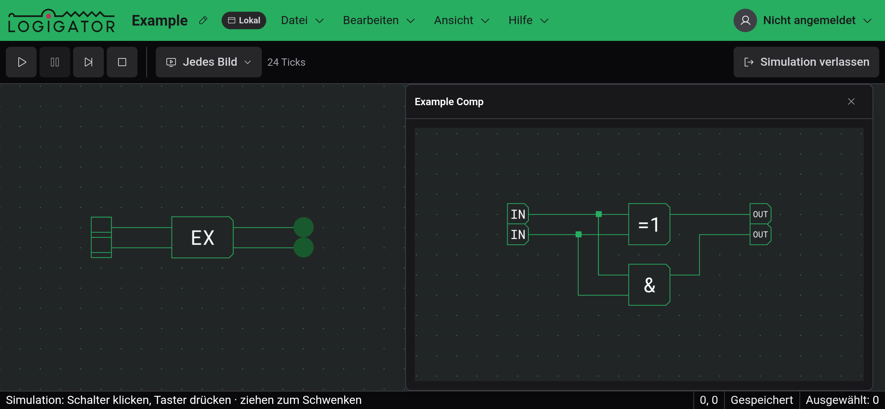
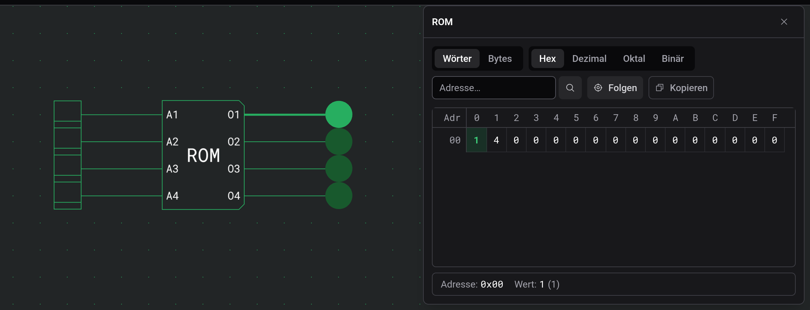

# Inspektion und Beobachtungen

Während einer [Simulation](docs:simulation), ob laufend oder pausiert, lassen sich zwei Arten von Komponenten öffnen, um hineinzusehen. Ein Klick auf ein ROM zeigt seinen Inhalt, das gerade gelesene Wort hervorgehoben. Ein Klick auf eine benutzerdefinierte Komponente öffnet eine Beobachtung, eine Live-Ansicht ihrer inneren Schaltung.

Am Desktop öffnet sich jede Ansicht als Fenster, das du verschieben und in der Größe ändern kannst. Ein erneuter Klick auf die Komponente holt ihr Fenster nach vorn. In der [Touch-Ansicht](docs:phones-and-tablets) teilen sich ROM-Ansichten eine Leiste am unteren Bildschirmrand, und eine Beobachtung füllt den ganzen Bildschirm. Verlässt du die Simulation, schließen sich alle.

## ROM-Inhalt

Die Ansicht ist schreibgeschützt; den Inhalt änderst du beim Bearbeiten in den Einstellungen des ROM. Das Wort an der aktuellen Adresse ist hervorgehoben, und mit „Folgen“ (standardmäßig an) scrollt die Tabelle mit, wenn sich die Adresse ändert. Die Zeile unten zeigt Adresse und Wert der hervorgehobenen Zelle. Ein Klick auf eine andere Zelle zeigt stattdessen diese, bis sich die Adresse das nächste Mal ändert.

Die Schaltflächen über der Tabelle wählen Wörter oder Bytes und das Zahlensystem: Hex, Dezimal, Oktal oder Binär. Um zu einer Adresse zu springen, tippe sie hexadezimal in das Feld „Adresse…“. „Kopieren“ legt die ganze Tabelle als Text in die Zwischenablage, in der gewählten Ansicht und Basis.

## Beobachtungen

Eine Beobachtung zeichnet die innere Schaltung der Komponente mit denselben leuchtenden Leitungen wie die Arbeitsfläche. Du kannst darin verschieben und zoomen und die Schalter und Taster darin bedienen. Sie steuern die echte Simulation, also reagiert auch der Rest der Schaltung.

Ein Klick auf eine benutzerdefinierte Komponente innerhalb einer Beobachtung öffnet deren Schaltung im selben Fenster, und der Titel zeigt den Pfad, etwa Outer › Inner. Klicke auf einen früheren Namen, um wieder hinaufzugehen. Ein ROM in einer Beobachtung öffnet seine eigene Ansicht.

Meldet die Beobachtung, dass die innere Schaltung nicht zur kompilierten Simulation passt, wurde die Komponente nach dem Start der Simulation geändert. Verlasse die Simulation und starte sie neu.

## Siehe auch

- [Simulation](docs:simulation): eine Schaltung laufen lassen
- [Benutzerdefinierte Komponenten](docs:custom-components): die Komponenten bauen, die du beobachtest
- [Komponenten und Optionen](docs:components-and-options): Optionen und Inhalt eines ROM
