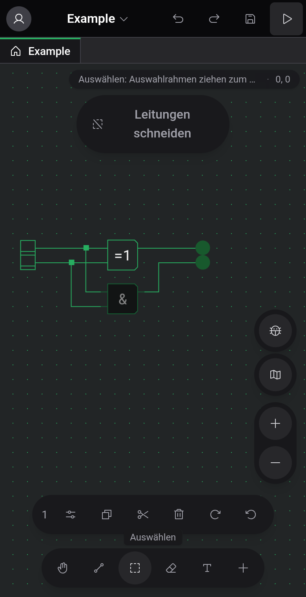

# Smartphones und Tablets

Ist das Fenster 1024 px breit oder schmaler, wechselt der Editor zu einer Touch-Ansicht: Menüleiste, Werkzeugleiste, Palette und Statusleiste weichen schwebenden Bedienelementen rund um die Arbeitsfläche. Das betrifft Smartphones, die meisten Tablets im Hochformat und schmale Desktop-Fenster. Der Rest dieser Dokumentation beschreibt die breite Ansicht. Diese Seite zeigt, was anders ist.

## Wo was liegt

- Oben links öffnet dein Avatar die Account-Leiste mit Design, Sprache, den Editor-Einstellungen sowie An- und Abmelden.
- Ein Tippen auf den Projektnamen öffnet das Projektmenü: Neues Projekt, Neue Komponente, Öffnen, In die Cloud hochladen oder Teilen, Als Datei exportieren, Bild generieren, Leitungen reparieren und die Einträge des Hilfe-Menüs.
- Rückgängig, Wiederholen, Speichern und Simulation starten sind Schaltflächen oben rechts.
- Eine Pille in der rechten oberen Ecke zeigt den Hinweis zum aktiven Werkzeug und die Rasterposition.
- Die Leiste unten enthält die fünf Werkzeuge und eine +-Schaltfläche, die die Komponenten-Leiste öffnet. Während du eine benutzerdefinierte Komponente bearbeitest, kommt eine Schaltfläche für die Anschlüsse dazu.
- Zoom-Schaltflächen, Käfer-Schaltfläche und Minimap sitzen am rechten Rand. Die Minimap ist anfangs eingeklappt.

Die Ansicht hat keine Statusleiste, daher fehlen die Anzeige „Gespeichert“ / „Ungespeicherte Änderungen“ und das Speicherort-Kennzeichen neben dem Projektnamen. Tastaturbefehle funktionieren mit angeschlossener Tastatur weiterhin, ändern kannst du sie aber nur in der breiten Ansicht.

## Gesten

Ziehe mit zwei Fingern, um die Ansicht zu verschieben, und zoome durch Aufziehen. Was ein Ziehen mit einem Finger bewirkt, hängt vom Werkzeug ab: Es zeichnet eine Leitung, einen Auswahlrahmen oder einen Radierstrich und verschiebt die Ansicht nur mit „Schwenken“.

Um eine Komponente zu platzieren, tippe auf +, wähle sie in der Leiste aus und tippe auf die Stelle der Arbeitsfläche, an die sie soll.

## Auswahl und Zwischenablage

Ist etwas ausgewählt, zeigt eine Leiste über den Werkzeugen, wie viele Elemente es sind, mit Schaltflächen für Kopieren, Ausschneiden, Löschen und beide Drehrichtungen sowie Einfügen, sobald die Zwischenablage etwas enthält. Ist genau eine Komponente ausgewählt, öffnet eine Einstellungen-Schaltfläche ihre Optionen in einer Leiste.

Nach dem Kopieren bleibt die Leiste mit Einfügen stehen, auch wenn nichts ausgewählt ist. Ihr ✕ leert die Zwischenablage und schließt die Leiste. Eingefügte Elemente landen in der Mitte der Ansicht: Ziehe sie auf einen freien Platz und heb den Finger, um sie abzusetzen, oder tippe woanders hin, um abzubrechen.

## Simulation und Inspektion

Die Play-Schaltfläche oben startet die Simulation. Die Steuerung erscheint dann in einer Leiste am unteren Rand, und oben ersetzt die Schaltfläche zum Verlassen Rückgängig, Wiederholen und Speichern.

Ein Tippen auf ein ROM öffnet seine Ansicht in einer Leiste am unteren Bildschirmrand. Die Arbeitsfläche darüber bleibt bedienbar, und mehrere Ansichten teilen sich die Leiste als Tabs. Die Beobachtung einer benutzerdefinierten Komponente füllt den ganzen Bildschirm, und ihr Zurück-Pfeil führt zur Arbeitsfläche. Siehe [Inspektion und Beobachtungen](docs:inspection).

## Siehe auch

- [Arbeitsfläche und Werkzeuge](docs:board-and-tools): was jedes Werkzeug tut
- [Simulation](docs:simulation): Steuerung und Geschwindigkeit
- [Einstellungen](docs:settings): Design, Sprache und Editor-Einstellungen
