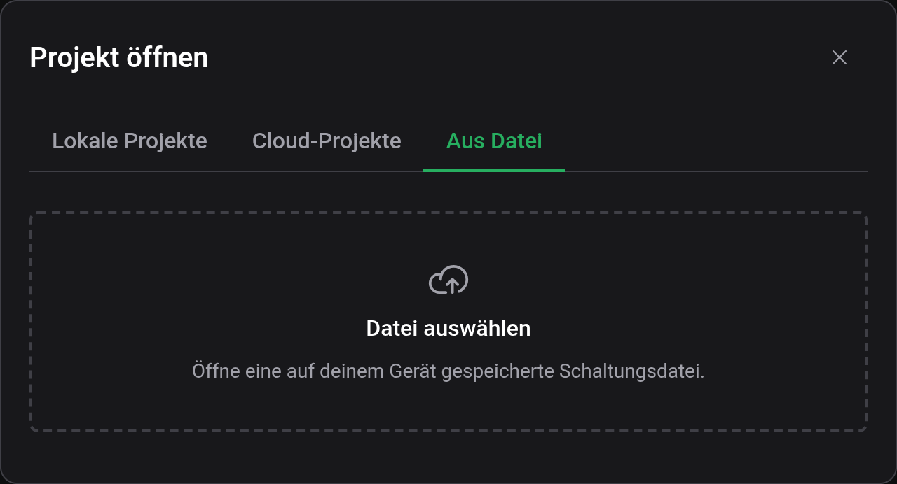
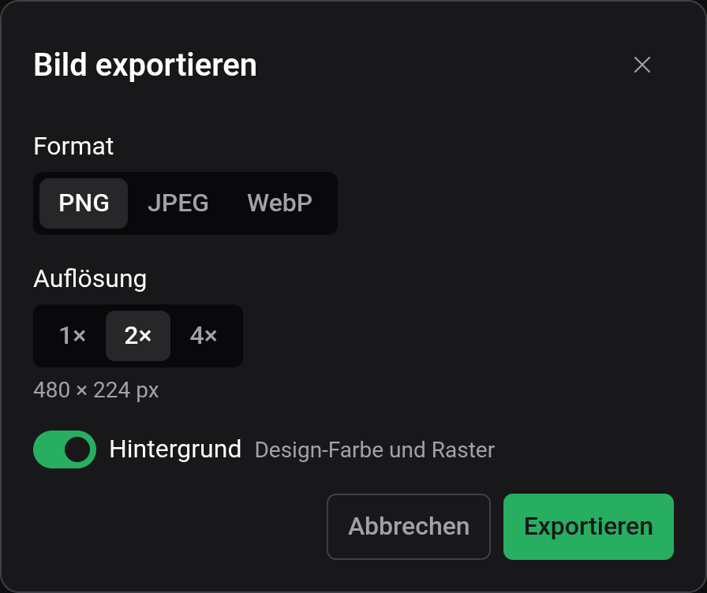

# Speichern & Dateien

Wo deine Arbeit lebt: in deinem Browser, in deinem Account oder in einer Datei auf deinem Gerät. Diese Seite behandelt das Speichern im Browser, den Export in eine Datei und das Erzeugen eines Bildes deiner Schaltung.

## Dein Projekt speichern

Speichere mit **Datei → Speichern** oder `Ctrl+S`. Die Schaltfläche sitzt auch in der Werkzeugleiste.

Ein Projekt, das nie gespeichert wurde, ist ein **Entwurf** — das Kennzeichen neben dem Projektnamen sagt das. Beim ersten Speichern eines Entwurfs fragt Logigator nach zwei Dingen:

- **Name** — wie das Projekt heißen soll.
- **Speicherort** — **Lokal** (in diesem Browser gespeichert) oder **Cloud** (in deinem Logigator-Account gespeichert, sofern du angemeldet bist).

Nach diesem ersten Speichern schreibt **Speichern** direkt dorthin zurück, wo das Projekt lebt — keine weiteren Nachfragen. Siehe [Cloud & Teilen](docs:cloud) dafür, was das Anmelden und der Cloud-Speicherort hinzufügen.

### Wissen, wo ein Projekt gespeichert ist

Das Kennzeichen neben dem Projektnamen zeigt stets die Heimat des Projekts:

| Kennzeichen | Bedeutung                                                    |
| ----------- | ------------------------------------------------------------ |
| **Entwurf** | Noch nie gespeichert — speichere es, um es abzulegen.        |
| **Lokal**   | Nur in diesem Browser gespeichert.                           |
| **Cloud**   | In deinem Account gespeichert, von jedem Gerät erreichbar.   |
| **Geteilt** | Schreibgeschützt aus dem Freigabelink einer Person geöffnet. |

### Die Gespeichert-/Ungespeichert-Anzeige

Die **Statusleiste** am unteren Rand des Editors zeigt **Gespeichert**, wenn alles geschrieben ist, und **Ungespeicherte Änderungen** in dem Moment, in dem du eine Bearbeitung vornimmst. Nutze sie als schnellen Check, bevor du den Tab schließt.

### Ein Hinweis zu lokalen Projekten

Lokale Projekte leben nur in dem Browser, in dem du sie gespeichert hast. Wie der Speicherdialog warnt:

> Lokale Projekte werden nicht geräteübergreifend gespeichert und können verloren gehen.

Wenn ein Projekt wichtig ist, speichere es in der **Cloud** (siehe [Cloud & Teilen](docs:cloud)) oder **exportiere es in eine Datei**, sodass du eine Kopie hast, die du selbst kontrollierst.

### Alte Projekte öffnen

Wenn du eine Schaltung öffnest, die mit dem älteren Logigator-Editor erstellt wurde, wandelt das Speichern hier sie in das neue Format um. Wird sie danach wieder im alten Editor geöffnet, können benutzerdefinierte Komponenten fehlen oder falsch dargestellt werden, also behalte das Original, falls du es noch brauchst.

## Schaltungsdateien (`.lgix`)

Du kannst eine Schaltung auch als Datei auf deinem eigenen Gerät behalten.

- **Export** — **Datei → Als Datei exportieren** lädt das offene Projekt als `.lgix`-Datei herunter.
- **Import** — **Datei → Öffnen → Aus Datei**, dann **Datei auswählen**, lädt eine `.lgix`-Datei zurück in den Editor als neues lokales Projekt.

Eine Datei ist immer nur ein Export oder ein Import — sie ist kein Ort, an dem dein Projekt „lebt“, so wie es der lokale Speicher und der Cloud-Speicher sind. Das Exportieren ändert nicht, wo dein Projekt gespeichert ist.

### Was in einer `.lgix`-Datei steckt

Eine `.lgix`-Datei ist eine komprimierte, in sich geschlossene Momentaufnahme deiner Schaltung. Sie bündelt die Arbeitsfläche selbst **und** eine eingefrorene Kopie jeder [benutzerdefinierten Komponente](docs:custom-components), die die Schaltung verwendet, sodass sie auf jedem Rechner korrekt öffnet, selbst wenn dieser Rechner diese Komponenten nie gesehen hat.

Die Datei ist komprimiert, aber nicht verschlüsselt oder gesperrt — behandle sie als bequemes Paket, nicht als sicheres oder fälschungssicheres. Logigator kann auch die exportierten `.json`-Schaltungsdateien des älteren Editors importieren.

> Schreibgeschützte Projekte, die aus einem Freigabelink geöffnet wurden, können nicht in eine Datei exportiert werden. Klone zuerst das geteilte Projekt in deine eigene Bibliothek — siehe [Cloud & Teilen](docs:cloud).

## Ein Bild erzeugen

Um ein Bild deiner Schaltung zu exportieren, wähle **Datei → Bild generieren**. Der Dialog lässt dich einstellen:

- **Format** — **PNG**, **JPEG** oder **WebP**.
- **Auflösung** — die Ausgabegröße; sehr große Größen werden automatisch reduziert, um die Grenzen deines Geräts einzuhalten.
- **Hintergrund** — die aktuelle Design-Farbe und das Raster.
- **Qualität** — die Kompressionsqualität (für JPEG und WebP angezeigt; PNG ist verlustfrei).

Der Dialog zeigt die endgültigen Pixelmaße als Vorschau, bevor du exportierst.

## Siehe auch

- [Cloud & Teilen](docs:cloud) — anmelden, Cloud-Speicher, hochladen und Freigabelinks
- [Benutzerdefinierte Komponenten](docs:custom-components) — die wiederverwendbaren Bauteile, die eine Datei mit sich trägt
- [Tastaturbefehle](docs:shortcuts) — die Belegung `Ctrl+S` und andere ändern
