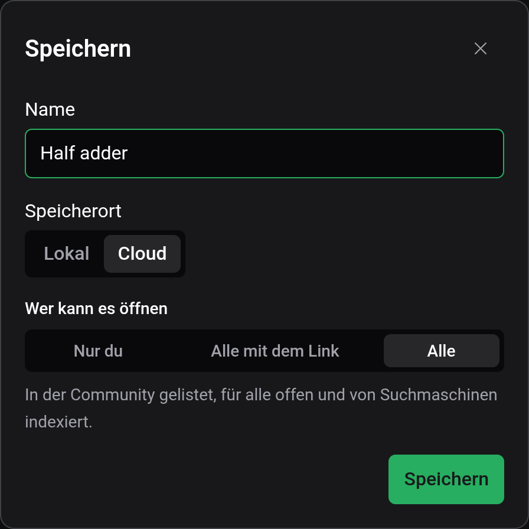
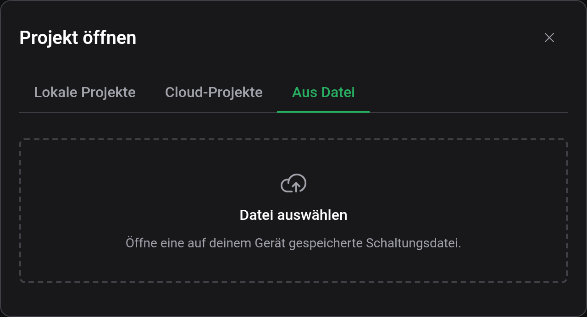
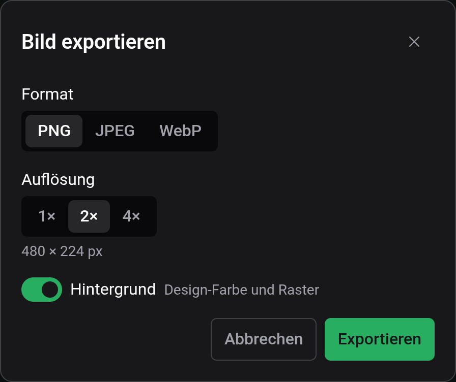

# Speichern und Dateien

Ein Projekt liegt an einem von zwei Orten: in diesem Browser (Lokal) oder in deinem Logigator-Account (Cloud). Dateien auf deinem Gerät dienen zum Exportieren und Importieren, sie sind kein dritter Speicherort. Der Editor speichert nicht automatisch.

## Ein Projekt speichern

Datei → Speichern, die Speichern-Schaltfläche in der Werkzeugleiste oder `Ctrl+S` speichert das offene Projekt. Ein neues Projekt ist bis zum ersten Speichern ein Entwurf, und dabei öffnet sich der Dialog „Speichern“:

- Name, bis 20 Zeichen.
- Speicherort, Lokal oder Cloud. Cloud setzt eine Anmeldung voraus und ist dann vorausgewählt.
- Wer kann es öffnen, nur bei Cloud. Vorausgewählt ist Alle: Das Projekt erscheint dann in der Community und ist über Suchmaschinen auffindbar. Wähle „Nur du“, um es privat zu halten. Siehe [Cloud und Teilen](docs:cloud).

Spätere Speichervorgänge gehen direkt an denselben Ort. Die eine Ausnahme ist ein Cloud-Projekt, das lokale benutzerdefinierte Komponenten verwendet: Beim Speichern öffnet sich zuerst der Dialog „In die Cloud hochladen“, denn ein Cloud-Projekt kann nur Cloud-Komponenten verwenden.

Lokale Projekte bleiben in dem Browser, der sie gespeichert hat. Wie der Dialog warnt, werden sie nicht geräteübergreifend gespeichert und können verloren gehen, wenn die Website-Daten des Browsers gelöscht werden. Was du behalten willst, speicherst du in der Cloud oder exportierst es als Datei.

## Wo ein Projekt gespeichert ist

Das Kennzeichen neben dem Projektnamen zeigt, wo das offene Projekt liegt:

| Kennzeichen | Bedeutung                                                                              |
| ----------- | -------------------------------------------------------------------------------------- |
| Entwurf     | Noch nicht gespeichert.                                                                |
| Lokal       | In diesem Browser gespeichert.                                                         |
| Cloud       | In deinem Account gespeichert.                                                         |
| Geteilt     | Über den Freigabelink einer anderen Person geöffnet. Du kannst es nicht überschreiben. |

Ein Fork-Kennzeichen daneben heißt, dass das Projekt von jemand anderem kopiert wurde. Fahre darüber, um zu sehen, von wem.

Die Statusleiste zeigt „Gespeichert“ oder „Ungespeicherte Änderungen“. Öffnest du mit ungespeicherten Änderungen ein anderes Projekt oder beginnst ein neues, fragt der Editor, ob du sie verwerfen willst, und der Browser warnt dich, bevor du den Tab schließt.

## Öffnen, umbenennen und löschen

Datei → Öffnen (`Ctrl+O`) hat drei Tabs: Lokale Projekte, Cloud-Projekte und Aus Datei. Jede Liste lässt sich durchsuchen, und jede Zeile hat Schaltflächen zum Umbenennen und Löschen des Projekts. Lokale Zeilen lassen sich außerdem in die Cloud hochladen, Cloud-Zeilen teilen.

Der Stift neben dem Projektnamen in der Titelleiste benennt das offene Projekt um.

## Schaltungsdateien

Datei → Als Datei exportieren lädt das offene Projekt als `.lgix`-Datei herunter. Die Datei enthält die Arbeitsfläche und eine Kopie jeder verwendeten benutzerdefinierten Komponente, sie öffnet also auf jedem Rechner vollständig. Sie ist komprimiert, aber weder verschlüsselt noch signiert, jeder kann sie also lesen. Das Exportieren ändert nichts daran, wo das Projekt gespeichert ist.

Zum Importieren öffnest du Datei → Öffnen → Aus Datei und wählst eine Datei. Der Editor liest `.lgix`-Dateien und die `.json`-Dateien, die der alte Logigator-Editor exportiert hat. Der Import wird sofort als neues lokales Projekt gespeichert.

Ein Projekt, das über einen Freigabelink geöffnet wurde, lässt sich nicht exportieren. Klone es zuerst (siehe [Cloud und Teilen](docs:cloud)).

## Ein Bild exportieren

Datei → Bild generieren öffnet den Dialog „Bild exportieren“:

- Format: PNG, JPEG oder WebP.
- Auflösung: 1×, 2× oder 4×, vorausgewählt ist 2×. Wäre das Bild größer, als dein Gerät darstellen kann, wird es verkleinert, und der Dialog sagt das.
- Hintergrund: an zeichnet die Hintergrundfarbe des Designs und das Raster. Aus ergibt ein transparentes PNG oder WebP oder ein weißes JPEG.
- Qualität, 10 bis 100 %, bei JPEG und WebP. PNG ist verlustfrei.

Der Dialog zeigt die endgültige Größe in Pixeln, bevor du exportierst. Ist der Tab einer benutzerdefinierten Komponente offen, wählt ein Feld „Projekt“, welche Schaltung exportiert wird.

## Siehe auch

- [Cloud und Teilen](docs:cloud): hochladen, teilen und klonen
- [Benutzerdefinierte Komponenten](docs:custom-components): die Komponenten, die eine Datei mitnimmt
- [Tastaturbefehle](docs:shortcuts): die Tasten für Speichern und Öffnen ändern
