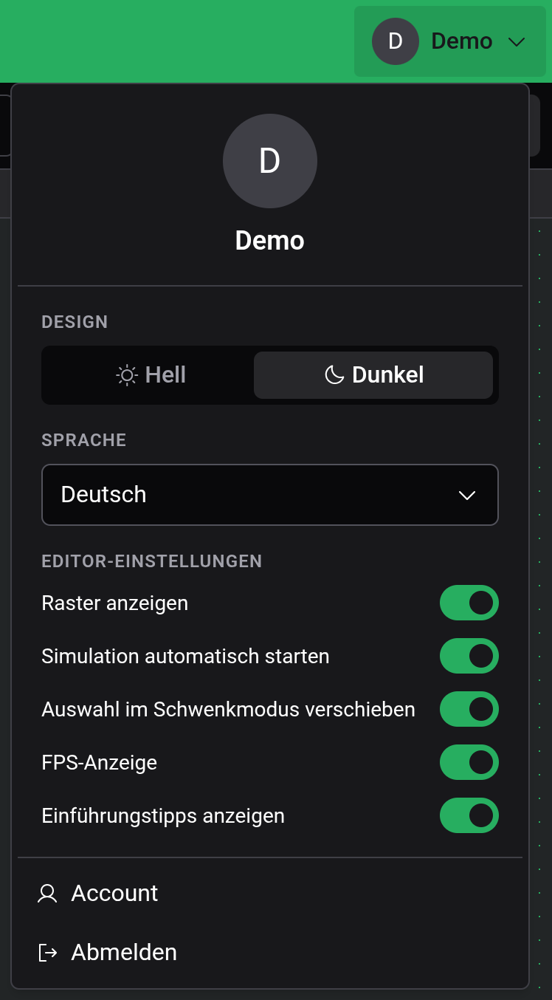

# Einstellungen

Alle Einstellungen findest du im Account-Menü, das du mit der Account-Schaltfläche am rechten Ende der Titelleiste öffnest. In der Touch-Ansicht ist es der Avatar oben links.

## Design und Sprache

Design wechselt zwischen Hell und Dunkel. Standard ist Dunkel. Unter Sprache stehen English, Deutsch, Français und Español zur Wahl. Beides wirkt sofort und gilt auch für die Logigator-Website: Stellst du im Editor die Sprache um, ändert sie sich auch auf der Website, und umgekehrt.

## Editor-Einstellungen

| Einstellung                         | Standard | Was sie bewirkt                                                                                                          |
| ----------------------------------- | -------- | ------------------------------------------------------------------------------------------------------------------------ |
| Raster anzeigen                     | an       | Zeichnet das Punktraster. Komponenten rasten in beiden Fällen ein.                                                       |
| Simulation automatisch starten      | an       | Lässt die Schaltung laufen, sobald du die [Simulation](docs:simulation) betrittst. Aus wartet sie pausiert bei Tick 0.   |
| Auswahl im Schwenkmodus verschieben | an       | Ein Ziehen mit „Schwenken“, das in der Auswahl beginnt, verschiebt die Auswahl. Aus verschiebt jedes Ziehen die Ansicht. |
| FPS-Anzeige                         | aus      | Zeigt die Bilder pro Sekunde in der Ecke der Arbeitsfläche.                                                              |
| Einführungstipps anzeigen           | an       | Zeigt einen Tipp, wenn du bestimmte Werkzeuge zum ersten Mal benutzt. Siehe [Einstieg](docs:getting-started).            |

Diese fünf Einstellungen, deine Tastaturbefehle und der Zustand der Minimap werden nur in diesem Browser gespeichert. Ein anderer Browser oder ein anderes Gerät beginnt mit den Standardwerten, und das Löschen der Website-Daten setzt sie zurück.

## Siehe auch

- [Einstieg](docs:getting-started): das Tutorial und die Tipps
- [Simulation](docs:simulation): wo „Simulation automatisch starten“ wirkt
- [Cloud und Teilen](docs:cloud): Anmeldung und dein Account
