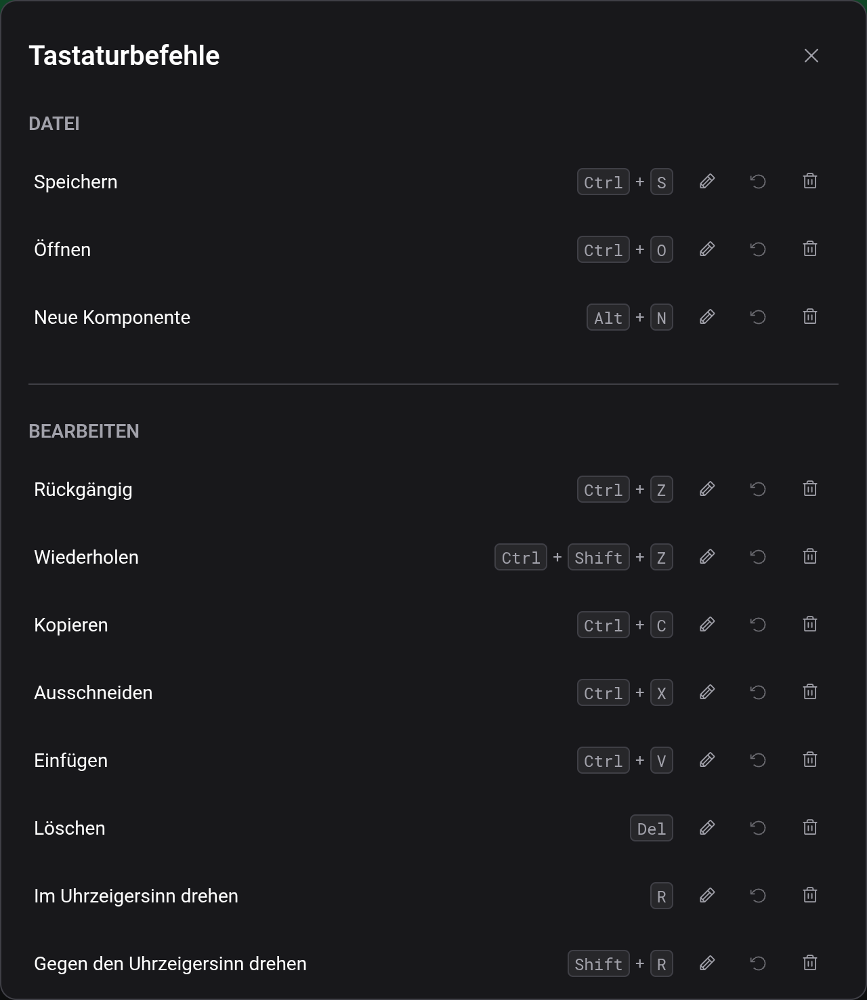

# Tastaturbefehle

Das sind die Standardbelegungen, in der Reihenfolge, in der Bearbeiten → Tastaturbefehle sie auflistet. Auf dem Mac funktioniert `⌘` überall, wo die Tabelle `Ctrl` nennt, und `Ctrl` funktioniert ebenfalls.

## Standardbelegung

| Aktion                                                 | Standard       |
| ------------------------------------------------------ | -------------- |
| Speichern                                              | `Ctrl+S`       |
| Öffnen                                                 | `Ctrl+O`       |
| Neue Komponente                                        | `Alt+N`        |
| Rückgängig                                             | `Ctrl+Z`       |
| Wiederholen                                            | `Ctrl+Shift+Z` |
| Kopieren                                               | `Ctrl+C`       |
| Ausschneiden                                           | `Ctrl+X`       |
| Einfügen                                               | `Ctrl+V`       |
| Löschen                                                | `Delete`       |
| Im Uhrzeigersinn drehen                                | `R`            |
| Gegen den Uhrzeigersinn drehen                         | `Shift+R`      |
| Auswahl nach oben / unten / links / rechts verschieben | Pfeiltasten    |
| Einzoomen                                              | `Ctrl++`       |
| Auszoomen                                              | `Ctrl+-`       |
| Zoom 100%                                              | `Ctrl+0`       |
| Schwenken                                              | `P`            |
| Leitungswerkzeug                                       | `W`            |
| Auswählen                                              | `S`            |
| Radieren                                               | `E`            |
| Text platzieren                                        | `T`            |
| Leitungen an der Auswahlkante schneiden (halten)       | `Alt`          |
| Zur Auswahl hinzufügen oder daraus entfernen (halten)  | `Ctrl`         |
| Simulation starten/stoppen                             | `Enter`        |
| Abbrechen                                              | `Escape`       |

Während du in ein Textfeld tippst, reagiert kein Kürzel außer `Escape`. In einer Simulation sind die Bearbeitungskürzel abgeschaltet, und `Escape` verlässt die Simulation.

## Gehaltene Tasten

Die beiden mit „halten“ markierten Aktionen wirken, solange die Taste gedrückt ist, statt einmal auszulösen. Halte `Alt`, während du einen Auswahlrahmen loslässt, um die Leitungen an seiner Kante zu schneiden (siehe [Arbeitsfläche und Werkzeuge](docs:board-and-tools)). Halte `Ctrl` beim Klicken oder Aufziehen eines Rahmens, um zur Auswahl hinzuzufügen oder daraus zu entfernen. Das funktioniert mit Auswählen, Schwenken und dem Leitungswerkzeug.

## Eine Belegung ändern

Bearbeiten → Tastaturbefehle listet jede Aktion. Klicke auf den Stift daneben und drücke die neue Kombination. `Escape` bricht die Aufzeichnung ab und lässt sich deshalb nicht anders belegen. Eine einzelne Modifikatortaste wie `Alt` kann nur einer der beiden Halte-Aktionen zugewiesen werden.

Gehört die Kombination schon zu einer anderen Aktion, verliert diese sie, und eine Meldung nennt sie. „Zurücksetzen“ stellt die Standardbelegung einer Aktion wieder her, „Zuweisung aufheben“ lässt sie ohne Kürzel, und „Alle zurücksetzen“ stellt alle Standardbelegungen wieder her.

Deine Belegungen werden in diesem Browser gespeichert. Löschst du die Website-Daten, gelten wieder die Standardwerte.

## Siehe auch

- [Arbeitsfläche und Werkzeuge](docs:board-and-tools): die Werkzeuge und Aktionen hinter diesen Tasten
- [Simulation](docs:simulation): was Enter und Escape dort tun
