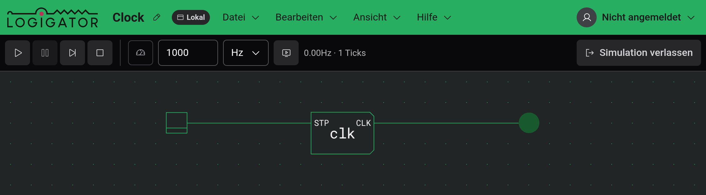

# Simulation

Sobald deine Schaltung gebaut ist, lass sie laufen, um die Signale fließen zu sehen. In der Simulation versorgst du die Schaltung mit Strom, betätigst ihre Eingänge und siehst die Ergebnisse live auf der Arbeitsfläche aufleuchten.

## Eine Simulation starten und verlassen

Drücke die Schaltfläche **Simulation starten** ganz rechts in der Werkzeugleiste, um deine Schaltung mit Strom zu versorgen. Du kannst auch `Enter` drücken.

Während eine Simulation läuft, ist die Arbeitsfläche **für die Bearbeitung gesperrt** — du kannst nichts platzieren, verschieben, verdrahten oder löschen. Du kannst weiterhin frei schwenken und zoomen, und du kannst die Eingänge der Schaltung anklicken (siehe [Mit einer laufenden Schaltung interagieren](#mit-einer-laufenden-schaltung-interagieren)).

Um zur Bearbeitung zurückzukehren, drücke **Simulation verlassen** (wo die Start-Schaltfläche war), oder drücke erneut `Enter` oder `Escape`.

Ob die Simulation **laufend** oder **pausiert** beginnt, hängt von der Einstellung **Simulation automatisch starten** ab. Wenn sie an ist, beginnt die Schaltung in dem Moment zu laufen, in dem du sie betrittst; wenn sie aus ist, wird sie pausiert betreten, sodass du sie selbst starten kannst. Siehe [Einstellungen & Darstellung](docs:settings).

## Die Ausführungssteuerungen

Wenn eine Simulation aktiv ist, tauscht die Werkzeugleiste ihre Zeichenwerkzeuge gegen die Ausführungssteuerungen.

| Steuerung         | Was sie tut                                                                                                                                         |
| ----------------- | --------------------------------------------------------------------------------------------------------------------------------------------------- |
| **Start**         | Startet (oder setzt fort) die Simulation.                                                                                                           |
| **Pause**         | Friert die Simulation an Ort und Stelle ein und behält ihren aktuellen Zustand, sodass du fortsetzen oder steppen kannst.                           |
| **Einzelschritt** | Rückt die Schaltung um einen einzelnen Tick vor. Verfügbar, solange pausiert — praktisch, um ein Signal Schritt für Schritt zu verfolgen.           |
| **Stopp**         | Setzt die Schaltung zurück an den Anfang und löscht jede aufleuchtende Leitung. Die Simulation bleibt aktiv und pausiert, bereit, erneut zu laufen. |

**Stopp** und **Simulation verlassen** sind verschieden: **Stopp** spult die laufende Schaltung an den Anfang zurück, behält dich aber in der Simulation, während **Simulation verlassen** die Simulation ganz verlässt und dich zur Bearbeitung zurückbringt.

## Simulationsgeschwindigkeit

Neben den Ausführungssteuerungen liegt ein Satz von Geschwindigkeitsoptionen und eine Live-Anzeige. Es gibt drei Wege, die Simulation zu takten:

- **Mit Bildrate synchronisieren** — die Schaltung rückt einen Tick pro gezeichnetem Bild vor, sodass ihre Geschwindigkeit der Bildwiederholrate deines Displays folgt. Dies ist der Standard und hält sich schnell ändernde Schaltungen leicht beobachtbar.
- **Auf Zielfrequenz begrenzen** — die Schaltung wird auf eine feste, von dir gewählte Frequenz getaktet. Tippe eine Zahl in das Geschwindigkeitsfeld und wähle ihre Einheit (`Hz`, `kHz` oder `MHz`) aus dem Dropdown. Schalte die Schaltfläche **Auf Zielfrequenz begrenzen** ein, um sie zu nutzen.
- **Freier Lauf** — sind weder **Mit Bildrate synchronisieren** noch **Auf Zielfrequenz begrenzen** eingeschaltet, läuft die Schaltung so schnell, wie sie irgend kann.

Die Anzeige rechts zeigt die **gemessene Geschwindigkeit**, die die Simulation tatsächlich erreicht (zum Beispiel `1kHz`), zusammen mit den insgesamt seit dem Start verstrichenen **Ticks**. Die gemessene Geschwindigkeit kann hinter einer von dir gesetzten Zielfrequenz zurückbleiben, wenn die Schaltung zu groß ist, um mitzuhalten.

## Mit einer laufenden Schaltung interagieren

Nur die Eingänge der Schaltung reagieren auf Klicks, solange sie läuft:

- **Schalter** — ein rastender Eingang. Klicke ihn, um seinen Ausgang an- oder auszuschalten; er bleibt, wo du ihn gelassen hast.
- **Taster** — ein Momenteingang. Klicke ihn, um einen einzelnen Puls an seinem Ausgang auszusenden.

Während sich Signale ausbreiten, **leuchten** unter Strom stehende Leitungen und Anschlüsse auf, und Ausgangskomponenten zeigen ihren Zustand — LEDs glühen, Segment Displays und LED-Matrizen zeigen ihre Muster. Ziehe irgendwo auf der Arbeitsfläche zum Schwenken; das Klicken auf leeren Raum bewirkt nichts.

Um in eine laufende Schaltung hineinzuschauen — den Inhalt eines Speichers zu lesen oder die innere Schaltung einer benutzerdefinierten Komponente live zu beobachten — siehe [Inspektion & Beobachtungen](docs:inspection).

## Wenn eine Simulation nicht startet

Einige Probleme hindern eine Schaltung ganz daran, zu simulieren. Sind welche vorhanden, zeigt **Simulation starten** eine Fehlermeldung und bleibt im Bearbeitungsmodus, sodass du sie beheben kannst. Die häufigsten:

- **Eine nicht unterstützte Komponente** — eine Komponente, die der Simulator nicht ausführen kann. Entferne oder ersetze sie.
- **Eine benutzerdefinierte Komponente, die sich selbst platziert** — eine [benutzerdefinierte Komponente](docs:custom-components), deren innere Schaltung sich selbst enthält, direkt oder über eine andere benutzerdefinierte Komponente, was sich nie auflösen kann. Brich die Schleife auf.
- **Eine benutzerdefinierte Komponente ohne Schaltung** — eine benutzerdefinierte Komponente, die nichts zum Simulieren in sich hat. Gib ihr eine innere Schaltung oder entferne sie.
- **Eine Anschluss-Diskrepanz** — eine benutzerdefinierte Komponente, deren deklarierte Ein-/Ausgangsanschlüsse nicht mit den Eingangs- und Ausgangssteckern übereinstimmen, die tatsächlich in ihrer Schaltung stecken. Bringe die Stecker mit den Anschlüssen in Einklang.

Jede Meldung nennt die betroffene Komponente, damit du sie finden kannst.

## Siehe auch

- [Inspektion & Beobachtungen](docs:inspection) — Speicher lesen und innere Schaltungen live beobachten
- [Komponenten & Optionen](docs:components-and-options) — Schalter, Taster, LEDs und andere Bausteine
- [Benutzerdefinierte Komponenten](docs:custom-components) — eine Schaltung in ein wiederverwendbares Bauteil verpacken
- [Einstellungen & Darstellung](docs:settings) — die Option „Simulation automatisch starten“
- [Tastaturbefehle](docs:shortcuts) — jede Belegung und wie man sie ändert
