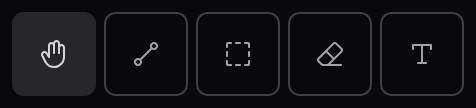
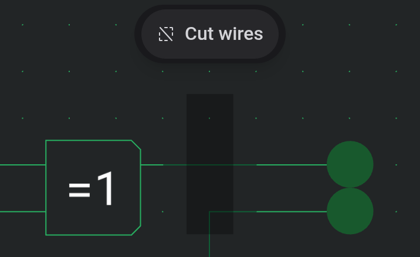

# Board and tools

The board is the grid you build on. Components and wires snap to it, and the status bar at the bottom shows the grid position under the cursor.

## Moving around

The mouse wheel zooms at the pointer, and so does a two-finger swipe or pinch on a trackpad. The zoom buttons in the toolbar and View → Zoom In, Zoom Out and Zoom 100% do the same in fixed steps.

To pan, drag with the right or middle mouse button. That works with every tool. With the Pan tool active, a left drag pans as well.

The minimap in the bottom-right corner shows the whole circuit with a frame around the part in view. Click or drag in it to move the view there. Hide minimap collapses it, and the editor remembers that.

## Tools

One tool is active at a time. Each has a button in the toolbar and a single-key shortcut.

| Tool      | Key | What a drag does                                                       |
| --------- | --- | ---------------------------------------------------------------------- |
| Pan       | `P` | Pans the board, or moves the selection if you start inside it          |
| Wire tool | `W` | Draws a wire (see [Wires and connections](docs:wires-and-connections)) |
| Select    | `S` | Draws a selection box, or moves the selection if you start inside it   |
| Eraser    | `E` | Deletes everything it passes over                                      |
| Text      | `T` | Places a text label (a click is enough)                                |

A click without dragging selects the element under the pointer in Pan, Wire tool and Select. The Wire tool first checks for a port or a wire crossing, since tapping those negates or connects instead.

## Placing components

Click a component in the palette and it follows the cursor as a ghost. Click the board to drop it. The ghost stays attached afterwards, so you can drop several in a row. `R` and `Shift+R` turn the ghost before you drop it, and the next one keeps that direction.

Nothing is placed where the ghost overlaps another component. Press `Escape` or pick a tool to stop placing.

## Selecting and moving

With Select, drag a box over the elements you want. Every component and wire the box touches is selected. Hold `Ctrl` (`⌘` on a Mac) to change the selection instead of replacing it: a click adds or removes one element, and a box adds what it covers. This works in Pan and the Wire tool too.

Drag the selection to move it. `R` rotates it clockwise, `Shift+R` counter-clockwise, and the arrow keys move it one grid step. When the selection ends up on top of something, it stays lifted and follows your next moves until it reaches a free spot.

`Escape` works in stages: it cancels a drag in progress, otherwise clears the selection, otherwise switches to Pan.

## Cutting wires at the selection edge

Normally a selection box takes whole wires. In scissor mode it cuts every wire that crosses its edge and selects only the pieces inside, which lets you lift a section out of the middle of a bus.

While Select is active, a Cut wires button floats at the top of the board and switches the mode on and off. On a keyboard you can also hold `Alt` while releasing the box to cut just that once.

## Copy, paste and delete

Copy (`Ctrl+C`), Cut (`Ctrl+X`), Paste (`Ctrl+V`) and Delete (`Delete`) are in the toolbar and the Edit menu. Pasted elements appear as a ghost under the cursor, or in the middle of the view if the pointer is not over the board. Drag the ghost to a free spot and release to drop it. `Escape` or a click outside the ghost cancels.

Undo (`Ctrl+Z`) and Redo (`Ctrl+Shift+Z`) cover every edit.

## Erasing

With the Eraser, click an element to delete it or drag across several. Pressing `Escape` before you let go brings back everything that drag erased.

## See also

- [Wires and connections](docs:wires-and-connections): drawing wires and connecting crossings
- [Components and options](docs:components-and-options): the parts you place
- [Phones and tablets](docs:phones-and-tablets): the same tools in the touch layout
- [Keyboard shortcuts](docs:shortcuts): changing the keys used here
