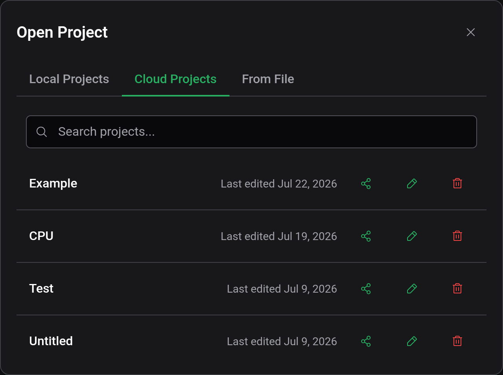
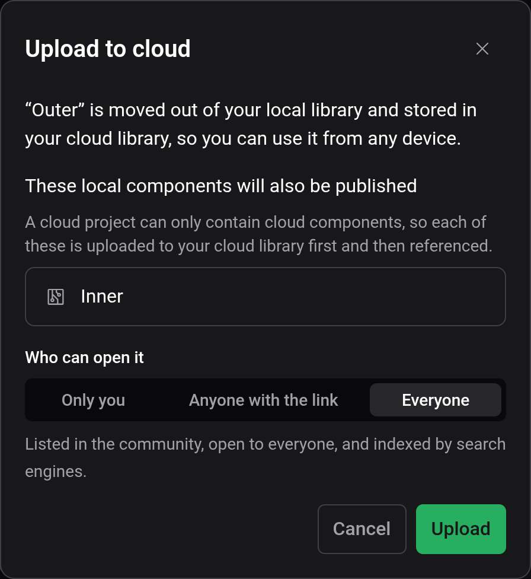
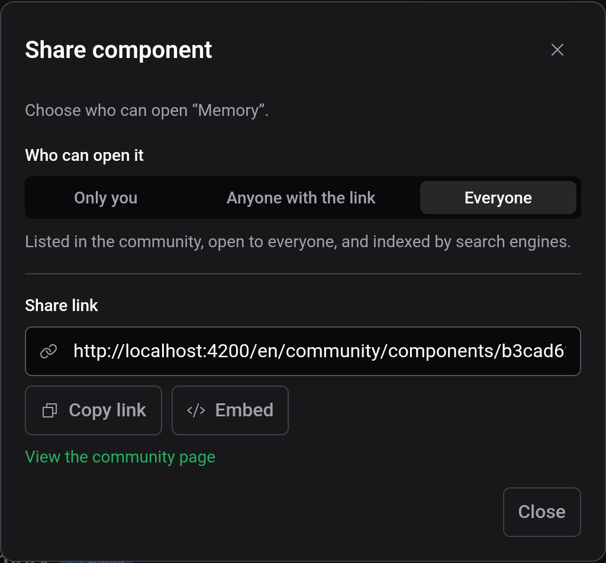

# Cloud and sharing

With a Logigator account, projects and custom components are stored in the cloud and open on any device you sign in on. Cloud documents can be shared by link or published in the community on the Logigator website. Everything else in the editor works without an account.

## Signing in and out

The account menu at the right end of the title bar shows Log In and Sign Up while you are signed out. Both open the Logigator website in a new tab, and the editor notices by itself once you have signed in there. Signed in, the menu shows Account, which opens your account page on the website, and Log Out.

If a cloud project or component has unsaved changes when you log out, the editor asks whether to save first: Save & Log Out, Log Out without Saving, or Cancel. After logging out, an open cloud project is replaced by an empty Draft and cloud components' tabs close. Local projects and components are not affected.

## Local and cloud

Local documents live in this browser and are gone if its site data is cleared. Cloud documents live in your account. The chip next to the project name says which one the open project is, and File → Open lists them in separate tabs, Local Projects and Cloud Projects. The Open dialog starts on Cloud Projects when you are signed in.

On the website, My projects and My components list your cloud documents as well. You can create, rename, share and delete them there, and open them in the editor.

## Uploading to the cloud

To move a saved local project to your account, choose File → Upload to cloud, or the upload button on its row in the Open dialog. To save a Draft to the cloud directly, pick Cloud in the Save dialog. For a local custom component, use Upload to cloud in its settings card.

A cloud project can only use cloud components. If yours uses local ones, the upload dialog lists them and uploads them along with it. The dialog also asks who can open the upload, with Everyone preselected, and the same choice applies to the uploaded components. Uploading moves the documents: the local copies are deleted.

## Sharing

File → Share opens the share dialog for a cloud project. The Share button on a row of the Cloud Projects tab does the same, and a cloud component has Share in its settings card. Local documents have to be uploaded first.

Who can open it has three choices, and each change applies right away:

| Choice               | Who can open it                                                                                            |
| -------------------- | ---------------------------------------------------------------------------------------------------------- |
| Only you             | Nobody else. The link is not shown.                                                                        |
| Anyone with the link | Whoever has the link. It stays out of the community listings and out of search engines.                    |
| Everyone             | Everyone. The document is listed in the community and can be found by search engines, once it has content. |

The share link leads to the document's page on the Logigator website. The Share button hands it to your device's share menu, or copies it where there is none. Embed gives a snippet in Markdown, HTML or BBCode, with a picture of the circuit linking to its page, to paste into a forum post or a wiki. View the community page opens that page.

Regenerate link replaces the link, and the old one stops working at once for everyone who has it. It is only offered for Anyone with the link: a published document's address is its link, and a private one has no link on display. Switching a document from Anyone with the link to Only you and back keeps the same link.

## Opening someone else's link

A share link opens the document's page on the website, with Open in editor and Save a copy. Save a copy asks you to sign in, copies the document into your cloud library and opens the copy. For documents set to Everyone, the page can also be starred.

In the editor, a shared document carries the Shared chip. You can change it and try it out, but you can't save it or export it. File → Clone to my projects, or Clone to my components for a component, saves a copy to your cloud library. The copy is made from the version the owner saved, without your changes, and starts out as Anyone with the link. Later edits on either side don't affect the other.

## See also

- [Saving and files](docs:saving-and-files): saving, files and image export
- [Custom components](docs:custom-components): components that travel with a project
- [Settings](docs:settings): the account menu
