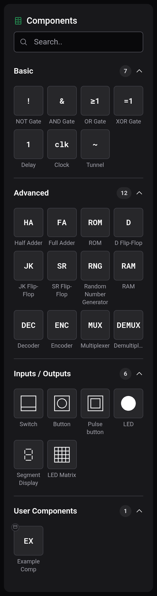
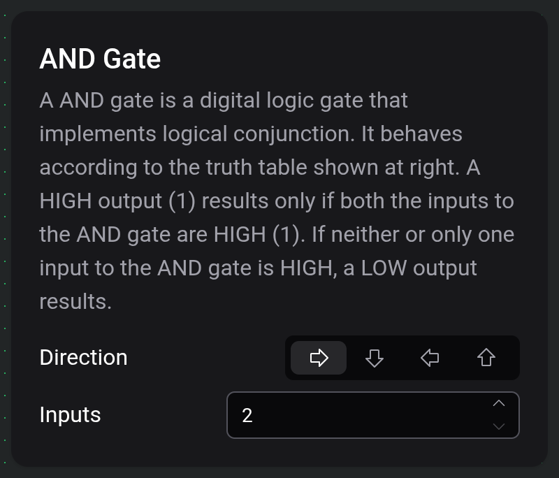
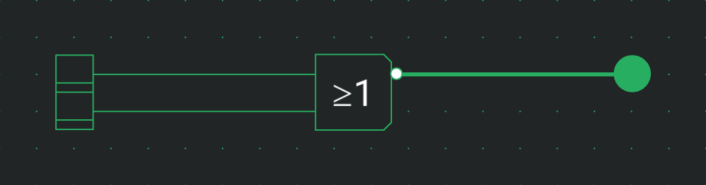

# Components and options

Components are the parts a circuit is made of: gates, memories, inputs and displays. You pick them from the palette on the left and set their options in the settings card.

## The palette

The search field at the top filters the palette by name. The categories are Basic, Advanced and Inputs / Outputs, plus User Components once you have built a [custom component](docs:custom-components). Click a category header to fold it. How placing works is described in [Board and tools](docs:board-and-tools).

Every component takes one tick to pass a change on to its output. The tables list each component's options besides Direction, which every component has.

### Basic

| Component | What it does                                                                                                                 | Options                    |
| --------- | ---------------------------------------------------------------------------------------------------------------------------- | -------------------------- |
| NOT Gate  | Inverts its input.                                                                                                           |                            |
| AND Gate  | Outputs 1 when every input is 1.                                                                                             | Inputs, 2 to 64            |
| OR Gate   | Outputs 1 when at least one input is 1.                                                                                      | Inputs, 2 to 64            |
| XOR Gate  | Outputs 1 when an odd number of inputs are 1.                                                                                | Inputs, 2 to 64            |
| Delay     | Passes its input through unchanged, one tick later.                                                                          |                            |
| Clock     | Sends a one-tick pulse, then stays at 0 for Delay ticks, and repeats. While its STP input is 1, it stays at 0.               | Delay, from 1              |
| Tunnel    | Connects to every other tunnel with the same label, without a wire. See [Wires and connections](docs:wires-and-connections). | Label, up to 10 characters |

### Advanced

| Component               | What it does                                                                                                              | Options                                                |
| ----------------------- | ------------------------------------------------------------------------------------------------------------------------- | ------------------------------------------------------ |
| Half Adder              | Adds A and B. S is the sum bit, C the carry.                                                                              |                                                        |
| Full Adder              | Adds A, B and the carry-in Cin. S is the sum bit, C the carry.                                                            |                                                        |
| ROM                     | Outputs the stored word at the address on its inputs. It has no clock.                                                    | Word Size 1 to 64, Address Size 1 to 11, Edit contents |
| D Flip-Flop             | Stores D on the rising edge of CLK. Q is the stored bit, !Q its inverse.                                                  |                                                        |
| JK Flip-Flop            | On the rising edge of CLK, J sets the bit, K resets it, and both together toggle it.                                      |                                                        |
| SR Flip-Flop            | On the rising edge of CLK, S sets the bit and R resets it.                                                                |                                                        |
| Random Number Generator | Puts a new random value on its outputs on every rising edge of CLK.                                                       | Outputs, 1 to 64                                       |
| RAM                     | On the rising edge of CLK, reads the word at the address onto the outputs, or stores the data inputs there while WE is 1. | Word Size 1 to 64, Address Size 1 to 16                |
| Decoder                 | Turns on the one output whose number is the binary value on the inputs.                                                   | Inputs, 1 to 6                                         |
| Encoder                 | Outputs the number of the highest input that is 1.                                                                        | Outputs, 1 to 6                                        |
| Multiplexer             | Passes the data input chosen by the select lines to its output. There are 2ⁿ data inputs for n select lines.              | Select lines, 1 to 6                                   |
| Demultiplexer           | Passes input I to the output chosen by the select lines.                                                                  | Select lines, 1 to 6                                   |

### Inputs / Outputs

| Component       | What it does                                                                                                                                                      | Options                                    |
| --------------- | ----------------------------------------------------------------------------------------------------------------------------------------------------------------- | ------------------------------------------ |
| Switch          | Toggles between 0 and 1 with each click during a simulation.                                                                                                      |                                            |
| Button          | Outputs 1 for as long as you hold it down.                                                                                                                        |                                            |
| Pulse button    | Outputs a one-tick pulse per click.                                                                                                                               |                                            |
| LED             | Lights up while its input is 1.                                                                                                                                   |                                            |
| Segment Display | Shows the binary number on its inputs, input 0 being the lowest bit.                                                                                              | Inputs 1 to 16, Base decimal, hex or octal |
| LED Matrix      | A square grid of LEDs. On the rising edge of CLK, the data inputs are written into the row the address inputs select. At 16 × 16, each address covers half a row. | Width/Height 4, 8 or 16                    |

## The settings card

Selecting a single component, or picking one to place, shows its settings card next to the board: the name, a description, and the options. Direction has four arrow buttons that turn the component. A direction chosen while placing is kept for the next component of that type. The card is hidden during a simulation.

Changing Inputs, Outputs or a size option changes the number of ports right away.

For a ROM, Edit contents opens a hex editor for the stored words. Word Size sets how many bits a word has and Address Size how many address inputs there are, so a ROM with Address Size 4 holds 16 words. The contents are saved with the circuit.

## Negating a port

With the Wire tool, tap an input or output port to add a negation bubble. The signal through that port is then inverted, with no extra delay. Tap the bubble again to remove it. While you hover a port, the Wire tool shows what a tap would do. A bubble on a flip-flop's CLK input makes it react to the falling edge instead.

Tunnels, Input and Output plugs and the ports of a placed custom component can't be negated.

## Text labels

Text isn't in the palette. With the Text tool (`T`), click the board to place a label reading "[insert text]". Edit text in its settings card opens a dialog for the text, which can run over several lines, and Font size ranges from 2 to 128. Wires pass through labels without connecting. Clicking a wire that runs under a label selects the wire.

## See also

- [Wires and connections](docs:wires-and-connections): connecting ports
- [Custom components](docs:custom-components): building your own parts
- [Simulation](docs:simulation): operating switches and buttons
- [Board and tools](docs:board-and-tools): placing, moving and rotating
