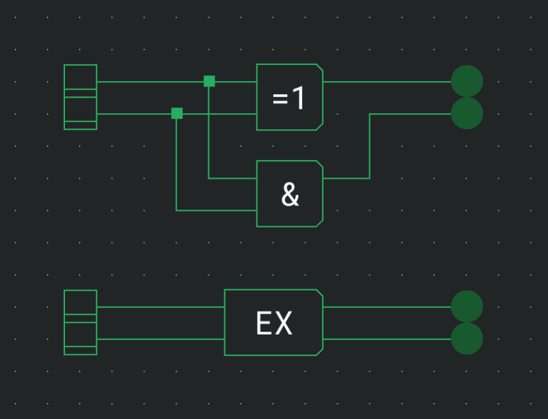
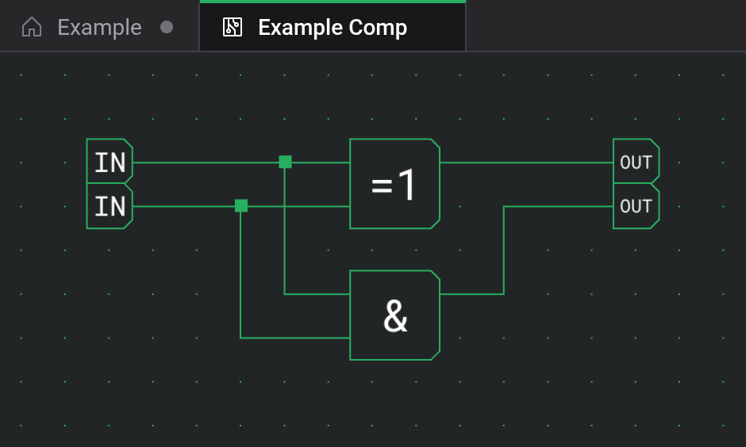

# Custom components

A custom component turns a circuit into a single part with its own symbol and named ports. Build a counter once, and every copy of it on the board is one box instead of a dozen gates.

## Creating a component

File → New Component (`Alt+N`), or the New Component button in the toolbar, opens a dialog:

- Name, up to 20 characters, is how the component appears in the palette.
- Symbol, up to 5 characters, is drawn on its box.
- Description is optional.
- Store decides where the component is kept. Local keeps it in this browser. Cloud keeps it in your account and needs you to be signed in; it also asks who can open it, with Everyone preselected (see [Cloud and sharing](docs:cloud)).

Create opens the component in a new tab with an empty board. Save (`Ctrl+S`) in that tab saves the component.

## Ports

While a component's tab is active, a Ports panel sits above the palette. Place Input and Output plugs from it and wire them into the circuit. Each plug becomes one port of the finished component.

The panel lists the plugs. Type into a row to name the port, with up to 5 characters, which is shown next to the port on the component's box. Drag the rows to change the order of the ports; where the plugs sit on the board doesn't matter.

## Placing and updating

Saved components appear in the palette under User Components, the most recently edited first. Place them like any other part. Each copy on the board is a box with the symbol and one port per plug.

A placed copy keeps the circuit the component had when you placed it. Editing the component later changes none of the copies until you update them. The settings card of an outdated copy offers Update to latest for that copy and Update all instances for every outdated copy in the open circuit, with the count in brackets. Both can be undone. The palette tile carries an arrow while copies are outdated.

To change the circuit, choose Edit circuit in the settings card of a placed copy or of the palette tile. Edit details changes the name, symbol and description.

## Nesting

Components can contain other components. A component can never contain itself, directly or through another one, so while you edit one, the palette hides every component that would create such a loop.

When you save, share or export a circuit, the components it uses are included, so it opens complete anywhere.

## Deleting

Delete in the settings card removes the component from your library. Copies already placed stay in their circuits and show an Embedded chip. Restore & edit on such a copy brings it back into your local library. Deleting a cloud component also stops its share link from working.

## See also

- [Components and options](docs:components-and-options): the built-in parts
- [Inspection and watches](docs:inspection): looking inside a running copy
- [Cloud and sharing](docs:cloud): uploading and sharing components
- [Saving and files](docs:saving-and-files): how components travel in files
