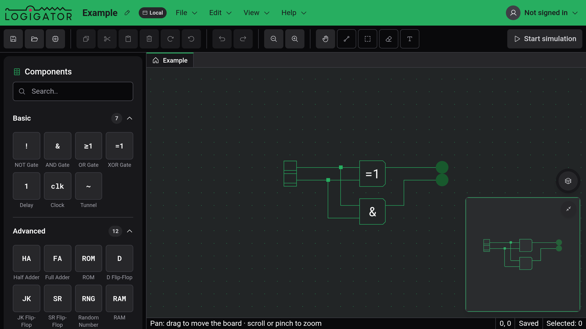

# Getting started

Logigator is a logic circuit simulator that runs in the browser. You place gates on a grid, draw wires between them and press Start simulation to watch signals move through the circuit. A finished circuit can be saved as a [custom component](docs:custom-components) and used as a single block inside a bigger one.

You don't need an account. Without one, projects are saved in the browser or [exported to a file](docs:saving-and-files). Signing in adds [cloud storage and share links](docs:cloud).

## The editor window

- The board in the middle is the grid you build on. The mouse wheel zooms, and dragging with the right or middle button pans.
- The title bar shows the project's name and where it is stored (Draft, Local, Cloud or Shared), followed by the File, Edit, View and Help menus. The pencil next to the name renames the project.
- The toolbar holds buttons for saving and opening, the clipboard, rotating, undo and zoom, then the five [tools](docs:board-and-tools), and Start simulation at the right end.
- The component palette on the left lists every part you can place.
- The status bar at the bottom shows a hint for the active tool, the cursor's grid position, Saved or Unsaved changes, and how many elements are selected.
- The minimap and the Report a bug button sit in the bottom-right corner of the board.

When you edit a custom component, a tab bar appears above the board with Main project and one tab per open component.

In a window 1024 px wide or narrower, the editor switches to a touch layout with different controls. See [Phones and tablets](docs:phones-and-tablets).

## Tutorial and tips

On your first visit, a card over the board offers a tutorial that builds an AND gate with two switches and an LED. It takes about a minute. Start tutorial begins it, the ✕ closes the card, and Skip tutorial ends the tutorial at any step.

The first time you use certain tools, such as the Wire tool or scissor select, a short tip explains them. Each tip appears once. Turn off all tips in any tip, or the Show onboarding tips setting, stops them. Help → Show tips again turns them back on, shows the ones you have already seen again, and brings back the tutorial card.

## Help menu

- What's New lists the changes in each release. It opens by itself once after each update.
- Documentation opens these pages inside the editor.
- About shows the version you are running, the license (GNU AGPL v3) and links to the source code, the privacy policy and the imprint.
- Cookie Settings reopens the consent dialog. It is only there when the editor runs with the consent banner.

## Reporting a problem

The bug button in the bottom-right corner opens Report a problem. Describe what you did before it went wrong. Your current project, browser details and recent activity are attached to the report. If the editor hits an unexpected error, the same form opens by itself with the error details included.

## See also

- [Board and tools](docs:board-and-tools): moving around, placing, selecting and erasing
- [Components and options](docs:components-and-options): every part and its options
- [Simulation](docs:simulation): running a circuit
- [Keyboard shortcuts](docs:shortcuts): every binding and how to change it
