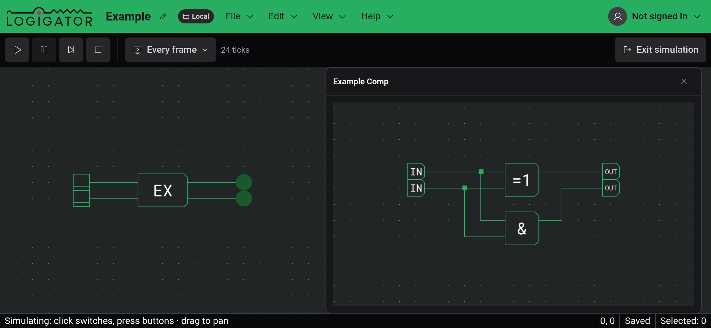
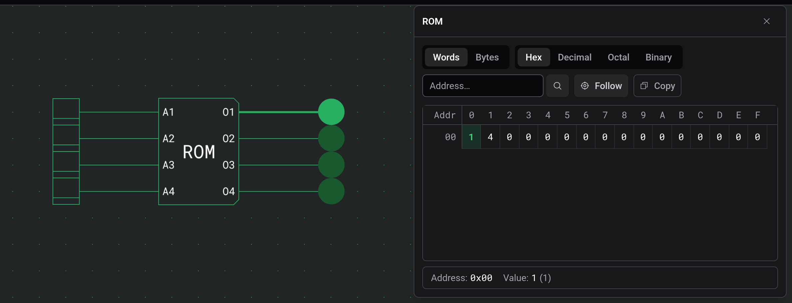
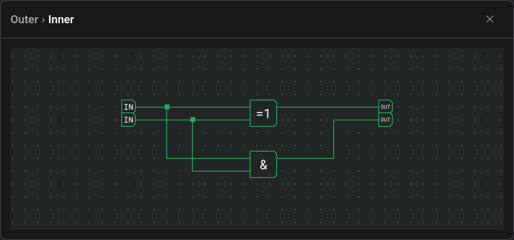

# Inspection and watches

During a [simulation](docs:simulation), running or paused, two kinds of component can be opened to see inside them. Clicking a ROM shows its contents with the word it is currently reading highlighted. Clicking a custom component opens a watch, a live view of its inner circuit.

On a desktop, each view opens as a window that you can move and resize. Clicking the component again brings its window to the front. In the [touch layout](docs:phones-and-tablets), ROM views share a sheet at the bottom of the screen and a watch fills the whole screen. Leaving the simulation closes all of them.

## ROM contents

The viewer is read-only; you change the contents in the ROM's settings while editing. The word at the current address is highlighted, and with Follow on (the default) the table scrolls along as the address changes. The line at the bottom shows the address and value of the highlighted cell. Clicking another cell shows that one instead until the address next changes.

The buttons above the table choose Words or Bytes and the number base: Hex, Decimal, Octal or Binary. To jump to an address, type it in hex into the Address… field. Copy puts the whole table on the clipboard as text, in the view and base you picked.

## Watches

A watch draws the component's inner circuit with the same lit wires as the board. You can pan and zoom inside it, and operate the switches and buttons it contains. They drive the real simulation, so the rest of the circuit reacts.

Clicking a custom component inside a watch opens its circuit in the same window, and the title shows the path, such as Outer › Inner. Click an earlier name to go back up. A ROM inside a watch opens its own viewer.

If the watch reports that the inner circuit does not match the compiled simulation, the component was changed after the simulation started. Leave the simulation and start it again.

## See also

- [Simulation](docs:simulation): running a circuit
- [Custom components](docs:custom-components): building the components you watch
- [Components and options](docs:components-and-options): ROM options and contents
