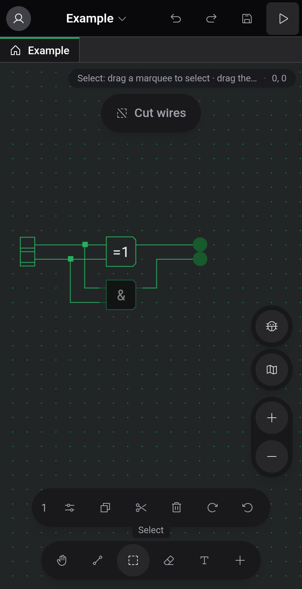

# Phones and tablets

When the window is 1024 px wide or narrower, the editor switches to a touch layout: the menu bar, toolbar, palette and status bar give way to floating controls around the board. This happens on phones, on most tablets held upright, and in a narrow desktop window. The rest of this documentation describes the wide layout. This page covers what is different.

## Where things are

- At the top left, your avatar opens the Account drawer with theme, language, the editor settings, and signing in or out.
- Tapping the project name opens the project menu: New Project, New Component, Open, Upload to cloud or Share, Export to file, Generate image, Repair Wires and the Help entries.
- Undo, redo, save and start simulation are buttons at the top right.
- A pill in the top-right corner shows the hint for the active tool and the grid position.
- The bar at the bottom holds the five tools and a + button that opens the Components sheet. While you edit a custom component, a Ports button is added.
- The zoom buttons, the bug button and the minimap are on the right edge. The minimap starts collapsed.

The layout has no status bar, so the Saved / Unsaved changes indicator and the storage chip next to the project name are missing. Keyboard shortcuts still work with an attached keyboard, but you can only change them in the wide layout.

## Gestures

Drag with two fingers to pan and pinch to zoom. A one-finger drag depends on the tool: it draws a wire, a selection box or an eraser stroke, and only pans with the Pan tool.

To place a component, tap +, pick it from the sheet and tap the board where it should go.

## Selection and clipboard

When something is selected, a bar above the tools shows how many elements that is, with buttons for Copy, Cut, Delete and both rotations, and Paste once the clipboard holds something. With a single component selected, a Settings button opens its options in a sheet.

After a copy, the bar stays up with Paste even when nothing is selected. Its ✕ empties the clipboard and closes the bar. Pasted elements land in the middle of the view: drag them to a free spot and lift your finger to drop them, or tap somewhere else to cancel.

## Simulation and inspection

The play button at the top starts the simulation. The run controls then appear in a bar along the bottom edge, and the exit button replaces undo, redo and save at the top.

Tapping a ROM opens its viewer in a sheet at the bottom of the screen. The board above stays usable, and several viewers share the sheet as tabs. A custom component's watch fills the whole screen, and its back arrow returns to the board. See [Inspection and watches](docs:inspection).

## See also

- [Board and tools](docs:board-and-tools): what each tool does
- [Simulation](docs:simulation): run controls and speed
- [Settings](docs:settings): theme, language and editor settings
