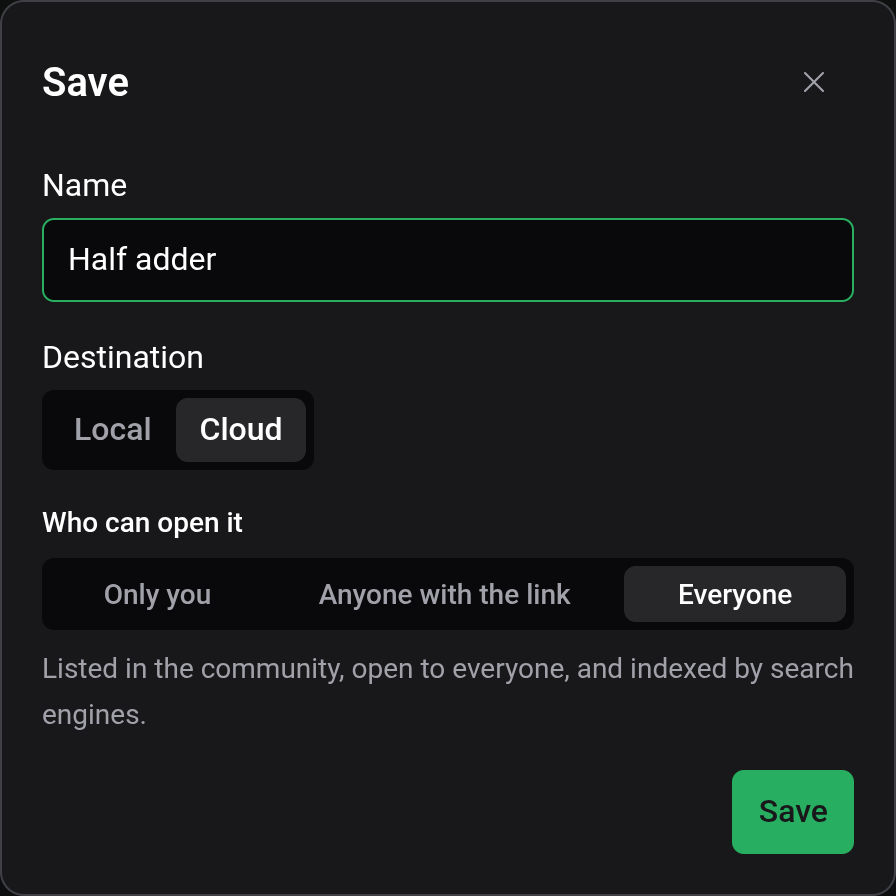
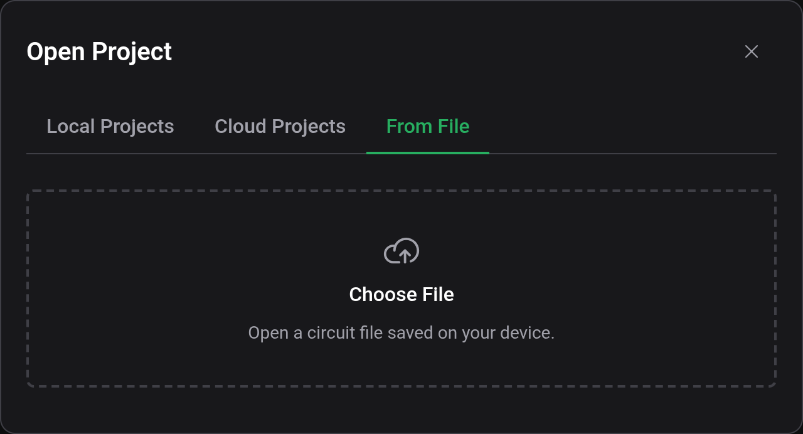
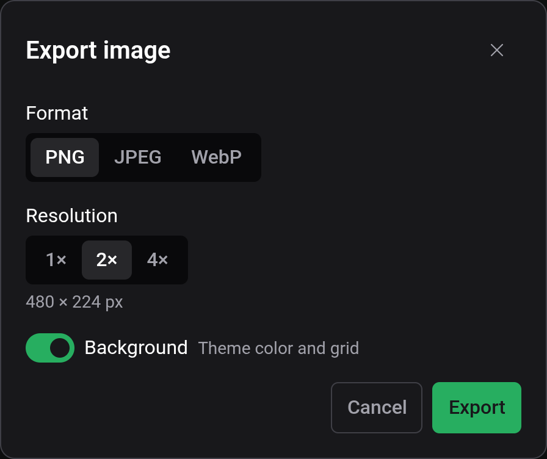

# Saving and files

A project is stored in one of two places: in this browser (Local) or in your Logigator account (Cloud). Files on your device are for exporting and importing, not a third place to save to. The editor doesn't save automatically.

## Saving a project

File → Save, the toolbar's save button or `Ctrl+S` saves the open project. A new project is a Draft until its first save, which opens the Save dialog:

- Name, up to 20 characters.
- Destination, Local or Cloud. Cloud needs you to be signed in and is preselected when you are.
- Who can open it, for Cloud only. Everyone is preselected, which lists the project in the community and lets search engines find it. Pick Only you to keep it private. See [Cloud and sharing](docs:cloud).

Later saves go straight back to the same place. The one exception is a cloud project that uses local custom components: saving it first opens the Upload to cloud dialog, because a cloud project can only use cloud components.

Local projects stay in the browser that saved them. As the Save dialog warns, they are not persisted across devices and may be lost when the browser's site data is cleared. Save anything you want to keep to the cloud or export it to a file.

## Where a project is stored

The chip next to the project name shows where the open project lives:

| Chip   | Meaning                                                        |
| ------ | -------------------------------------------------------------- |
| Draft  | Not saved yet.                                                 |
| Local  | Saved in this browser.                                         |
| Cloud  | Saved in your account.                                         |
| Shared | Opened from someone else's share link. You can't save over it. |

A Fork chip beside it means the project was copied from someone else's. Hover it to see from whom.

The status bar shows Saved or Unsaved changes. Opening another project or starting a new one with unsaved changes asks whether to discard them, and the browser warns you before you close the tab.

## Opening, renaming and deleting

File → Open (`Ctrl+O`) has three tabs: Local Projects, Cloud Projects and From File. Each list can be searched, and each row has buttons to rename or delete the project. Local rows can also be uploaded to the cloud, and cloud rows shared.

The pencil next to the project name in the title bar renames the open project.

## Circuit files

File → Export to file downloads the open project as a `.lgix` file. The file contains the board and a copy of every custom component it uses, so it opens complete on any computer. It is compressed but not encrypted or signed, so anyone can read it. Exporting doesn't change where the project is saved.

To import, open File → Open → From File and choose a file. The editor reads `.lgix` files and the `.json` files the old Logigator editor exported. The import is saved right away as a new Local project.

A project opened from a share link can't be exported. Clone it first (see [Cloud and sharing](docs:cloud)).

## Exporting an image

File → Generate image opens the Export image dialog:

- Format: PNG, JPEG or WebP.
- Resolution: 1×, 2× or 4×, with 2× preselected. If the image would be larger than your device can render, it is scaled down and the dialog says so.
- Background: on draws the theme's background colour and the grid. Off gives a transparent PNG or WebP, or a white JPEG.
- Quality, 10 to 100 %, for JPEG and WebP. PNG is lossless.

The dialog shows the final size in pixels before you export. With a custom component's tab open, a Project field chooses which circuit to export.

## See also

- [Cloud and sharing](docs:cloud): uploading, sharing and cloning
- [Custom components](docs:custom-components): the components a file carries
- [Keyboard shortcuts](docs:shortcuts): changing the Save and Open keys
