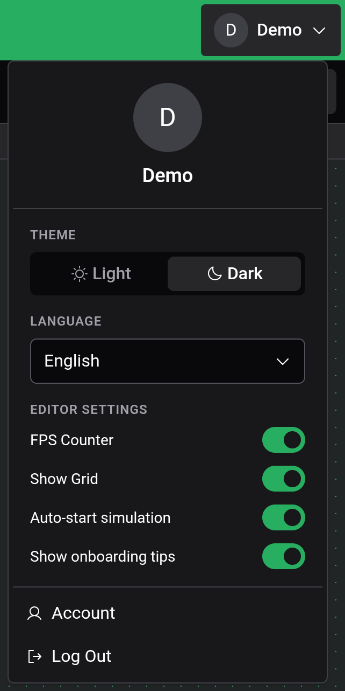

# Settings & Appearance

Logigator has a handful of preferences for tailoring the editor to your taste. You'll find them all in one place: open the **account menu** in the top-right corner of the editor. (On a phone or tablet, open the menu from the top-left.)

## Theme

Switch between a **Light** and a **Dark** appearance. The choice applies immediately across the whole editor.

## Language

Logigator is available in several languages:

- **English**
- **Deutsch** (German)
- **Français** (French)
- **Español** (Spanish)

Pick one from the **Language** dropdown; the interface updates right away.

## Editor settings

Three on/off toggles change how the board behaves:

- **Show Grid** — draws the dotted grid on the board. On by default. Turn it off for a cleaner canvas; components still snap to the grid either way.
- **FPS Counter** — shows a small frames-per-second readout over the board. Off by default; handy when checking performance on a large circuit.
- **Auto-start simulation** — when on (the default), pressing **Start simulation** begins running the circuit immediately. Turn it off to enter [simulation](docs:simulation) paused, so you can step through it from the very first tick.

## Onboarding tips

The **Show onboarding tips** toggle controls the just-in-time hints that appear the first time you use a feature. Turn it off to silence them, or back on to see them again. The same switch is reset by **Help → Show tips again**, which also re-offers the guided tutorial. See [Getting Started](docs:getting-started).

## Where these settings are stored

All of these preferences — theme, language, the editor toggles and your tip settings — are saved in **this browser**, on this device. They aren't tied to your account, so a different browser or device starts from the defaults. Clearing the browser's site data resets them.

## See also

- [Cloud & Sharing](docs:cloud) — your account, signing in and out, and cloud storage
- [Getting Started](docs:getting-started) — the guided tutorial and a tour of the editor
- [Simulation](docs:simulation) — where the Auto-start simulation option takes effect
