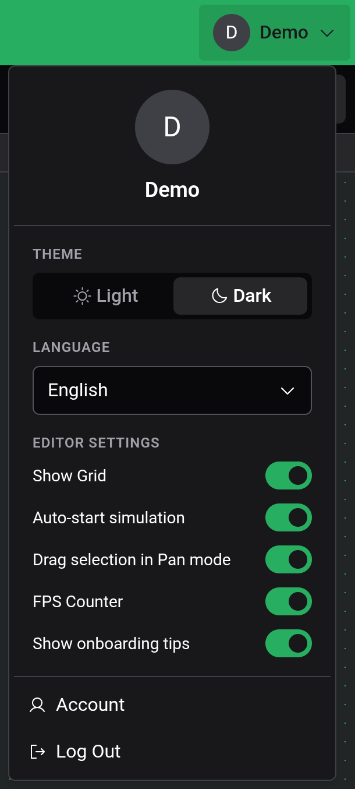

# Settings

All settings are in the account menu, opened from the account button at the right end of the title bar. In the touch layout it is the avatar at the top left.

## Theme and language

Theme switches between Light and Dark. Dark is the default. Language offers English, Deutsch, Français and Español. Both apply immediately, and both are shared with the Logigator website: changing the language in the editor changes it on the site too, and the other way round.

## Editor settings

| Setting                    | Default | What it does                                                                                                   |
| -------------------------- | ------- | -------------------------------------------------------------------------------------------------------------- |
| Show Grid                  | on      | Draws the dot grid. Components snap to the grid either way.                                                    |
| Auto-start simulation      | on      | Starts the circuit running as soon as you enter [simulation](docs:simulation). Off, it waits paused at tick 0. |
| Drag selection in Pan mode | on      | A drag with the Pan tool that starts inside the selection moves the selection. Off, every drag pans.           |
| FPS Counter                | off     | Shows frames per second in the corner of the board.                                                            |
| Show onboarding tips       | on      | Shows a tip the first time you use certain tools. See [Getting started](docs:getting-started).                 |

These five settings, your keyboard shortcuts and the minimap's state are stored in this browser only. A different browser or device starts with the defaults, and clearing the site data resets them.

## See also

- [Getting started](docs:getting-started): the tutorial and tips
- [Simulation](docs:simulation): where Auto-start simulation applies
- [Cloud and sharing](docs:cloud): signing in and your account
