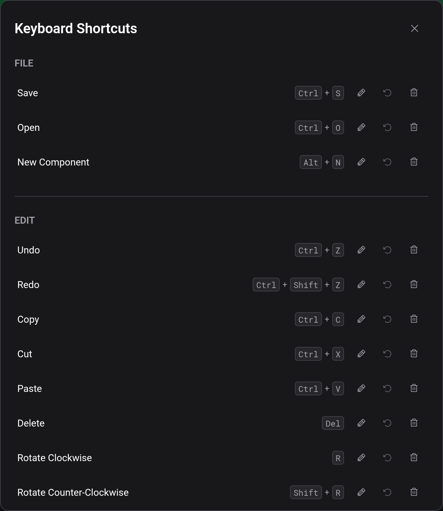

# Keyboard shortcuts

These are the default bindings, in the order Edit → Keyboard Shortcuts lists them. On a Mac, `⌘` works wherever the table says `Ctrl`, and `Ctrl` works as well.

## Default bindings

| Action                                  | Default        |
| --------------------------------------- | -------------- |
| Save                                    | `Ctrl+S`       |
| Open                                    | `Ctrl+O`       |
| New Component                           | `Alt+N`        |
| Undo                                    | `Ctrl+Z`       |
| Redo                                    | `Ctrl+Shift+Z` |
| Copy                                    | `Ctrl+C`       |
| Cut                                     | `Ctrl+X`       |
| Paste                                   | `Ctrl+V`       |
| Delete                                  | `Delete`       |
| Rotate Clockwise                        | `R`            |
| Rotate Counter-Clockwise                | `Shift+R`      |
| Move Selection Up / Down / Left / Right | arrow keys     |
| Zoom In                                 | `Ctrl++`       |
| Zoom Out                                | `Ctrl+-`       |
| Zoom 100%                               | `Ctrl+0`       |
| Pan                                     | `P`            |
| Wire Tool                               | `W`            |
| Select                                  | `S`            |
| Erase                                   | `E`            |
| Place Text                              | `T`            |
| Cut Wires at Selection Edge (hold)      | `Alt`          |
| Add to or Remove from Selection (hold)  | `Ctrl`         |
| Start/Stop Simulation                   | `Enter`        |
| Cancel                                  | `Escape`       |

Shortcuts do nothing while you type in a text field, except `Escape`. During a simulation, the editing shortcuts are switched off and `Escape` leaves the simulation.

## Held keys

The two actions marked "hold" act while the key is down instead of firing once. Hold `Alt` while releasing a selection box to cut the wires at its edge (see [Board and tools](docs:board-and-tools)). Hold `Ctrl` while clicking or drawing a box to add to the selection or remove from it. That works with Select, Pan and the Wire tool.

## Changing a binding

Edit → Keyboard Shortcuts lists every action. Click the pencil next to one and press the new combination. `Escape` cancels the recording, which is why it can't be bound to anything else. A single modifier key such as `Alt` can only be bound to the two held actions.

If the combination already belongs to another action, that action loses it and a message says which one. Reset puts one action back to its default, Unassign leaves it without a shortcut, and Reset All restores every default.

Your bindings are stored in this browser. Clearing the site data resets them.

## See also

- [Board and tools](docs:board-and-tools): the tools and actions these keys trigger
- [Simulation](docs:simulation): what Enter and Escape do there
