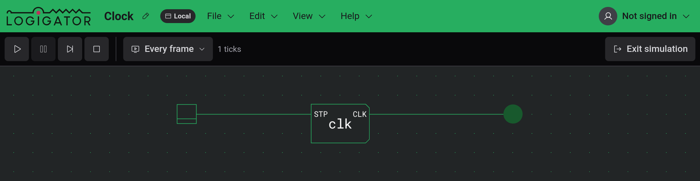
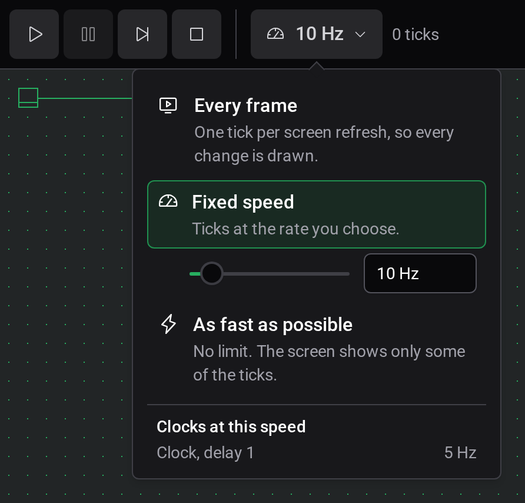

# Simulation

Start simulation, at the right end of the toolbar, powers the circuit: powered wires light up, LEDs and displays show their state, and switches and buttons respond to clicks. `Enter` does the same.

## Entering and leaving

The simulation always runs the main project. If a custom component's tab is open, the editor switches back to Main project first.

While it runs, the board is locked. You can pan and zoom, operate inputs and [inspect](docs:inspection) ROMs and custom components, but not place, move, wire or delete anything. Exit simulation, `Enter` or `Escape` returns to editing with the Pan tool.

With the Auto-start simulation setting on (the default), the circuit starts running as soon as you enter. With it off, the simulation waits paused at tick 0 so you can step from the start.

## Run controls

While a simulation is active, the toolbar is replaced by four buttons, the speed button and a readout.

| Button | What it does                                                                                 |
| ------ | -------------------------------------------------------------------------------------------- |
| Run    | Starts or resumes the simulation.                                                            |
| Pause  | Stops at the current tick and keeps the state.                                               |
| Step   | Advances one tick. Only available while paused.                                              |
| Stop   | Resets the circuit to tick 0, turns every switch off and pauses. You stay in the simulation. |

The readout shows the ticks since the start and, while running, the speed actually reached.

## Speed

The speed button shows the current setting. Clicking it opens a panel with three modes, which you can switch while the circuit runs:

- Every frame, the default, advances one tick per screen refresh, so the speed follows your display's refresh rate.
- Fixed speed ticks at a rate you set, 1 kHz to begin with. The slider goes from 1 Hz to 10 MHz. In the box next to it you can type any rate from 0.1 Hz up, such as `20`, `2.5k` or `1M`. A red box means the input is not a rate, and the last valid one stays in effect. If the circuit is too large to keep up, a warning sign appears next to the readout.
- As fast as possible runs without a limit. The screen then shows only some of the ticks.

Under the modes, Clocks at this speed lists the frequency each clock delay in the circuit produces. A clock is on for one tick and off for Delay ticks, so one cycle takes Delay + 1 ticks: at 10 Hz, a clock with delay 1 runs at 5 Hz and one with delay 4 at 2 Hz. With Fixed speed the list is there right away. In the other two modes the rate has to be measured first, so the list appears about a second after the circuit starts running.

## Operating inputs

- A Switch toggles with each click and stays where you left it.
- A Button is on for as long as you hold it down.
- A Pulse button sends a pulse of one tick per click, however long you hold it.

Dragging from anywhere else on the board pans it.

## When the simulation won't start

The editor refuses to start and shows a message naming the component when:

- a custom component contains itself, directly or through another one,
- a custom component has no circuit inside it,
- a custom component's ports no longer match the Input and Output plugs in its circuit.

Fix the named component and start again. If the message says the simulation engine could not start, your browser does not support WebAssembly.

## See also

- [Inspection and watches](docs:inspection): ROM contents and watches
- [Components and options](docs:components-and-options): what each input and display does
- [Settings](docs:settings): Auto-start simulation
- [Phones and tablets](docs:phones-and-tablets): the run controls in the touch layout
