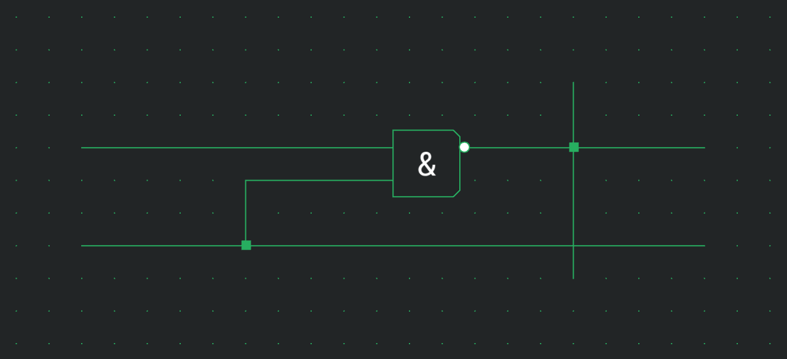
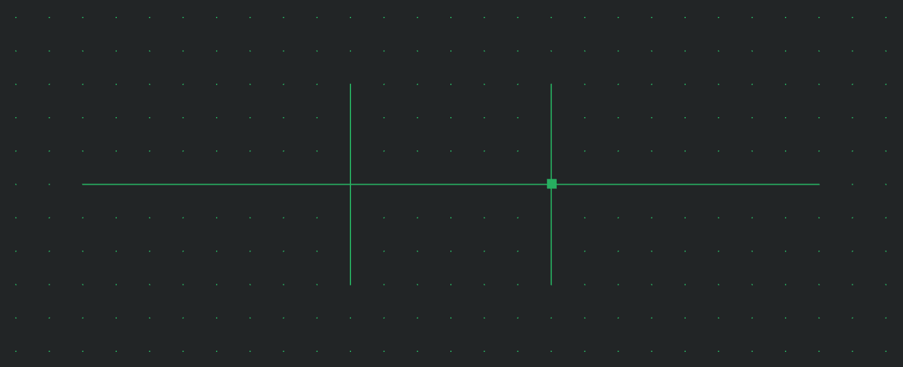
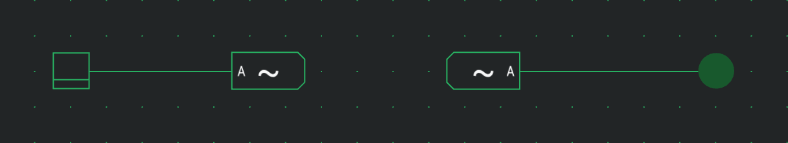

# Wires & Connections

Wires carry signals between component ports. This page covers drawing them, controlling where they connect, and joining parts wirelessly with tunnels.

## Drawing wires

Pick the **Wire** tool from the toolbar (shortcut `W`), then drag on the board. Wires are always straight, running horizontally or vertically along the grid. Drag diagonally and the wire routes as an **L-shape**: the direction you move first sets the first leg, and the bend follows your cursor.

Release to place the wire. A wire endpoint that lands on a component port connects to it automatically. While you drag, a segment that would run through a component's body turns red and won't be placed — route around it instead.

To extend a run, just draw another wire starting from the end of an existing one. Wires that meet end-to-end join into a single connected path.

## Junctions: when wires connect

Where wires meet, Logigator follows a simple rule so you stay in control of your circuit:

- A wire that **ends on** another wire connects to it. A small **connection dot** marks the join.
- Two wires that simply **cross** — neither one ending at the crossing — pass over each other **without** connecting. There is no dot, and no signal flows between them.

This lets you route wires across each other freely without creating accidental connections.

### Toggling a crossing

To connect two wires that merely cross, pick the **Wire** tool and tap the crossing point: a connection dot appears and the wires are now joined. Tap the same dot again to split them back apart. Hovering the crossing with the Wire tool previews what a tap will do — the dot it would add, or the existing dot it would remove.

You will also see connection dots appear on their own wherever three or more wire ends (or a wire end and a component port) come together. These dots are just a visual cue showing where things are electrically connected; you don't place or select them.

## Negating a port

With the **Wire** tool you can also tap directly on a component's port to invert the signal there — a small **negation bubble** appears on the port. This is covered in full on the [Components & Options](docs:components-and-options) page.

## Tunnels: wireless connections

A **Tunnel** connects points on your board without a wire running between them. Every tunnel carrying the same **label** is electrically joined, as if a wire linked them. This keeps busy boards tidy — for example, routing a clock or a shared bus across the circuit without drawing long wires.

To use tunnels:

1. Place a **Tunnel** from the palette's **Basic** category and wire it to the signal you want to carry.
2. Place another Tunnel wherever you want that signal to reappear.
3. Select each Tunnel and give them the **same Label** in the settings card.

All tunnels with matching labels behave as one connected net; tunnels with different labels stay independent.

## Cutting and rearranging wires

The **Select** tool moves and removes wires along with anything else you select, and its scissor mode trims a wire exactly at the edge of your selection box — handy for slicing one wire out of a bundle. The **Erase** tool deletes wires you click or drag across. Both are covered in [Board & Tools](docs:board-and-tools).

## See also

- [Components & Options](docs:components-and-options) — the parts these wires connect, and port negation
- [Simulation](docs:simulation) — running the circuit and watching powered wires light up
- [Board & Tools](docs:board-and-tools) — the Wire tool, selecting, cutting and erasing
