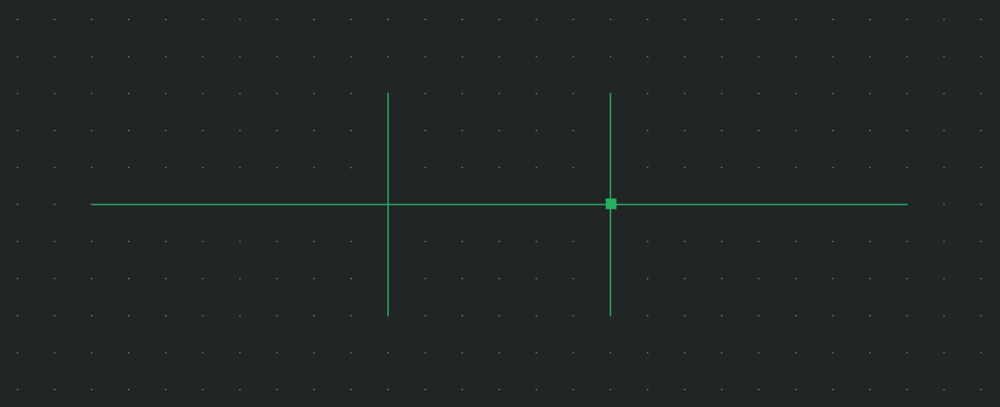
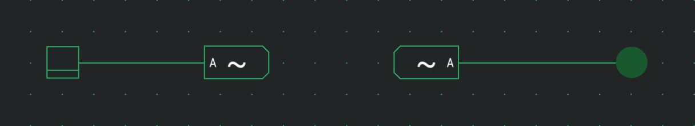

# Wires and connections

Wires carry signals between ports. They run horizontally and vertically along the grid, and a signal spreads through every wire that is connected to it.

## Drawing wires

Pick the Wire tool (`W`) and drag. A drag that moves diagonally draws an L: the direction you move in first becomes the first leg. To change your mind, go back to the starting point and set off in the other direction.

A wire can start at a port, at a junction or anywhere along another wire, and it connects wherever it ends on a port. While you drag, a leg that would run through a component turns red. Releasing with a red leg places nothing.

A wire drawn over an existing one merges into it, and two wires that meet end to end in a straight line become one.

## Where wires connect

A wire that ends on another wire connects to it, and a wire that runs across a port's tip connects to that port. Two wires that only cross, with neither ending there, stay separate. That lets you route wires over each other without connecting them.

A connection dot appears wherever three or more wire ends and port tips meet. A plain crossing has no dot.

To connect a crossing, tap it with the Wire tool. A dot appears and the four legs are connected. Tap the dot again to separate them. Hovering a crossing shows what a tap would do. A dot where a wire ends on another one can't be removed this way; delete or move the wire instead.

## Tunnels

A Tunnel connects to every other tunnel on the same board that has the same label, as if a wire ran between them. Use them to carry a clock or a bus across a large board. Every new tunnel starts with the label 0, so two new tunnels are connected until you change one of them. Labels are case-sensitive and up to 10 characters long.

Tunnels only connect within one circuit. A tunnel inside a custom component never connects to one outside it.

## Repairing wires

Edit → Repair Wires checks the board for wire problems, such as overlapping pieces, that make connections behave unexpectedly, and fixes them. When a loaded circuit has such problems, the editor offers the repair with a Repair wires button. Check afterwards that the circuit still does what it should. Repairing during a simulation stops the simulation first.

## See also

- [Board and tools](docs:board-and-tools): selecting, cutting and erasing wires
- [Components and options](docs:components-and-options): negating a port
- [Simulation](docs:simulation): watching powered wires light up
