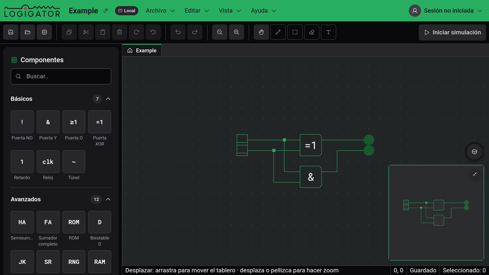
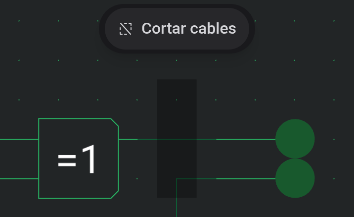

# Tablero y herramientas

El tablero es la cuadrícula donde construyes tu circuito. Esta página explica cómo moverte por él y cómo funciona cada herramienta de edición.

## Moverse por el tablero

- **Zoom**: desplaza la rueda del ratón sobre el tablero, o pellizca en un dispositivo táctil. También puedes usar los botones de zoom de la barra de herramientas, **Vista → Acercar / Alejar**, o **Vista → Zoom 100%** para restablecer el tamaño real.
- **Desplazar**: elige la herramienta **Desplazar** (la mano) y arrastra. También puedes desplazarte desde _cualquier_ herramienta arrastrando con el **botón derecho del ratón**, así que rara vez necesitas cambiar de herramienta solo para reposicionar.
- **Táctil**: arrastra con dos dedos para desplazarte y pellizca para hacer zoom en cualquier momento; un arrastre con un solo dedo solo se desplaza mientras la herramienta Desplazar está activa.

La **barra de estado** de la parte inferior siempre muestra un breve recordatorio de lo que hace la herramienta activa, además de la posición de tu cursor en la cuadrícula.

## Las herramientas de la barra de herramientas

El grupo de la derecha de la barra de herramientas contiene las cinco herramientas de dibujo. Solo una está activa a la vez; cada una tiene además un atajo de una sola tecla.

| Herramienta     | Atajo | Qué hace                                                                                                                                                        |
| --------------- | ----- | --------------------------------------------------------------------------------------------------------------------------------------------------------------- |
| **Desplazar**   | `P`   | Arrastra para mover el tablero; desplaza o pellizca para hacer zoom.                                                                                            |
| **Cable**       | `W`   | Arrastra para dibujar cables; toca un puerto para negarlo, o toca un cruce para conectar o dividir. Consulta [Cables y conexiones](docs:wires-and-connections). |
| **Seleccionar** | `S`   | Arrastra un recuadro para seleccionar elementos; arrastra la selección para moverla.                                                                            |
| **Borrar**      | `E`   | Haz clic o arrastra sobre los elementos para eliminarlos.                                                                                                       |
| **Texto**       | `T`   | Coloca una etiqueta de texto en el tablero.                                                                                                                     |

## Colocar componentes

Para añadir un componente, elígelo de la [paleta de componentes](docs:components-and-options) de la izquierda. Un fantasma del componente sigue entonces a tu cursor por el tablero; muévelo donde quieras, luego pulsa y suelta para colocarlo. La colocación permanece activa, así que puedes colocar varios del mismo componente seguidos. Pulsa `Escape`, o elige otra herramienta, para dejar de colocar.

Un componente no se puede colocar encima de otro elemento; el fantasma muestra dónde caerá.

## Seleccionar, mover y girar

Con la herramienta **Seleccionar**, arrastra un recuadro (un marco) sobre los elementos que quieras. Todo lo que el recuadro toque —componentes y cables— queda seleccionado. Para mover una selección, arrastra desde dentro de ella hasta un nuevo sitio.

Una vez que algo está seleccionado puedes:

- **Girarlo**: pulsa `R` para el sentido horario, `Shift+R` para el sentido antihorario, o usa los botones de girar de la barra de herramientas.
- **Moverlo** un solo paso de cuadrícula a la vez con las **teclas de flecha**.

Como al colocar, un movimiento o una rotación solo se confirman cuando los elementos caen en un sitio libre.

## Cortar cables en el borde de la selección

La herramienta de selección tiene un modo **tijera** que recorta los cables exactamente en el borde de tu recuadro de selección, en lugar de agarrar cables enteros. Esto es útil para extraer un cable del medio de un bus.

Una pequeña pastilla flota sobre el tablero mientras la herramienta de selección está activa; haz clic en ella para activar el modo tijera. En el escritorio también puedes simplemente **mantener `Alt`** mientras arrastras el recuadro de selección para cortar durante ese arrastre; la pastilla se ilumina para indicar que el modo está activado. Todo lo que el recuadro contenga por completo permanece seleccionado, y los cables que cruzan el borde del recuadro se cortan ahí.

## Copiar, cortar, pegar y eliminar

La edición estándar funciona sobre la selección actual:

- **Copiar** (`Ctrl+C`) y **Cortar** (`Ctrl+X`) colocan la selección en el portapapeles; cortar además la elimina.
- **Pegar** (`Ctrl+V`) trae de vuelta los elementos copiados bajo el cursor, o en el centro de la vista en pantallas táctiles. Llegan como un fantasma que posicionas: arrástralos a un sitio libre y suelta para colocarlos, o pulsa `Escape` para cancelar.
- **Eliminar** (`Delete`) elimina la selección.

Estos comandos también están en la barra de herramientas y en el menú **Editar**. Toda edición se puede deshacer con **Deshacer** (`Ctrl+Z`) y rehacer con **Rehacer** (`Ctrl+Shift+Z`).

## Borrar

La herramienta **Borrar** (el borrador) es la forma más rápida de quitar cosas: haz clic en un elemento para eliminarlo, o arrastra sobre varios para barrerlos todos. Pulsa `Escape` a mitad de un arrastre para cancelar y restaurar lo que borraste.

## El minimapa

El minimapa de la esquina inferior derecha muestra todo tu circuito a la vez, con un marco que señala la parte que estás viendo actualmente, útil para orientarte en un tablero grande. Contráelo con su alternancia cuando necesites el espacio.

## Consulta también

- [Cables y conexiones](docs:wires-and-connections): dibujar cables, cruces y alternar conexiones
- [Componentes y opciones](docs:components-and-options): las piezas que colocas y configuras
- [Atajos de teclado](docs:shortcuts): cambia cualquiera de las asignaciones usadas aquí
