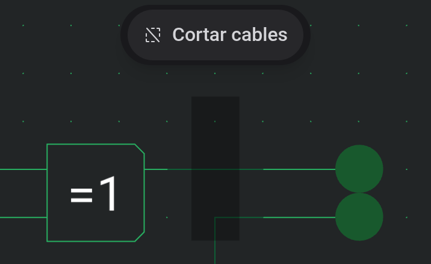

# Tablero y herramientas

El tablero es la cuadrícula en la que construyes. Los componentes y los cables se ajustan a ella, y la barra de estado de abajo muestra la posición de la cuadrícula bajo el cursor.

## Moverse

La rueda del ratón hace zoom en la posición del puntero, igual que deslizar dos dedos o pellizcar en el panel táctil. Los botones de zoom de la barra de herramientas y Vista → Acercar, Alejar y Zoom 100% hacen lo mismo en pasos fijos.

Para desplazar la vista, arrastra con el botón derecho o central del ratón. Funciona con cualquier herramienta. Con la herramienta Desplazar activa, arrastrar con el botón izquierdo también desplaza.

El minimapa, en la esquina inferior derecha, muestra todo el circuito con un marco alrededor de la parte visible. Haz clic o arrastra en él para llevar la vista allí. «Ocultar minimapa» lo pliega, y el editor lo recuerda.

## Herramientas

Solo hay una herramienta activa a la vez. Cada una tiene un botón en la barra de herramientas y un atajo de una tecla.

| Herramienta          | Tecla | Qué hace un arrastre                                                         |
| -------------------- | ----- | ---------------------------------------------------------------------------- |
| Desplazar            | `P`   | Desplaza la vista, o la selección si empiezas dentro de ella                 |
| Herramienta de cable | `W`   | Traza un cable (consulta [Cables y conexiones](docs:wires-and-connections))  |
| Seleccionar          | `S`   | Traza un marco de selección, o mueve la selección si empiezas dentro de ella |
| Borrador             | `E`   | Elimina todo lo que atraviesa                                                |
| Texto                | `T`   | Coloca una etiqueta de texto (basta un clic)                                 |

Un clic sin arrastrar selecciona el elemento bajo el puntero en Desplazar, Herramienta de cable y Seleccionar. La herramienta de cable comprueba antes si has tocado un puerto o un cruce de cables, porque tocarlos niega o conecta en su lugar.

## Colocar componentes

Haz clic en un componente de la paleta y una vista previa sigue al cursor. Un clic en el tablero lo coloca. La vista previa sigue en el cursor después, así que puedes colocar varios seguidos. `R` y `Shift+R` giran la vista previa antes de colocarla, y el siguiente componente conserva esa dirección.

No se coloca nada donde la vista previa se solapa con otro componente. `Escape` o elegir otra herramienta termina la colocación.

## Seleccionar y mover

Con Seleccionar, traza un marco sobre los elementos que quieras. Se selecciona cada componente y cada cable que toque el marco. Mantén `Ctrl` (`⌘` en Mac) para cambiar la selección en lugar de sustituirla: un clic añade o quita un elemento, y un marco añade lo que cubre. También funciona en Desplazar y en la herramienta de cable.

Arrastra la selección para moverla. `R` la gira en sentido horario, `Shift+R` en sentido antihorario, y las flechas la mueven un paso de la cuadrícula. Si la selección cae encima de otra cosa, queda levantada y sigue tus movimientos siguientes hasta llegar a un sitio libre.

`Escape` actúa por pasos: cancela un arrastre en curso; si no lo hay, vacía la selección; y si tampoco, cambia a Desplazar.

## Cortar cables en el borde de la selección

Normalmente un marco de selección toma cables enteros. En el modo de corte, corta cada cable que cruza su borde y selecciona solo los trozos de dentro, con lo que puedes sacar un tramo del centro de un bus.

Mientras Seleccionar está activa, un botón «Cortar cables» flota en la parte superior del tablero y activa o desactiva el modo. Con teclado también puedes mantener `Alt` al soltar el marco para cortar solo esa vez.

## Copiar, pegar y eliminar

Copiar (`Ctrl+C`), Cortar (`Ctrl+X`), Pegar (`Ctrl+V`) y Eliminar (`Delete`) están en la barra de herramientas y en el menú Editar. Los elementos pegados aparecen como vista previa bajo el cursor, o en el centro de la vista si el puntero no está sobre el tablero. Arrastra la vista previa a un sitio libre y suelta para colocarla. `Escape` o un clic fuera de la vista previa cancela.

Deshacer (`Ctrl+Z`) y Rehacer (`Ctrl+Shift+Z`) sirven para cualquier edición.

## Borrar

Con el borrador, haz clic en un elemento para eliminarlo o arrastra sobre varios. Si pulsas `Escape` antes de soltar, vuelve todo lo que ese arrastre borró.

## Ver también

- [Cables y conexiones](docs:wires-and-connections): trazar cables y conectar cruces
- [Componentes y opciones](docs:components-and-options): las piezas que colocas
- [Móviles y tabletas](docs:phones-and-tablets): las mismas herramientas en la vista táctil
- [Atajos de teclado](docs:shortcuts): cambiar las teclas usadas aquí
