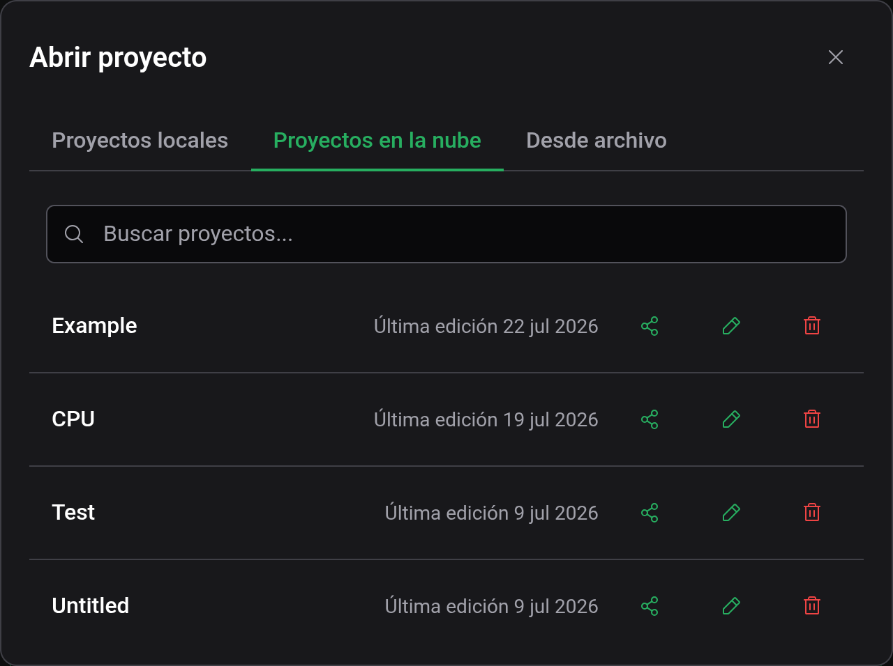
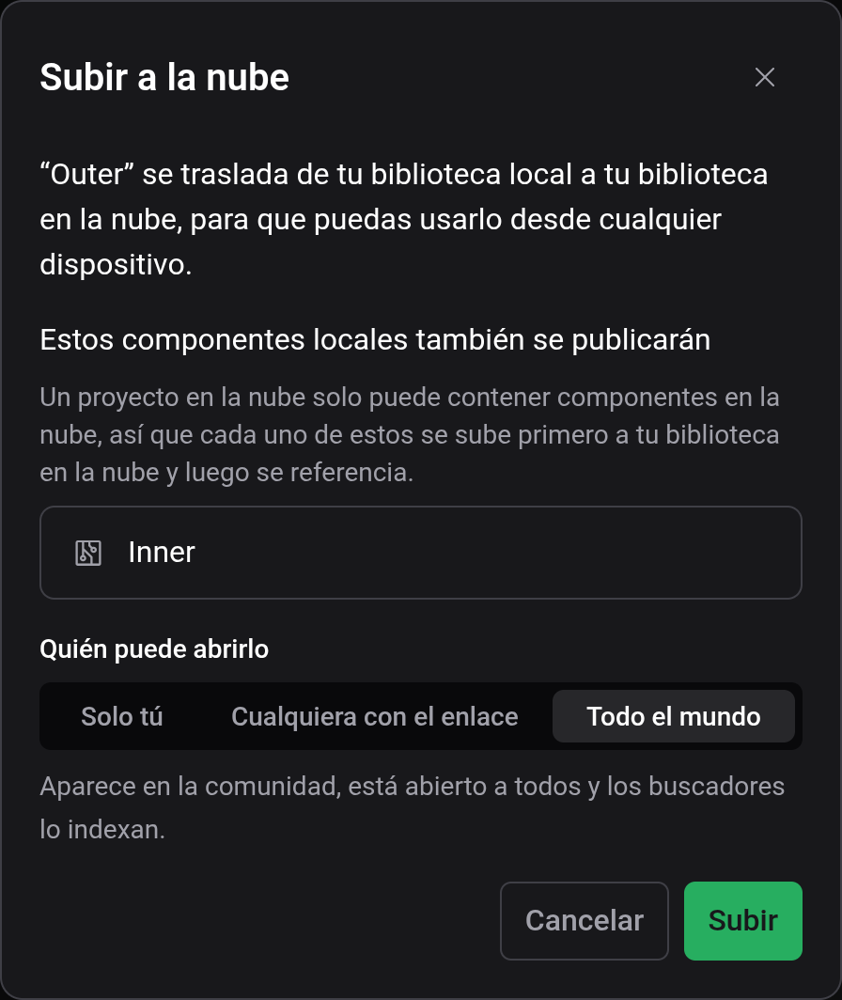
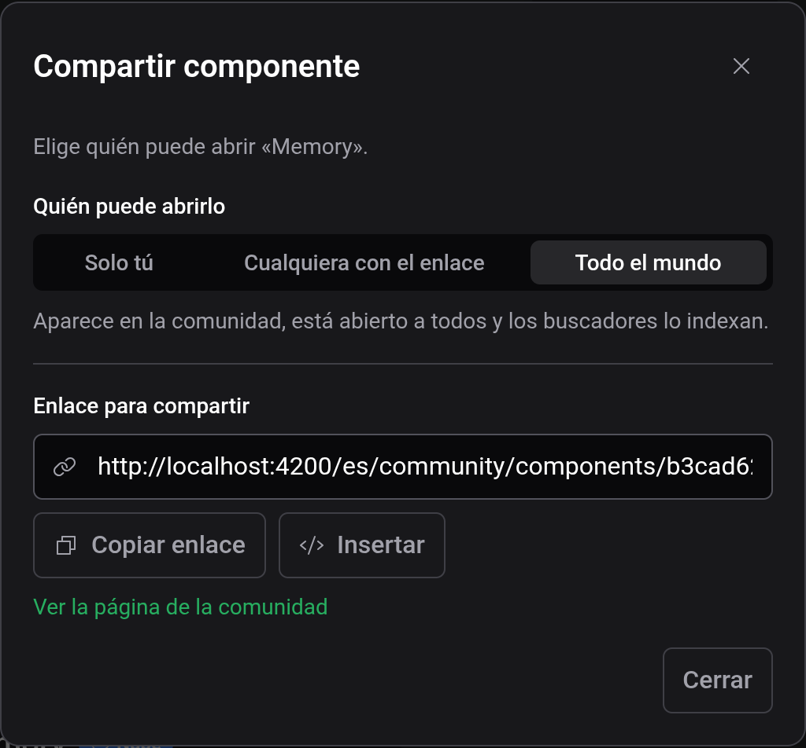

# Nube y compartir

Con una cuenta de Logigator, los proyectos y componentes personalizados se guardan en la nube y se abren en cualquier dispositivo en el que inicies sesión. Los documentos de la nube se pueden compartir con un enlace o publicar en la comunidad del sitio web de Logigator. Todo lo demás del editor funciona sin cuenta.

## Iniciar y cerrar sesión

El menú de la cuenta, en el extremo derecho de la barra de título, muestra «Iniciar sesión» y «Registrarse» mientras no has iniciado sesión. Ambos abren el sitio web de Logigator en una pestaña nueva, y el editor detecta por sí solo cuando has iniciado sesión allí. Con la sesión iniciada, el menú muestra «Cuenta», que abre tu página de cuenta en el sitio, y «Cerrar sesión».

Si un proyecto o componente de la nube tiene cambios sin guardar al cerrar sesión, el editor pregunta si quieres guardarlos antes: «Guardar y cerrar sesión», «Cerrar sesión sin guardar» o «Cancelar». Tras cerrar sesión, un proyecto de la nube abierto se sustituye por un borrador vacío y se cierran las pestañas de los componentes de la nube. Los proyectos y componentes locales no se tocan.

## Local y nube

Los documentos locales viven en este navegador y desaparecen si se borran sus datos del sitio. Los de la nube viven en tu cuenta. La etiqueta junto al nombre del proyecto indica cuál es el caso del proyecto abierto, y Archivo → Abrir los lista en pestañas separadas, Proyectos locales y Proyectos en la nube. Con la sesión iniciada, el diálogo se abre en Proyectos en la nube.

En el sitio web, Mis proyectos y Mis componentes listan también tus documentos de la nube. Allí puedes crearlos, renombrarlos, compartirlos, eliminarlos y abrirlos en el editor.

## Subir a la nube

Para mover un proyecto local guardado a tu cuenta, elige Archivo → Subir a la nube, o el botón de subir de su fila en el diálogo «Abrir proyecto». Para guardar un borrador directamente en la nube, elige Nube en el diálogo «Guardar». Para un componente personalizado local, usa «Subir a la nube» en su tarjeta de ajustes.

Un proyecto de la nube solo puede usar componentes de la nube. Si el tuyo usa componentes locales, el diálogo los lista y los sube con él. También pregunta quién puede abrir lo que subes, con Todo el mundo preseleccionado, y la misma elección vale para los componentes subidos. Subir mueve los documentos: las copias locales se eliminan.

## Compartir

Archivo → Compartir abre el diálogo de compartir de un proyecto de la nube. El botón «Compartir» en una fila de la pestaña Proyectos en la nube hace lo mismo, y un componente de la nube tiene «Compartir» en su tarjeta de ajustes. Los documentos locales hay que subirlos primero.

«Quién puede abrirlo» tiene tres opciones, y cada cambio se aplica al momento:

| Opción                   | Quién puede abrirlo                                                                                                 |
| ------------------------ | ------------------------------------------------------------------------------------------------------------------- |
| Solo tú                  | Nadie más. El enlace no se muestra.                                                                                 |
| Cualquiera con el enlace | Quien tenga el enlace. El documento queda fuera de los listados de la comunidad y de los buscadores.                |
| Todo el mundo            | Todo el mundo. El documento aparece en la comunidad y los buscadores pueden encontrarlo, en cuanto tiene contenido. |

El enlace para compartir lleva a la página del documento en el sitio web de Logigator. El botón «Compartir» lo pasa al menú de compartir de tu dispositivo, o lo copia si no hay ninguno. «Insertar» da un fragmento en Markdown, HTML o BBCode, con una imagen del circuito que enlaza a su página, para pegarlo en un foro o una wiki. «Ver la página de la comunidad» abre esa página.

«Regenerar enlace» sustituye el enlace, y el antiguo deja de funcionar al instante para todos los que lo tengan. Solo se ofrece con «Cualquiera con el enlace»: la dirección de un documento publicado es su enlace, y uno privado no muestra enlace. Si pasas un documento de «Cualquiera con el enlace» a «Solo tú» y vuelves, el enlace sigue siendo el mismo.

## Abrir el enlace de otra persona

Un enlace para compartir abre la página del documento en el sitio web, con «Abrir en el editor» y «Guardar una copia». «Guardar una copia» te pide iniciar sesión, copia el documento en tu biblioteca de la nube y abre la copia. En los documentos con Todo el mundo, la página también permite dar una estrella.

En el editor, un documento compartido lleva la etiqueta Compartido. Puedes cambiarlo y probarlo, pero no guardarlo ni exportarlo. Archivo → Clonar a mis proyectos, o Clonar a mis componentes para un componente, guarda una copia en tu biblioteca de la nube. La copia se hace a partir de la versión que guardó su propietario, sin tus cambios, y empieza como «Cualquiera con el enlace». Los cambios posteriores en un lado no afectan al otro.

## Ver también

- [Guardar y archivos](docs:saving-and-files): guardar, archivos y exportar imágenes
- [Componentes personalizados](docs:custom-components): componentes que viajan con un proyecto
- [Ajustes](docs:settings): el menú de la cuenta
