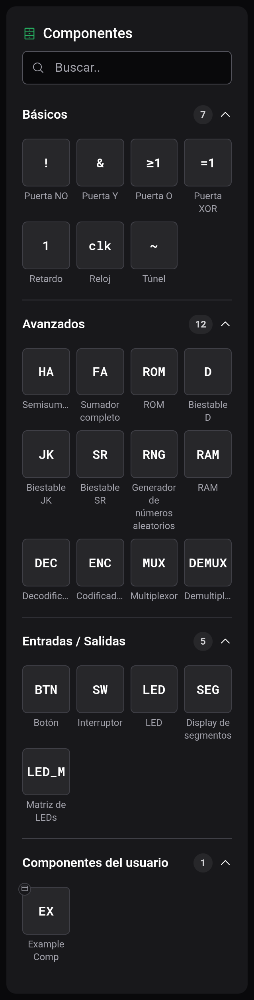
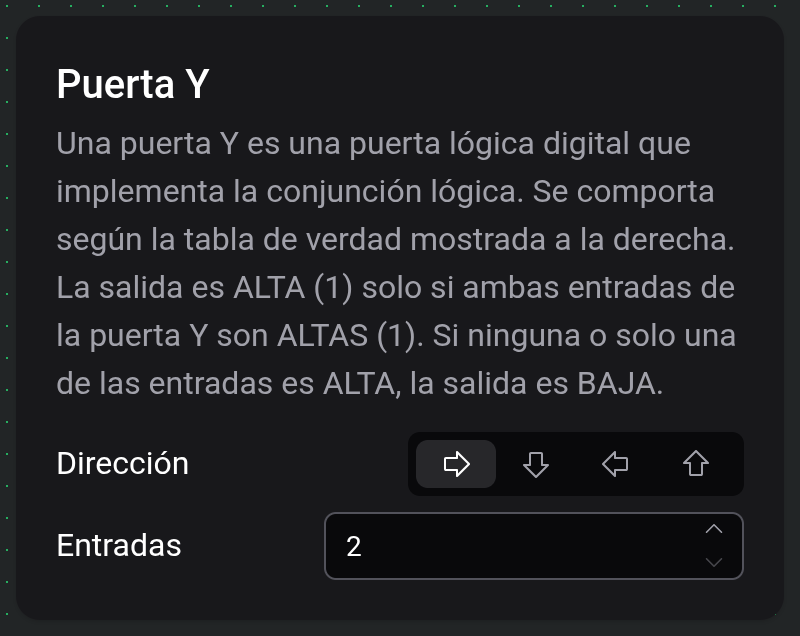

# Componentes y opciones

Los componentes son los bloques de construcción de un circuito: puertas, memorias, entradas, displays y más. Esta página explica dónde encontrarlos, cómo colocarlos y cómo configurar el que tengas seleccionado.

## La paleta de componentes

La paleta es el panel de la izquierda. Lista todos los componentes que puedes colocar, agrupados en categorías. Usa el cuadro de búsqueda de la parte superior para filtrar por nombre, y haz clic en el encabezado de una categoría para desplegarla o contraerla.

- **Básicos**: los bloques lógicos del día a día: **Puerta NO**, **Puerta Y**, **Puerta O**, **Puerta XOR**, **Retardo**, **Reloj** y **Túnel**.
- **Avanzados**: bloques de construcción más grandes: sumadores, memorias, biestables y piezas de encaminamiento (consulta la tabla de abajo).
- **Entradas / Salidas**: el hardware con el que interactúas mientras se ejecuta una simulación: **Botón**, **Interruptor**, **LED**, **Display de segmentos** y **Matriz de LEDs**.
- **Componentes del usuario**: tus propias piezas reutilizables. Esta sección está vacía hasta que construyas una; consulta [Componentes personalizados](docs:custom-components).

Una categoría **Puertos** aparece solo mientras editas un componente personalizado. Contiene los conectores de **Entrada** y **Salida** que usas para definir los puertos de ese componente; consulta [Componentes personalizados](docs:custom-components).

Para colocar un componente, haz clic en él en la paleta y sigue a tu cursor como un fantasma; muévelo donde quieras y pulsa para colocarlo. La colocación permanece activa para que puedas colocar varios seguidos; pulsa `Escape` o elige otra herramienta para detenerte. Consulta [Tablero y herramientas](docs:board-and-tools) para más sobre colocar, mover y girar.

### Básicos

| Componente     | Qué hace                                                                                                                                                            |
| -------------- | ------------------------------------------------------------------------------------------------------------------------------------------------------------------- |
| **Puerta NO**  | Invierte su entrada: entrada ALTA da salida BAJA, y viceversa.                                                                                                      |
| **Puerta Y**   | La salida es ALTA solo cuando todas las entradas son ALTAS.                                                                                                         |
| **Puerta O**   | La salida es ALTA cuando al menos una entrada es ALTA.                                                                                                              |
| **Puerta XOR** | La salida es ALTA cuando un número impar de entradas son ALTAS.                                                                                                     |
| **Retardo**    | Deja pasar su entrada sin cambios, añadiendo un tick de simulación de retardo.                                                                                      |
| **Reloj**      | Emite un pulso repetido de un tick; el retardo entre pulsos es configurable, y poner su entrada STP en ALTO lo pausa.                                               |
| **Túnel**      | Una conexión sin cables: todos los túneles que comparten la misma etiqueta están unidos eléctricamente. Consulta [Cables y conexiones](docs:wires-and-connections). |

### Avanzados

| Componente                          | Qué hace                                                                                                                 |
| ----------------------------------- | ------------------------------------------------------------------------------------------------------------------------ |
| **Semisumador**                     | Suma dos números de 1 bit; S es el bit de suma, C el acarreo.                                                            |
| **Sumador completo**                | Suma dos sumandos más un acarreo de entrada; S es el bit de suma, C el acarreo.                                          |
| **ROM**                             | Memoria de solo lectura cuyo contenido almacenado editas a mano.                                                         |
| **RAM**                             | Memoria de acceso aleatorio: lee la palabra direccionada en un flanco de reloj, o almacena una mientras WE está en ALTO. |
| **Biestable D**                     | Almacena un bit; captura D en el flanco ascendente de CLK.                                                               |
| **Biestable JK**                    | Almacena un bit; J activa, K reinicia, ambos conmutan, en el flanco ascendente de CLK.                                   |
| **Biestable SR**                    | Almacena un bit; S activa y R reinicia en el flanco ascendente de CLK.                                                   |
| **Generador de números aleatorios** | Produce datos aleatorios en sus salidas en cada flanco ascendente de CLK.                                                |
| **Decodificador**                   | Activa la única salida cuyo índice es igual al valor binario presente en sus entradas.                                   |
| **Codificador**                     | Emite el índice binario de su entrada activa de mayor peso.                                                              |
| **Multiplexor**                     | Encamina hacia la única salida la entrada de datos elegida por las líneas de selección.                                  |
| **Demultiplexor**                   | Encamina la única entrada de datos hacia la salida elegida por las líneas de selección.                                  |

### Entradas / Salidas

| Componente               | Qué hace                                                                                                                  |
| ------------------------ | ------------------------------------------------------------------------------------------------------------------------- |
| **Botón**                | Un pulsador momentáneo: haz clic en él durante la simulación para emitir un único pulso.                                  |
| **Interruptor**          | Un interruptor con enclavamiento: haz clic en él durante la simulación para alternar su salida entre encendido y apagado. |
| **LED**                  | Se enciende mientras el cable que alimenta su entrada está alimentado.                                                    |
| **Display de segmentos** | Muestra el valor binario presente en sus entradas como un número en una base elegida.                                     |
| **Matriz de LEDs**       | Una cuadrícula cuadrada de LEDs que muestra una imagen, escrita fila a fila en el flanco ascendente de CLK.               |

## Configurar un componente

Cuando seleccionas un único componente colocado —o mientras colocas uno— aparece una pequeña **tarjeta de ajustes** junto al tablero mostrando el nombre de ese componente, una breve descripción y sus opciones ajustables. En un dispositivo táctil las mismas opciones se abren en el cajón de **Ajustes** en su lugar.

### Dirección: en todos los componentes

Todo componente tiene un control de **Dirección**: cuatro flechas para Este, Sur, Oeste y Norte. Orienta el componente para que mire hacia donde quieras, lo que equivale a girarlo. (También puedes girar una selección en el tablero con `R` y `Shift+R`; consulta [Tablero y herramientas](docs:board-and-tools).)

### Opciones específicas de cada tipo

Todo lo que va más allá de la Dirección depende del componente. Muchos componentes no tienen ninguna (una puerta NO, por ejemplo). Los que sí:

| Componente                                           | Opciones                                                                                          |
| ---------------------------------------------------- | ------------------------------------------------------------------------------------------------- |
| **Puerta Y / O / XOR**, **Decodificador**            | **Entradas**: cuántos puertos de entrada.                                                         |
| **Codificador**, **Generador de números aleatorios** | **Salidas**: cuántos puertos de salida.                                                           |
| **Reloj**                                            | **Retardo**: el número de ticks entre pulsos.                                                     |
| **Túnel**                                            | **Etiqueta**: el nombre que lo empareja con otros túneles.                                        |
| **ROM**                                              | **Tamaño de palabra**, **Tamaño de dirección** y **Editar contenido** (ver abajo).                |
| **RAM**                                              | **Tamaño de palabra** y **Tamaño de dirección**.                                                  |
| **Multiplexor / Demultiplexor**                      | **Líneas de selección**: cuántas entradas de selección, lo que fija el número de líneas de datos. |
| **Display de segmentos**                             | **Entradas** —cuántos bits de entrada— y **Base** —la base numérica en que se muestra el valor.   |
| **Matriz de LEDs**                                   | **Ancho/Alto**: el tamaño de la cuadrícula de LEDs.                                               |

### Editar el contenido de la ROM

Seleccionar una **ROM** muestra un botón de **Editar contenido**. Abre un editor hexadecimal donde escribes las palabras almacenadas de la memoria; las opciones **Tamaño de palabra** y **Tamaño de dirección** fijan cuán ancha es cada palabra y cuántas palabras hay. Tus ediciones se guardan con el circuito. La misma vista hexadecimal de solo lectura está disponible mientras se ejecuta una simulación; consulta [Inspección y monitores](docs:inspection).

## Negar un puerto

Cualquier puerto de entrada o salida se puede **negar** para que la señal que pasa por él se invierta, sin añadir una puerta NO aparte. Elige la herramienta **Cable** y toca directamente sobre un puerto: una pequeña **burbuja de negación** aparece en él, y el puerto queda ahora invertido. Tócalo de nuevo para quitar la burbuja.

Mientras la herramienta Cable está activa, pasar el cursor cerca de un puerto previsualiza la burbuja que añadiría un toque, para que veas exactamente qué puerto estás a punto de negar.

## Colocar texto

La paleta no incluye texto: las etiquetas se colocan con la herramienta **Texto** de la barra de herramientas. Elígela, haz clic en el tablero y escribe tu nota; la tarjeta de ajustes de la etiqueta te permite **Editar texto** y cambiar su **Tamaño de fuente**. Los cables pueden pasar a través de una etiqueta de texto sin conectarse a ella.

## Consulta también

- [Cables y conexiones](docs:wires-and-connections): conectar puertos en circuitos funcionales
- [Componentes personalizados](docs:custom-components): empaquetar un circuito en tu propia pieza reutilizable
- [Simulación](docs:simulation): ejecutar el circuito e interactuar con botones, interruptores y displays
- [Tablero y herramientas](docs:board-and-tools): colocar, seleccionar, mover y girar
