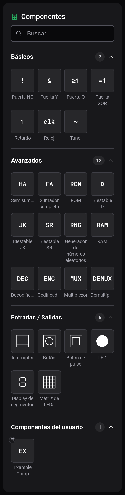
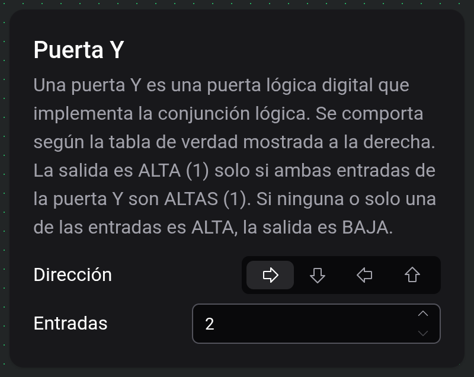

# Componentes y opciones

Los componentes son las piezas de las que se compone un circuito: puertas, memorias, entradas y pantallas. Los eliges en la paleta de la izquierda y ajustas sus opciones en la tarjeta de ajustes.

## La paleta

El campo de búsqueda de arriba filtra la paleta por nombre. Las categorías son Básicos, Avanzados y Entradas / Salidas, además de Componentes del usuario en cuanto hayas construido un [componente personalizado](docs:custom-components). Un clic en el encabezado de una categoría la pliega. La colocación se describe en [Tablero y herramientas](docs:board-and-tools).

Cada componente tarda un tick en pasar un cambio a su salida. Las tablas indican las opciones de cada componente además de Dirección, que tienen todos.

### Básicos

| Componente | Qué hace                                                                                                                           | Opciones                      |
| ---------- | ---------------------------------------------------------------------------------------------------------------------------------- | ----------------------------- |
| Puerta NO  | Invierte su entrada.                                                                                                               |                               |
| Puerta Y   | Da 1 cuando todas las entradas son 1.                                                                                              | Entradas, de 2 a 64           |
| Puerta O   | Da 1 cuando al menos una entrada es 1.                                                                                             | Entradas, de 2 a 64           |
| Puerta XOR | Da 1 cuando un número impar de entradas es 1.                                                                                      | Entradas, de 2 a 64           |
| Retardo    | Deja pasar su entrada sin cambios, un tick después.                                                                                |                               |
| Reloj      | Envía un pulso de un tick, se queda en 0 durante Retardo ticks y vuelve a empezar. Mientras su entrada STP es 1, se queda en 0.    | Retardo, desde 1              |
| Túnel      | Se conecta sin cable con todos los demás túneles de la misma etiqueta. Consulta [Cables y conexiones](docs:wires-and-connections). | Etiqueta, hasta 10 caracteres |

### Avanzados

| Componente                      | Qué hace                                                                                                                               | Opciones                                                               |
| ------------------------------- | -------------------------------------------------------------------------------------------------------------------------------------- | ---------------------------------------------------------------------- |
| Semisumador                     | Suma A y B. S es el bit de suma y C el acarreo.                                                                                        |                                                                        |
| Sumador completo                | Suma A, B y el acarreo de entrada Cin. S es el bit de suma y C el acarreo.                                                             |                                                                        |
| ROM                             | Da la palabra guardada en la dirección presente en sus entradas. No tiene reloj.                                                       | Tamaño de palabra 1 a 64, Tamaño de dirección 1 a 11, Editar contenido |
| Biestable D                     | Guarda D en el flanco de subida de CLK. Q es el bit guardado y !Q su inverso.                                                          |                                                                        |
| Biestable JK                    | En el flanco de subida de CLK, J pone el bit a 1, K lo pone a 0 y ambos juntos lo invierten.                                           |                                                                        |
| Biestable SR                    | En el flanco de subida de CLK, S pone el bit a 1 y R lo pone a 0.                                                                      |                                                                        |
| Generador de números aleatorios | Pone un valor aleatorio nuevo en sus salidas en cada flanco de subida de CLK.                                                          | Salidas, de 1 a 64                                                     |
| RAM                             | En el flanco de subida de CLK, lee la palabra de la dirección hacia las salidas, o guarda allí las entradas de datos mientras WE es 1. | Tamaño de palabra 1 a 64, Tamaño de dirección 1 a 16                   |
| Decodificador                   | Activa la única salida cuyo número coincide con el valor binario de las entradas.                                                      | Entradas, de 1 a 6                                                     |
| Codificador                     | Da el número de la entrada más alta que es 1.                                                                                          | Salidas, de 1 a 6                                                      |
| Multiplexor                     | Pasa a su salida la entrada de datos que eligen las líneas de selección. Con n líneas de selección hay 2ⁿ entradas de datos.           | Líneas de selección, de 1 a 6                                          |
| Demultiplexor                   | Pasa la entrada I a la salida que eligen las líneas de selección.                                                                      | Líneas de selección, de 1 a 6                                          |

### Entradas / Salidas

| Componente           | Qué hace                                                                                                                                                                                         | Opciones                                           |
| -------------------- | ------------------------------------------------------------------------------------------------------------------------------------------------------------------------------------------------ | -------------------------------------------------- |
| Interruptor          | Cambia entre 0 y 1 con cada clic durante una simulación.                                                                                                                                         |                                                    |
| Botón                | Da 1 mientras lo mantienes pulsado.                                                                                                                                                              |                                                    |
| Botón de pulso       | Da un pulso de un tick por clic.                                                                                                                                                                 |                                                    |
| LED                  | Se enciende mientras su entrada es 1.                                                                                                                                                            |                                                    |
| Display de segmentos | Muestra el número binario de sus entradas; la entrada 0 es el bit menos significativo.                                                                                                           | Entradas 1 a 16, Base decimal, hexadecimal u octal |
| Matriz de LEDs       | Una cuadrícula cuadrada de LEDs. En el flanco de subida de CLK, las entradas de datos se escriben en la fila que eligen las entradas de dirección. En 16 × 16, cada dirección abarca media fila. | Ancho/Alto 4, 8 o 16                               |

## La tarjeta de ajustes

Al seleccionar un solo componente, o al elegir uno para colocar, aparece su tarjeta de ajustes junto al tablero: el nombre, una descripción y las opciones. Dirección tiene cuatro botones con flechas que giran el componente. La dirección elegida al colocar se mantiene para el siguiente componente del mismo tipo. Durante una simulación, la tarjeta está oculta.

Cambiar Entradas, Salidas o una opción de tamaño cambia al instante el número de puertos.

En una ROM, «Editar contenido» abre un editor hexadecimal para las palabras guardadas. Tamaño de palabra fija cuántos bits tiene una palabra y Tamaño de dirección cuántas entradas de dirección hay, así que una ROM con tamaño de dirección 4 guarda 16 palabras. El contenido se guarda con el circuito.

## Negar un puerto

Con la herramienta de cable, toca un puerto de entrada o salida para añadirle una burbuja de negación. La señal que pasa por ese puerto queda invertida, sin retardo adicional. Toca la burbuja otra vez para quitarla. Al pasar el puntero sobre un puerto, la herramienta de cable muestra lo que haría un toque. Una burbuja en la entrada CLK de un biestable hace que reaccione al flanco de bajada.

Los túneles, los conectores Entrada y Salida y los puertos de un componente personalizado colocado no se pueden negar.

## Etiquetas de texto

El texto no está en la paleta. Con la herramienta Texto (`T`), haz clic en el tablero para colocar una etiqueta «[insert text]». «Editar texto» en su tarjeta de ajustes abre un diálogo para el texto, que puede ocupar varias líneas, y Tamaño de fuente va de 2 a 128. Los cables atraviesan las etiquetas sin conectarse a ellas. Un clic en un cable que pasa bajo una etiqueta selecciona el cable.

## Ver también

- [Cables y conexiones](docs:wires-and-connections): conectar puertos
- [Componentes personalizados](docs:custom-components): construir tus propias piezas
- [Simulación](docs:simulation): usar interruptores y botones
- [Tablero y herramientas](docs:board-and-tools): colocar, mover y girar
