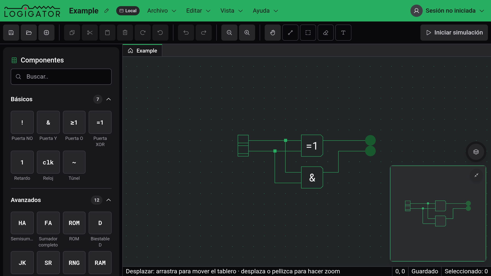

# Primeros pasos

Logigator es un simulador de circuitos lógicos que funciona en el navegador. Colocas puertas en una cuadrícula, trazas cables entre ellas y pulsas «Iniciar simulación» para ver cómo recorren las señales el circuito. Un circuito terminado se puede guardar como [componente personalizado](docs:custom-components) y usar como un solo bloque dentro de otro más grande.

No necesitas una cuenta. Sin ella, guardas los proyectos en el navegador o los [exportas a un archivo](docs:saving-and-files). Al iniciar sesión tienes además [almacenamiento en la nube y enlaces para compartir](docs:cloud).

## La ventana del editor

- El tablero, en el centro, es la cuadrícula en la que construyes. La rueda del ratón hace zoom, y arrastrar con el botón derecho o central desplaza la vista.
- La barra de título muestra el nombre del proyecto y dónde está guardado (Borrador, Local, Nube o Compartido), seguido de los menús Archivo, Editar, Vista y Ayuda. El lápiz junto al nombre cambia el nombre del proyecto.
- La barra de herramientas tiene botones para guardar y abrir, el portapapeles, girar, deshacer y hacer zoom, luego las cinco [herramientas](docs:board-and-tools) y, en el extremo derecho, «Iniciar simulación».
- La paleta de componentes, a la izquierda, lista todas las piezas que puedes colocar.
- La barra de estado, abajo, muestra una indicación sobre la herramienta activa, la posición del cursor en la cuadrícula, «Guardado» o «Cambios sin guardar» y cuántos elementos hay seleccionados.
- El minimapa y el botón «Informar de un error» están en la esquina inferior derecha del tablero.

Cuando editas un componente personalizado, aparece sobre el tablero una barra de pestañas con el proyecto principal y una pestaña por cada componente abierto.

En una ventana de 1024 px de ancho o menos, el editor cambia a una vista táctil con otros controles. Consulta [Móviles y tabletas](docs:phones-and-tablets).

## Tutorial y consejos

En tu primera visita, una tarjeta sobre el tablero ofrece un tutorial en el que construyes una puerta Y con dos interruptores y un LED. Dura alrededor de un minuto. «Empezar el tutorial» lo inicia, la ✕ cierra la tarjeta y «Omitir el tutorial» lo termina en cualquier paso.

La primera vez que usas ciertas herramientas, como la herramienta de cable o el corte en el borde de la selección, un breve consejo las explica. Cada consejo aparece una sola vez. «Desactivar todos los consejos» en un consejo, o el ajuste «Mostrar consejos de introducción», los apaga. Ayuda → Mostrar los consejos de nuevo los vuelve a activar, muestra otra vez los que ya viste y recupera la tarjeta del tutorial.

## El menú Ayuda

- Novedades lista los cambios de cada versión. Se abre solo una vez después de cada actualización.
- Documentación abre estas páginas dentro del editor.
- Acerca de muestra la versión que usas, la licencia (GNU AGPL v3) y enlaces al código fuente, la política de privacidad y el pie de imprenta.
- Ajustes de cookies vuelve a abrir el diálogo de consentimiento. Esta entrada solo existe cuando el editor funciona con el banner de cookies.

## Informar de un problema

El botón con forma de insecto, en la esquina inferior derecha, abre «Informar de un problema». Describe lo que hacías antes de que fallara. Tu proyecto actual, datos del navegador y la actividad reciente se adjuntan al informe. Si el editor sufre un error inesperado, el mismo formulario se abre solo, con los detalles del error.

## Ver también

- [Tablero y herramientas](docs:board-and-tools): moverse, colocar, seleccionar y borrar
- [Componentes y opciones](docs:components-and-options): todas las piezas y sus opciones
- [Simulación](docs:simulation): hacer funcionar un circuito
- [Atajos de teclado](docs:shortcuts): todos los atajos y cómo cambiarlos
