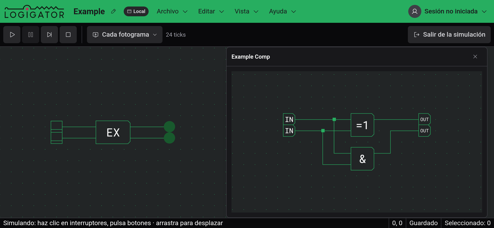
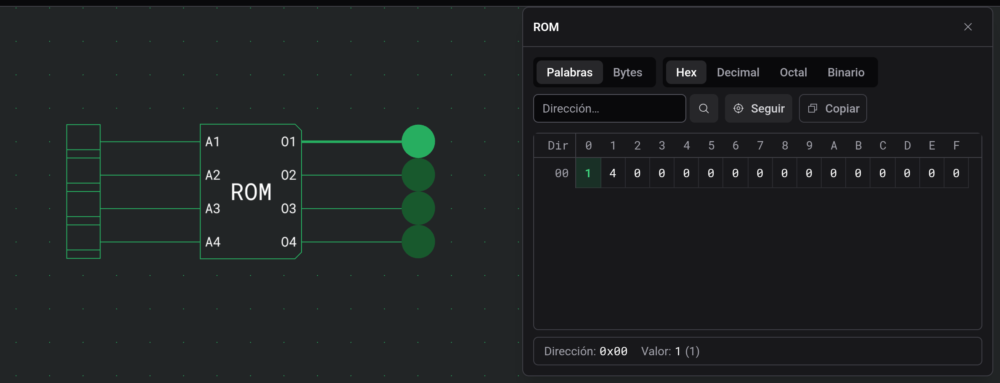

# Inspección y monitores

Durante una [simulación](docs:simulation), en marcha o en pausa, dos tipos de componente se pueden abrir para ver su interior. Un clic en una ROM muestra su contenido, con la palabra que está leyendo resaltada. Un clic en un componente personalizado abre un monitor, una vista en directo de su circuito interno.

En el escritorio, cada vista se abre en una ventana que puedes mover y cambiar de tamaño. Otro clic en el componente trae su ventana al frente. En la [vista táctil](docs:phones-and-tablets), las vistas de ROM comparten un panel en la parte inferior de la pantalla, y un monitor ocupa toda la pantalla. Al salir de la simulación se cierran todas.

## Contenido de una ROM

La vista es de solo lectura; el contenido se cambia al editar, en los ajustes de la ROM. La palabra de la dirección actual está resaltada, y con «Seguir» (activado por defecto) la tabla se desplaza a medida que cambia la dirección. La línea de abajo muestra la dirección y el valor de la celda resaltada. Un clic en otra celda muestra esa hasta el siguiente cambio de dirección.

Los botones sobre la tabla eligen Palabras o Bytes y la base: Hex, Decimal, Octal o Binario. Para ir a una dirección, escríbela en hexadecimal en el campo «Dirección…». «Copiar» pone toda la tabla en el portapapeles como texto, en la vista y la base elegidas.

## Monitores

Un monitor dibuja el circuito interno del componente con los mismos cables iluminados que el tablero. Dentro puedes desplazar la vista, hacer zoom y usar los interruptores y botones que contiene. Controlan la simulación real, así que el resto del circuito reacciona.

Un clic en un componente personalizado dentro de un monitor abre su circuito en la misma ventana, y el título muestra la ruta, por ejemplo Outer › Inner. Haz clic en un nombre anterior para volver a subir. Una ROM dentro de un monitor abre su propia vista.

Si el monitor avisa de que el circuito interno no coincide con la simulación compilada, el componente se cambió después de iniciar la simulación. Sal de la simulación y vuelve a iniciarla.

## Ver también

- [Simulación](docs:simulation): hacer funcionar un circuito
- [Componentes personalizados](docs:custom-components): construir los componentes que observas
- [Componentes y opciones](docs:components-and-options): opciones y contenido de una ROM
