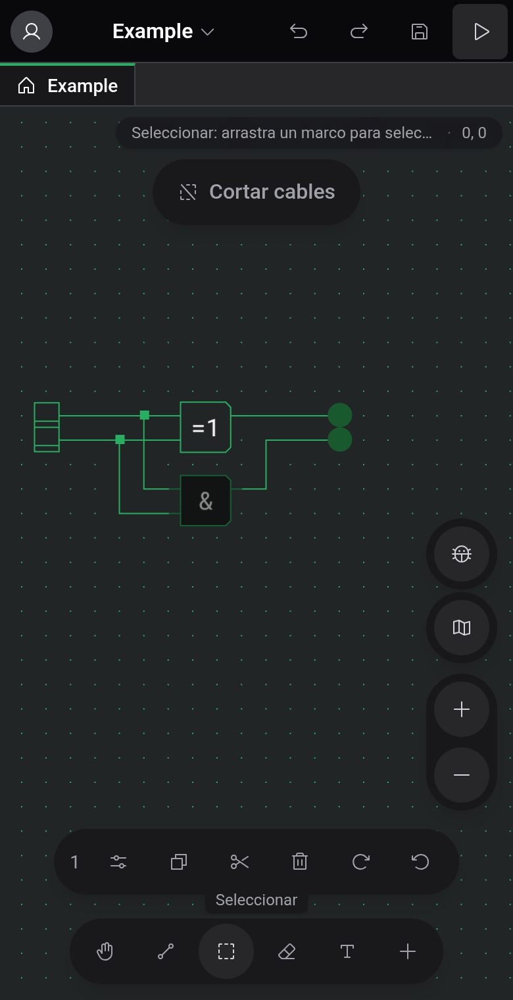

# Móviles y tabletas

Cuando la ventana mide 1024 px de ancho o menos, el editor cambia a una vista táctil: la barra de menús, la barra de herramientas, la paleta y la barra de estado dejan paso a controles flotantes alrededor del tablero. Ocurre en móviles, en la mayoría de las tabletas en vertical y en ventanas de escritorio estrechas. El resto de esta documentación describe la vista ancha. Esta página explica qué cambia.

## Dónde está cada cosa

- Arriba a la izquierda, tu avatar abre el panel Cuenta con el tema, el idioma, los ajustes del editor y el inicio o cierre de sesión.
- Tocar el nombre del proyecto abre el menú del proyecto: Nuevo proyecto, Nuevo componente, Abrir, Subir a la nube o Compartir, Exportar a archivo, Generar imagen, Reparar cables y las entradas del menú Ayuda.
- Deshacer, Rehacer, Guardar e Iniciar simulación son botones arriba a la derecha.
- Una píldora en la esquina superior derecha muestra la indicación de la herramienta activa y la posición en la cuadrícula.
- La barra de abajo contiene las cinco herramientas y un botón + que abre el panel Componentes. Mientras editas un componente personalizado, se añade un botón Puertos.
- Los botones de zoom, el botón del insecto y el minimapa están en el borde derecho. El minimapa empieza plegado.

Esta vista no tiene barra de estado, así que faltan el indicador «Guardado» / «Cambios sin guardar» y la etiqueta de almacenamiento junto al nombre del proyecto. Los atajos de teclado siguen funcionando con un teclado conectado, pero solo puedes cambiarlos en la vista ancha.

## Gestos

Arrastra con dos dedos para desplazar la vista y pellizca para hacer zoom. Lo que hace un arrastre con un dedo depende de la herramienta: traza un cable, un marco de selección o un trazo de borrador, y solo desplaza la vista con Desplazar.

Para colocar un componente, toca +, elígelo en el panel y toca el tablero donde deba ir.

## Selección y portapapeles

Cuando hay algo seleccionado, una barra sobre las herramientas indica cuántos elementos son, con botones para Copiar, Cortar, Eliminar y los dos giros, además de Pegar en cuanto el portapapeles contiene algo. Con un solo componente seleccionado, un botón Ajustes abre sus opciones en un panel.

Después de copiar, la barra sigue visible con Pegar aunque no haya nada seleccionado. Su ✕ vacía el portapapeles y cierra la barra. Los elementos pegados aparecen en el centro de la vista: arrástralos a un sitio libre y levanta el dedo para colocarlos, o toca en otro sitio para cancelar.

## Simulación e inspección

El botón de reproducción de arriba inicia la simulación. Los controles aparecen entonces en una barra en el borde inferior, y arriba el botón para salir sustituye a Deshacer, Rehacer y Guardar.

Tocar una ROM abre su vista en un panel en la parte inferior de la pantalla. El tablero de encima sigue usable, y varias vistas comparten el panel como pestañas. El monitor de un componente personalizado ocupa toda la pantalla, y su flecha de volver regresa al tablero. Consulta [Inspección y monitores](docs:inspection).

## Ver también

- [Tablero y herramientas](docs:board-and-tools): qué hace cada herramienta
- [Simulación](docs:simulation): controles y velocidad
- [Ajustes](docs:settings): tema, idioma y ajustes del editor
