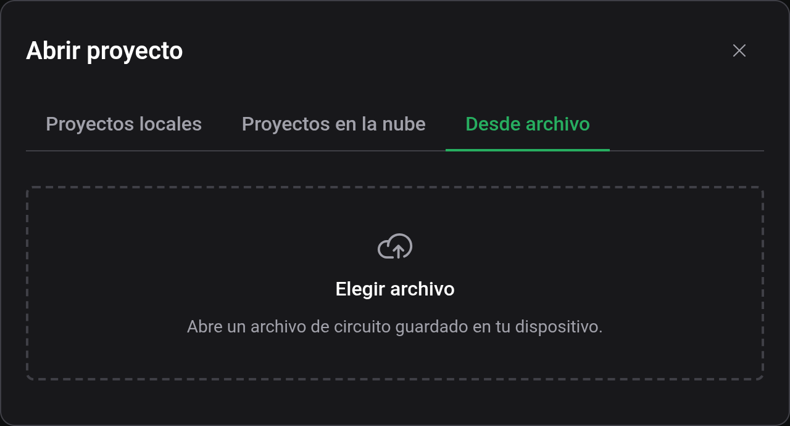
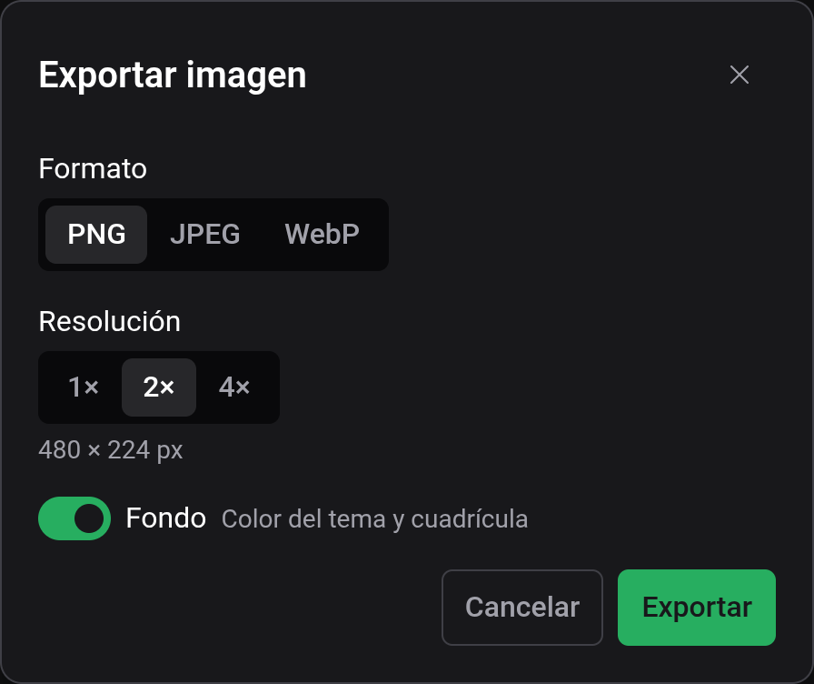

# Guardar y archivos

Dónde reside tu trabajo: en tu navegador, en tu cuenta o en un archivo de tu dispositivo. Esta página explica cómo guardar en el navegador, exportar a un archivo y generar una imagen de tu circuito.

## Guardar tu proyecto

Guarda con **Archivo → Guardar** o `Ctrl+S`. El botón también está en la barra de herramientas.

Un proyecto que nunca se ha guardado es un **Borrador**: la etiqueta junto al nombre del proyecto lo indica. La primera vez que guardas un Borrador, Logigator pide dos cosas:

- **Nombre**: cómo llamar al proyecto.
- **Destino**: **Local** (almacenado en este navegador) o **Nube** (almacenado en tu cuenta de Logigator, si has iniciado sesión).

Después de ese primer guardado, **Guardar** escribe directamente de vuelta allí donde reside el proyecto, sin más avisos. Consulta [Nube y compartir](docs:cloud) para saber qué añaden iniciar sesión y el destino Nube.

### Saber dónde está almacenado un proyecto

La etiqueta junto al nombre del proyecto siempre muestra el hogar del proyecto:

| Etiqueta       | Significado                                                                |
| -------------- | -------------------------------------------------------------------------- |
| **Borrador**   | Aún sin guardar: guárdalo para almacenarlo.                                |
| **Local**      | Guardado solo en este navegador.                                           |
| **Nube**       | Guardado en tu cuenta, accesible desde cualquier dispositivo.              |
| **Compartido** | Abierto en modo de solo lectura desde el enlace para compartir de alguien. |

### El indicador de guardado / sin guardar

La **barra de estado** en la parte inferior del editor muestra **Guardado** cuando todo está escrito, y **Cambios sin guardar** en el momento en que haces una edición. Úsalo como comprobación rápida antes de cerrar la pestaña.

### Una nota sobre los proyectos locales

Los proyectos locales residen solo en el navegador en el que los guardaste. Como advierte el diálogo de guardado:

> Los proyectos locales no se conservan entre dispositivos y pueden perderse.

Si un proyecto es importante, guárdalo en la **Nube** (consulta [Nube y compartir](docs:cloud)) o **expórtalo a un archivo** para tener una copia que tú controlas.

### Abrir proyectos antiguos

Si abres un circuito hecho con el editor de Logigator antiguo, guardarlo aquí lo convierte al formato nuevo. Volver a abrirlo después en el editor antiguo puede descartar o representar mal los componentes personalizados, así que conserva el original si aún lo necesitas.

## Archivos de circuito (`.lgix`)

También puedes conservar un circuito como un archivo en tu propio dispositivo.

- **Exportar**: **Archivo → Exportar a archivo** descarga el proyecto abierto como un archivo `.lgix`.
- **Importar**: **Archivo → Abrir → Desde archivo**, luego **Elegir archivo**, carga un archivo `.lgix` de vuelta en el editor como un nuevo proyecto local.

Un archivo es solo siempre una exportación o una importación: no es un lugar donde tu proyecto «reside» como lo son el almacenamiento Local y en la Nube. Exportar no cambia dónde está guardado tu proyecto.

### Qué hay en un archivo `.lgix`

Un archivo `.lgix` es una instantánea comprimida y autocontenida de tu circuito. Reúne el propio tablero **y** una copia congelada de cada [componente personalizado](docs:custom-components) que usa el circuito, de modo que se abre correctamente en cualquier máquina aunque esa máquina nunca haya visto esos componentes.

El archivo está comprimido pero no cifrado ni bloqueado: trátalo como un paquete cómodo, no como uno seguro o a prueba de manipulaciones. Logigator también puede importar los archivos de circuito `.json` exportados por el editor antiguo.

> Los proyectos de solo lectura abiertos desde un enlace para compartir no se pueden exportar a un archivo. Clona primero el proyecto compartido en tu propia biblioteca; consulta [Nube y compartir](docs:cloud).

## Generar una imagen

Para exportar una imagen de tu circuito, elige **Archivo → Generar imagen**. El diálogo te permite fijar:

- **Formato**: **PNG**, **JPEG** o **WebP**.
- **Resolución**: el tamaño de salida; los tamaños muy grandes se reducen automáticamente para ajustarse a los límites de tu dispositivo.
- **Fondo**: el color del tema actual y la cuadrícula.
- **Calidad**: la calidad de compresión (se muestra para JPEG y WebP; PNG es sin pérdidas).

El diálogo previsualiza las dimensiones finales en píxeles antes de que exportes.

## Consulta también

- [Nube y compartir](docs:cloud): iniciar sesión, almacenamiento en la nube, subir y enlaces para compartir
- [Componentes personalizados](docs:custom-components): las piezas reutilizables que un archivo lleva consigo
- [Atajos de teclado](docs:shortcuts): cambia la asignación `Ctrl+S` y otras
