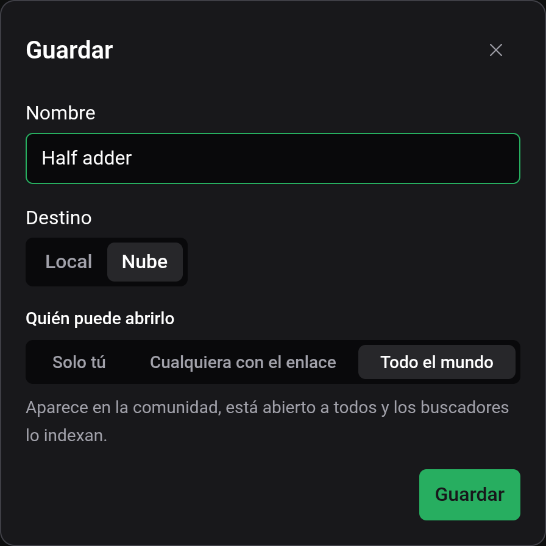
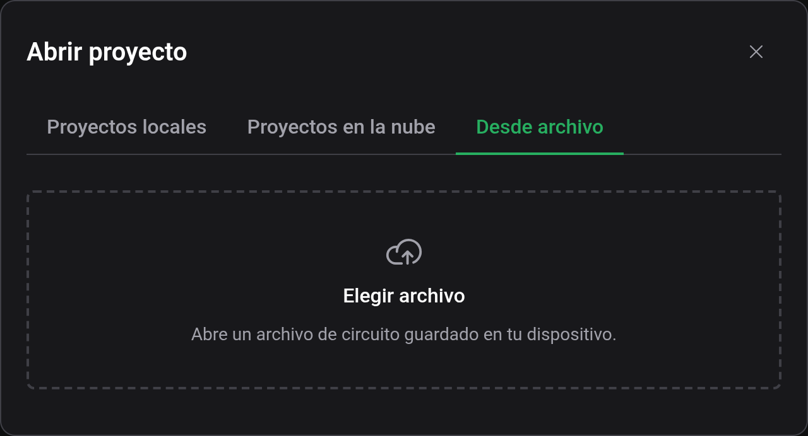
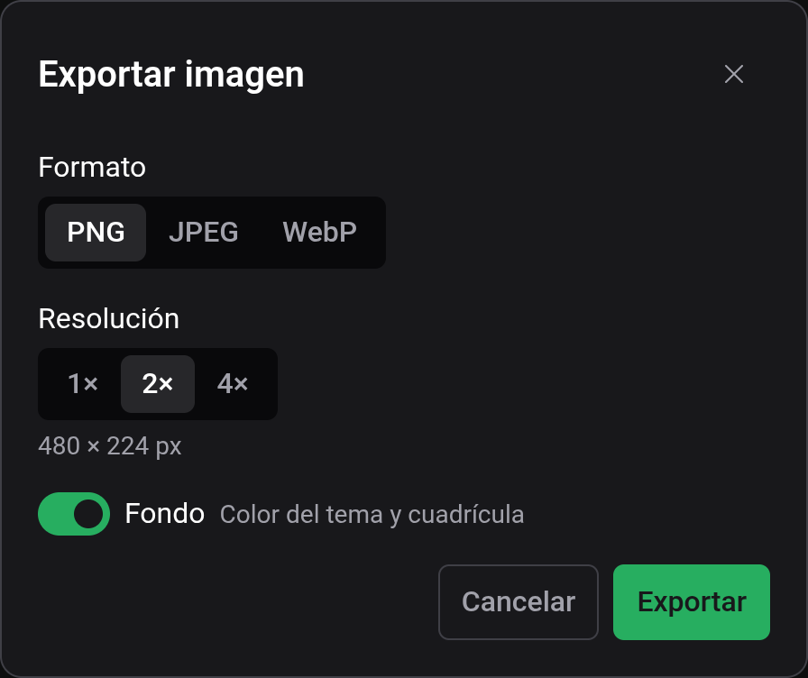

# Guardar y archivos

Un proyecto se guarda en uno de dos sitios: en este navegador (Local) o en tu cuenta de Logigator (Nube). Los archivos de tu dispositivo sirven para exportar e importar, no son un tercer lugar donde guardar. El editor no guarda automáticamente.

## Guardar un proyecto

Archivo → Guardar, el botón de guardar de la barra de herramientas o `Ctrl+S` guarda el proyecto abierto. Un proyecto nuevo es un borrador hasta que lo guardas por primera vez, lo que abre el diálogo «Guardar»:

- Nombre, hasta 20 caracteres.
- Destino, Local o Nube. Nube requiere haber iniciado sesión y en ese caso viene preseleccionada.
- Quién puede abrirlo, solo con Nube. Viene preseleccionado Todo el mundo: el proyecto aparece entonces en la comunidad y los buscadores pueden encontrarlo. Elige «Solo tú» para mantenerlo privado. Consulta [Nube y compartir](docs:cloud).

Las siguientes veces se guarda directamente en el mismo sitio. La única excepción es un proyecto de la nube que usa componentes personalizados locales: al guardarlo se abre primero el diálogo «Subir a la nube», porque un proyecto de la nube solo puede usar componentes de la nube.

Los proyectos locales se quedan en el navegador que los guardó. Como advierte el diálogo, no se conservan entre dispositivos y pueden perderse si se borran los datos del sitio. Guarda en la nube o exporta a un archivo lo que quieras conservar.

## Dónde está guardado un proyecto

La etiqueta junto al nombre del proyecto indica dónde está el proyecto abierto:

| Etiqueta   | Significado                                                                       |
| ---------- | --------------------------------------------------------------------------------- |
| Borrador   | Aún sin guardar.                                                                  |
| Local      | Guardado en este navegador.                                                       |
| Nube       | Guardado en tu cuenta.                                                            |
| Compartido | Abierto desde el enlace para compartir de otra persona. No puedes sobrescribirlo. |

Una etiqueta Bifurcar al lado indica que el proyecto se copió del de otra persona. Pasa el puntero por encima para ver de quién.

La barra de estado muestra «Guardado» o «Cambios sin guardar». Si abres otro proyecto o empiezas uno nuevo con cambios sin guardar, el editor pregunta si quieres descartarlos, y el navegador te avisa antes de cerrar la pestaña.

## Abrir, renombrar y eliminar

Archivo → Abrir (`Ctrl+O`) tiene tres pestañas: Proyectos locales, Proyectos en la nube y Desde archivo. En cada lista se puede buscar, y cada fila tiene botones para renombrar o eliminar el proyecto. Las filas locales se pueden además subir a la nube, y las de la nube compartir.

El lápiz junto al nombre del proyecto, en la barra de título, cambia el nombre del proyecto abierto.

## Archivos de circuito

Archivo → Exportar a archivo descarga el proyecto abierto como archivo `.lgix`. El archivo contiene el tablero y una copia de cada componente personalizado que usa, así que se abre completo en cualquier ordenador. Está comprimido, pero no cifrado ni firmado: cualquiera puede leerlo. Exportar no cambia dónde está guardado el proyecto.

Para importar, abre Archivo → Abrir → Desde archivo y elige un archivo. El editor lee archivos `.lgix` y los archivos `.json` que exportaba el antiguo editor de Logigator. La importación se guarda al momento como un proyecto local nuevo.

Un proyecto abierto desde un enlace para compartir no se puede exportar. Clónalo primero (consulta [Nube y compartir](docs:cloud)).

## Exportar una imagen

Archivo → Generar imagen abre el diálogo «Exportar imagen»:

- Formato: PNG, JPEG o WebP.
- Resolución: 1×, 2× o 4×, con 2× preseleccionado. Si la imagen fuera más grande de lo que tu dispositivo puede dibujar, se reduce y el diálogo lo indica.
- Fondo: activado dibuja el color de fondo del tema y la cuadrícula. Desactivado da un PNG o WebP transparente, o un JPEG blanco.
- Calidad, de 10 a 100 %, para JPEG y WebP. PNG no tiene pérdidas.

El diálogo muestra el tamaño final en píxeles antes de exportar. Si hay abierta la pestaña de un componente personalizado, un campo «Proyecto» elige qué circuito exportar.

## Ver también

- [Nube y compartir](docs:cloud): subir, compartir y clonar
- [Componentes personalizados](docs:custom-components): los componentes que lleva un archivo
- [Atajos de teclado](docs:shortcuts): cambiar las teclas de guardar y abrir
