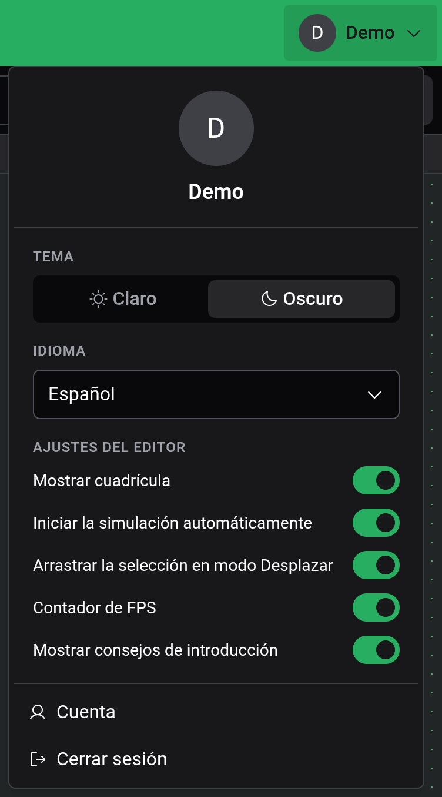

# Ajustes

Todos los ajustes están en el menú de la cuenta, que abres con el botón de cuenta del extremo derecho de la barra de título. En la vista táctil es el avatar de arriba a la izquierda.

## Tema e idioma

Tema cambia entre Claro y Oscuro. Oscuro es el predeterminado. Idioma ofrece English, Deutsch, Français y Español. Ambos se aplican al instante y valen también para el sitio web de Logigator: si cambias el idioma en el editor, cambia también en el sitio, y al revés.

## Ajustes del editor

| Ajuste                                   | Predeterminado | Qué hace                                                                                                                       |
| ---------------------------------------- | -------------- | ------------------------------------------------------------------------------------------------------------------------------ |
| Mostrar cuadrícula                       | activado       | Dibuja la cuadrícula de puntos. Los componentes se ajustan a ella en cualquier caso.                                           |
| Iniciar la simulación automáticamente    | activado       | Pone en marcha el circuito en cuanto entras en la [simulación](docs:simulation). Desactivado, espera en pausa en el tick 0.    |
| Arrastrar la selección en modo Desplazar | activado       | Un arrastre con Desplazar que empieza dentro de la selección mueve la selección. Desactivado, todo arrastre desplaza la vista. |
| Contador de FPS                          | desactivado    | Muestra los fotogramas por segundo en la esquina del tablero.                                                                  |
| Mostrar consejos de introducción         | activado       | Muestra un consejo la primera vez que usas ciertas herramientas. Consulta [Primeros pasos](docs:getting-started).              |

Estos cinco ajustes, tus atajos de teclado y el estado del minimapa se guardan solo en este navegador. Otro navegador u otro dispositivo empieza con los valores predeterminados, y borrar los datos del sitio los restablece.

## Ver también

- [Primeros pasos](docs:getting-started): el tutorial y los consejos
- [Simulación](docs:simulation): dónde actúa el inicio automático
- [Nube y compartir](docs:cloud): inicio de sesión y tu cuenta
