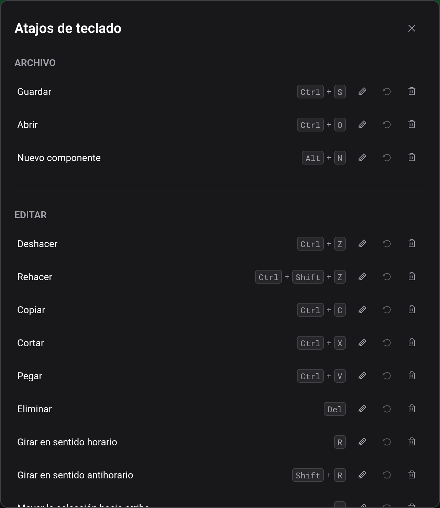

# Atajos de teclado

Logigator es más rápido con el teclado. A continuación están las asignaciones predeterminadas, seguidas de cómo cambiarlas.

> En macOS, los atajos con `Ctrl` usan la tecla **⌘ Command** en su lugar; por ejemplo, Guardar es `⌘S`.

## Archivo

| Acción           | Atajo    |
| ---------------- | -------- |
| Guardar          | `Ctrl+S` |
| Abrir            | `Ctrl+O` |
| Nuevo componente | `Alt+N`  |

## Editar

| Acción                            | Atajo          |
| --------------------------------- | -------------- |
| Deshacer                          | `Ctrl+Z`       |
| Rehacer                           | `Ctrl+Shift+Z` |
| Copiar                            | `Ctrl+C`       |
| Cortar                            | `Ctrl+X`       |
| Pegar                             | `Ctrl+V`       |
| Eliminar                          | `Delete`       |
| Girar en sentido horario          | `R`            |
| Girar en sentido antihorario      | `Shift+R`      |
| Mover la selección arriba         | `↑`            |
| Mover la selección abajo          | `↓`            |
| Mover la selección a la izquierda | `←`            |
| Mover la selección a la derecha   | `→`            |

## Vista

| Acción    | Atajo    |
| --------- | -------- |
| Acercar   | `Ctrl++` |
| Alejar    | `Ctrl+-` |
| Zoom 100% | `Ctrl+0` |

## Herramientas

| Acción                                               | Atajo |
| ---------------------------------------------------- | ----- |
| Desplazar                                            | `P`   |
| Herramienta de cable                                 | `W`   |
| Seleccionar                                          | `S`   |
| Borrar                                               | `E`   |
| Colocar texto                                        | `T`   |
| Cortar cables en el borde de la selección (mantener) | `Alt` |

## Interacción

| Acción                       | Atajo    |
| ---------------------------- | -------- |
| Iniciar / detener simulación | `Enter`  |
| Cancelar                     | `Escape` |

## Atajos mantenidos

La mayoría de los atajos se disparan una vez cuando los pulsas. Unos pocos se **mantienen** en su lugar: mantienes la tecla pulsada mientras haces otra cosa. El principal es **Cortar cables en el borde de la selección**: mantén `Alt` mientras arrastras un recuadro de selección con la [herramienta de selección](docs:board-and-tools) y los cables se cortan en el borde del recuadro mientras la tecla esté pulsada.

## Cambiar tus atajos

Abre **Editar → Atajos de teclado** para ver todas las acciones y su asignación actual.

Para cualquier acción puedes:

- **Editar**: haz clic en ella y luego pulsa la combinación de teclas que quieras. El gestor registra exactamente lo que pulsas.
- **Desasignar**: deja una acción sin ningún atajo en absoluto.
- **Restablecer**: restaura la asignación predeterminada de esa acción, o usa **Restablecer todo** para restaurar todos los valores predeterminados.

Si asignas una combinación que ya usa otra acción, se le quita a esa acción (Logigator te dice cuál) para que dos acciones nunca compartan una asignación.

Tus asignaciones personalizadas se recuerdan en este navegador. Borrar los datos del sitio del navegador las restablece a los valores predeterminados.

## Consulta también

- [Tablero y herramientas](docs:board-and-tools): las herramientas y acciones que activan estos atajos
- [Primeros pasos](docs:getting-started): un recorrido por el editor
