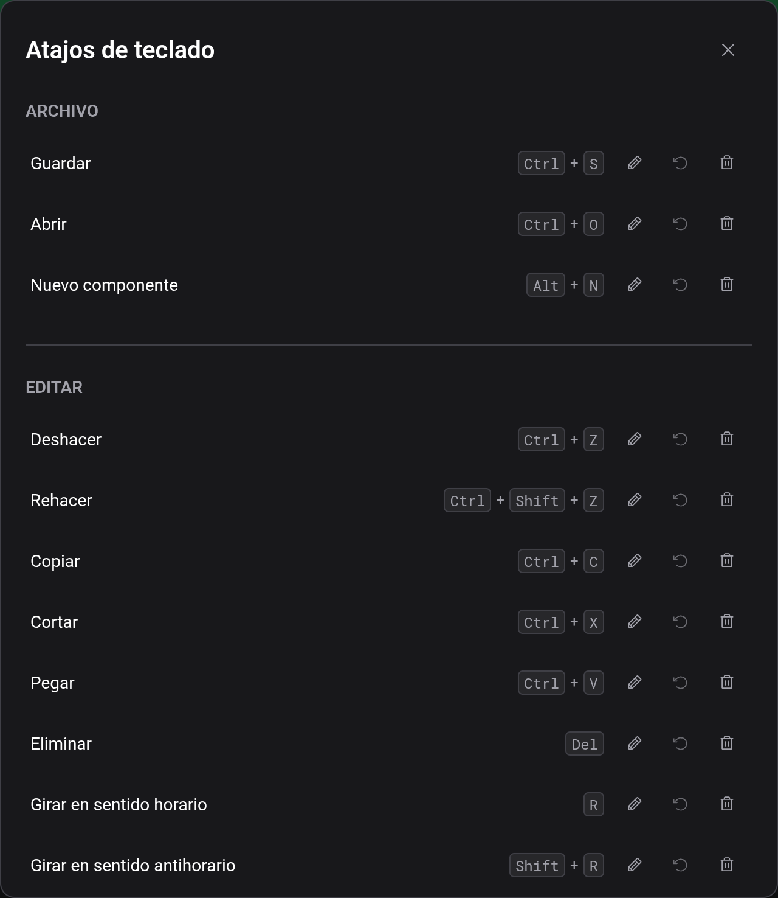

# Atajos de teclado

Estos son los atajos predeterminados, en el orden en que los lista Editar → Atajos de teclado. En Mac, `⌘` funciona en todos los sitios donde la tabla dice `Ctrl`, y `Ctrl` también funciona.

## Atajos predeterminados

| Acción                                                        | Predeterminado |
| ------------------------------------------------------------- | -------------- |
| Guardar                                                       | `Ctrl+S`       |
| Abrir                                                         | `Ctrl+O`       |
| Nuevo componente                                              | `Alt+N`        |
| Deshacer                                                      | `Ctrl+Z`       |
| Rehacer                                                       | `Ctrl+Shift+Z` |
| Copiar                                                        | `Ctrl+C`       |
| Cortar                                                        | `Ctrl+X`       |
| Pegar                                                         | `Ctrl+V`       |
| Eliminar                                                      | `Delete`       |
| Girar en sentido horario                                      | `R`            |
| Girar en sentido antihorario                                  | `Shift+R`      |
| Mover la selección hacia arriba / abajo / izquierda / derecha | flechas        |
| Acercar                                                       | `Ctrl++`       |
| Alejar                                                        | `Ctrl+-`       |
| Zoom 100%                                                     | `Ctrl+0`       |
| Desplazar                                                     | `P`            |
| Herramienta de cable                                          | `W`            |
| Seleccionar                                                   | `S`            |
| Borrar                                                        | `E`            |
| Colocar texto                                                 | `T`            |
| Cortar cables en el borde de la selección (mantener)          | `Alt`          |
| Añadir a la selección o quitarlo de ella (mantener)           | `Ctrl`         |
| Iniciar/detener simulación                                    | `Enter`        |
| Cancelar                                                      | `Escape`       |

Mientras escribes en un campo de texto, ningún atajo responde salvo `Escape`. Durante una simulación, los atajos de edición están desactivados y `Escape` sale de la simulación.

## Teclas mantenidas

Las dos acciones marcadas con «mantener» actúan mientras la tecla está pulsada, en lugar de dispararse una vez. Mantén `Alt` al soltar un marco de selección para cortar los cables en su borde (consulta [Tablero y herramientas](docs:board-and-tools)). Mantén `Ctrl` al hacer clic o trazar un marco para añadir a la selección o quitar de ella. Funciona con Seleccionar, Desplazar y la herramienta de cable.

## Cambiar un atajo

Editar → Atajos de teclado lista cada acción. Haz clic en el lápiz junto a una y pulsa la nueva combinación. `Escape` cancela la grabación, por eso no se puede asignar a otra cosa. Una tecla modificadora sola, como `Alt`, solo puede asignarse a las dos acciones mantenidas.

Si la combinación ya pertenece a otra acción, esa acción la pierde y un mensaje dice cuál. «Restablecer» devuelve el atajo predeterminado de una acción, «Desasignar» la deja sin atajo y «Restablecer todo» restaura todos los predeterminados.

Tus atajos se guardan en este navegador. Borrar los datos del sitio los restablece.

## Ver también

- [Tablero y herramientas](docs:board-and-tools): las herramientas y acciones detrás de estas teclas
- [Simulación](docs:simulation): qué hacen Enter y Escape allí
