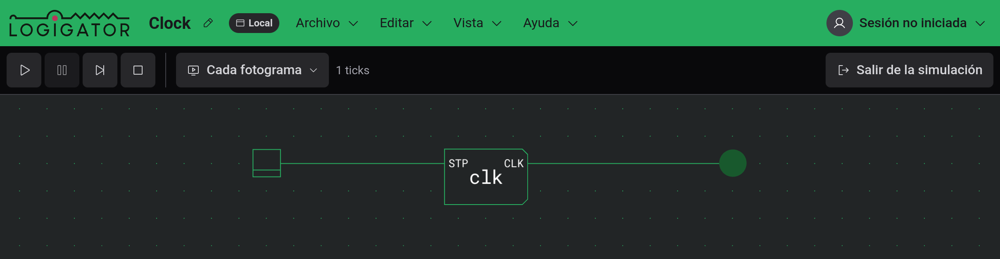
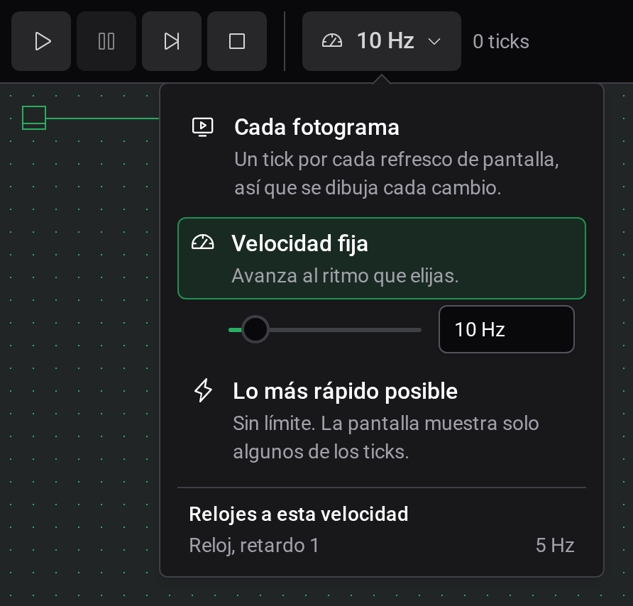

# Simulación

Una vez construido tu circuito, ejecútalo para ver fluir las señales. En la simulación alimentas el circuito, accionas sus entradas y ves los resultados iluminarse en directo en el tablero.

## Iniciar y salir de una simulación

Pulsa el botón **Iniciar simulación** en el extremo derecho de la barra de herramientas para alimentar tu circuito. También puedes pulsar `Enter`.

Mientras se ejecuta una simulación, el tablero está **bloqueado para la edición**: no puedes colocar, mover, cablear ni eliminar nada. Aún puedes desplazarte y hacer zoom libremente, y puedes hacer clic en las entradas del circuito (consulta [Interactuar con un circuito en ejecución](#interactuar-con-un-circuito-en-ejecución)).

Para volver a la edición, pulsa **Salir de la simulación** (donde estaba el botón Iniciar), o pulsa `Enter` de nuevo o `Escape`.

Que la simulación comience **en ejecución** o comience **en pausa** depende del ajuste **Iniciar la simulación automáticamente**. Cuando está activado, el circuito empieza a ejecutarse en el momento en que entras; cuando está desactivado, entra en pausa para que lo inicies tú mismo. Consulta [Ajustes y apariencia](docs:settings).

## Los controles de ejecución

Cuando una simulación está activa, la barra de herramientas cambia sus herramientas de dibujo por los controles de ejecución.

| Control      | Qué hace                                                                                                                                     |
| ------------ | -------------------------------------------------------------------------------------------------------------------------------------------- |
| **Ejecutar** | Inicia (o reanuda) la simulación.                                                                                                            |
| **Pausar**   | Congela la simulación donde está, conservando su estado actual para que puedas reanudar o avanzar paso a paso.                               |
| **Paso**     | Avanza el circuito un solo tick. Disponible en pausa, útil para rastrear una señal paso a paso.                                              |
| **Detener**  | Reinicia el circuito al comienzo y borra todos los cables encendidos. La simulación sigue activa y en pausa, lista para ejecutarse de nuevo. |

**Detener** y **Salir de la simulación** son diferentes: **Detener** rebobina el circuito en ejecución al principio pero te mantiene en la simulación, mientras que **Salir de la simulación** abandona la simulación por completo y te devuelve a la edición.

## Velocidad de simulación

Junto a los controles de ejecución está el **botón de velocidad**. Indica el ajuste actual — **Cada fotograma**, una frecuencia como `10 Hz` o **Velocidad máx.** — y al hacer clic abre el panel de velocidad:

El panel ofrece tres maneras de marcar el ritmo de la simulación. La opción resaltada es la que está en uso; haz clic en otra para cambiar, incluso mientras el circuito se ejecuta:

- **Cada fotograma**: el circuito avanza un tick por cada refresco de pantalla, así que se dibuja cada cambio y la velocidad sigue la tasa de refresco de tu pantalla. Este es el valor predeterminado.
- **Velocidad fija**: el circuito avanza al ritmo que elijas. Arrastra el control deslizante para elegir uno entre `1 Hz` y `10 MHz`, o escríbelo en el cuadro de al lado: `20`, `2,5k` y `1M` funcionan. Escribiendo también puedes bajar de lo que alcanza el control deslizante, hasta `0,1 Hz`: un tick cada diez segundos. Cambiar cualquiera de los dos selecciona **Velocidad fija**. Si el cuadro se vuelve rojo, lo que escribiste no es una frecuencia, y la simulación sigue con la última válida.
- **Lo más rápido posible**: sin límite; el circuito se ejecuta tan rápido como lo permita tu ordenador, y la pantalla muestra solo algunos de los ticks.

Debajo de las tres opciones, **Relojes a esta velocidad** muestra la frecuencia a la que funciona cada **Reloj** de tu circuito. El **Retardo** de un reloj es cuántos ticks espera antes de cambiar, así que un ciclo completo dura el doble: a `10 Hz`, un reloj con retardo `1` funciona a `5 Hz`. Para ralentizar un reloj, baja la velocidad o aumenta su retardo. Con una velocidad fija la lista aparece enseguida; con las otras dos, cuando el circuito lleva un momento en marcha, porque su velocidad solo se conoce midiéndola.

Junto al botón de velocidad, una lectura muestra mientras se ejecuta la **velocidad medida** que la simulación está alcanzando realmente, junto al total de **ticks** transcurridos desde que se inició. Cuando una velocidad fija es más de lo que el circuito puede seguir, la lectura se marca con un signo de advertencia.

## Interactuar con un circuito en ejecución

Solo las entradas del circuito responden a los clics mientras se ejecuta:

- **Interruptor**: una entrada con enclavamiento. Haz clic en él para alternar su salida entre encendido y apagado; permanece donde lo dejaste.
- **Botón**: una entrada momentánea. Su salida está encendida mientras lo mantienes pulsado y se apaga en cuanto lo sueltas.
- **Botón de pulso**: haz clic en él para emitir un único pulso de un tick en su salida.

A medida que las señales se propagan, los cables y puertos alimentados **se iluminan**, y los componentes de salida muestran su estado: los LED se encienden, los displays de segmentos y las matrices de LEDs muestran sus patrones. Arrastra en cualquier punto del tablero para desplazarte, salvo desde un botón, que simplemente se mantiene pulsado; hacer clic en un espacio vacío no hace nada.

Para mirar dentro de un circuito en ejecución —leer el contenido de una memoria o ver en directo el circuito interno de un componente personalizado— consulta [Inspección y monitores](docs:inspection).

## Cuando una simulación no arranca

Algunos problemas impiden por completo que un circuito se simule. Si hay alguno presente, **Iniciar simulación** muestra un mensaje de error y permanece en modo de edición para que puedas corregirlos. Los más comunes:

- **Un componente no compatible**: un componente que el simulador no puede ejecutar. Quítalo o sustitúyelo.
- **Un componente personalizado que se coloca a sí mismo**: un [componente personalizado](docs:custom-components) cuyo circuito interno se contiene a sí mismo, directamente o a través de otro componente personalizado, lo que nunca puede resolverse. Rompe el bucle.
- **Un componente personalizado sin circuito**: un componente personalizado que no tiene nada dentro que simular. Dale un circuito interno, o quítalo.
- **Un desajuste de puertos**: un componente personalizado cuyos puertos de entrada/salida declarados no coinciden con los conectores de entrada y salida realmente dentro de su circuito. Alinea los conectores con los puertos.

Cada mensaje nombra el componente implicado para que puedas encontrarlo.

## Consulta también

- [Inspección y monitores](docs:inspection): leer memoria y ver circuitos internos en directo
- [Componentes y opciones](docs:components-and-options): interruptores, botones, LED y otros bloques de construcción
- [Componentes personalizados](docs:custom-components): empaquetar un circuito en una pieza reutilizable
- [Ajustes y apariencia](docs:settings): la opción Iniciar la simulación automáticamente
- [Atajos de teclado](docs:shortcuts): cada asignación y cómo cambiarla
