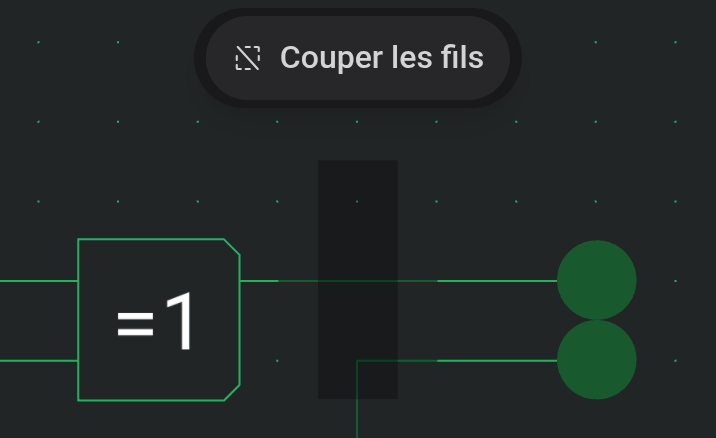

# Plan de travail et outils

Le plan de travail est la grille sur laquelle vous construisez. Composants et fils s'y alignent, et la barre d'état en bas affiche la position sur la grille sous le curseur.

## Se déplacer

La molette de la souris zoome à l'endroit du pointeur, tout comme un balayage à deux doigts ou un pincement sur le pavé tactile. Les boutons de zoom de la barre d'outils et Affichage → Zoom avant, Zoom arrière et Zoom 100 % font de même par paliers fixes.

Pour déplacer la vue, faites glisser avec le bouton droit ou central de la souris. Cela fonctionne avec tous les outils. Quand l'outil Déplacement est actif, un glisser avec le bouton gauche déplace aussi la vue.

La minicarte, dans le coin inférieur droit, montre tout le circuit avec un cadre autour de la partie visible. Cliquez ou faites glisser dedans pour y amener la vue. « Masquer la minicarte » la replie, et l'éditeur s'en souvient.

## Outils

Un seul outil est actif à la fois. Chacun a un bouton dans la barre d'outils et un raccourci d'une touche.

| Outil        | Touche | Ce que fait un glisser                                                        |
| ------------ | ------ | ----------------------------------------------------------------------------- |
| Déplacement  | `P`    | Déplace la vue, ou la sélection si vous commencez à l'intérieur               |
| Outil fil    | `W`    | Trace un fil (voir [Fils et connexions](docs:wires-and-connections))          |
| Sélectionner | `S`    | Trace un cadre de sélection, ou déplace la sélection si vous commencez dedans |
| Gomme        | `E`    | Supprime tout ce qu'elle traverse                                             |
| Texte        | `T`    | Place une étiquette de texte (un clic suffit)                                 |

Un clic sans glisser sélectionne l'élément sous le pointeur avec Déplacement, Outil fil et Sélectionner. L'outil fil vérifie d'abord si vous avez touché un port ou un croisement de fils, car un appui dessus inverse ou connecte à la place.

## Placer des composants

Cliquez sur un composant dans la palette et un aperçu suit le curseur. Un clic sur le plan de travail le pose. L'aperçu reste ensuite attaché au curseur, ce qui permet d'en poser plusieurs à la suite. `R` et `Shift+R` tournent l'aperçu avant de le poser, et le composant suivant garde cette orientation.

Rien n'est placé là où l'aperçu chevauche un autre composant. `Escape` ou le choix d'un autre outil arrête le placement.

## Sélectionner et déplacer

Avec Sélectionner, tracez un cadre sur les éléments voulus. Chaque composant et chaque fil touché par le cadre est sélectionné. Maintenez `Ctrl` (`⌘` sur Mac) pour modifier la sélection au lieu de la remplacer : un clic ajoute ou retire un élément, et un cadre ajoute ce qu'il couvre. Cela fonctionne aussi avec Déplacement et l'outil fil.

Faites glisser la sélection pour la déplacer. `R` la tourne dans le sens horaire, `Shift+R` dans le sens antihoraire, et les flèches la déplacent d'un pas de grille. Si la sélection atterrit sur autre chose, elle reste soulevée et suit vos mouvements suivants jusqu'à trouver une place libre.

`Escape` agit par étapes : il annule un glisser en cours, sinon vide la sélection, sinon passe à Déplacement.

## Couper les fils au bord de la sélection

Normalement, un cadre de sélection prend des fils entiers. En mode découpe, il coupe chaque fil qui traverse son bord et ne sélectionne que les morceaux à l'intérieur, ce qui permet d'extraire une section du milieu d'un bus.

Tant que Sélectionner est actif, un bouton « Couper les fils » flotte en haut du plan de travail et active ou désactive ce mode. Au clavier, vous pouvez aussi maintenir `Alt` en relâchant le cadre pour couper une seule fois.

## Copier, coller et supprimer

Copier (`Ctrl+C`), Couper (`Ctrl+X`), Coller (`Ctrl+V`) et Supprimer (`Delete`) se trouvent dans la barre d'outils et le menu Édition. Les éléments collés apparaissent comme un aperçu sous le curseur, ou au milieu de la vue si le pointeur n'est pas sur le plan de travail. Faites glisser l'aperçu vers une place libre et relâchez pour le poser. `Escape` ou un clic en dehors de l'aperçu annule.

Annuler (`Ctrl+Z`) et Rétablir (`Ctrl+Shift+Z`) valent pour chaque modification.

## Effacer

Avec la gomme, cliquez sur un élément pour le supprimer ou faites glisser sur plusieurs. Si vous appuyez sur `Escape` avant de relâcher, tout ce que ce glisser a effacé revient.

## Voir aussi

- [Fils et connexions](docs:wires-and-connections) : tracer des fils et connecter des croisements
- [Composants et options](docs:components-and-options) : les pièces que vous placez
- [Téléphones et tablettes](docs:phones-and-tablets) : les mêmes outils en disposition tactile
- [Raccourcis clavier](docs:shortcuts) : modifier les touches utilisées ici
