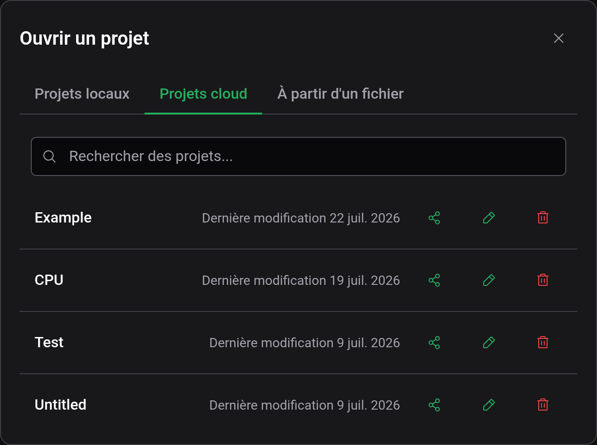
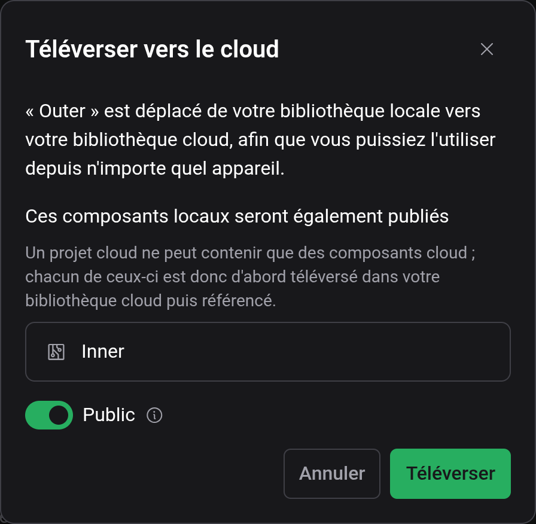
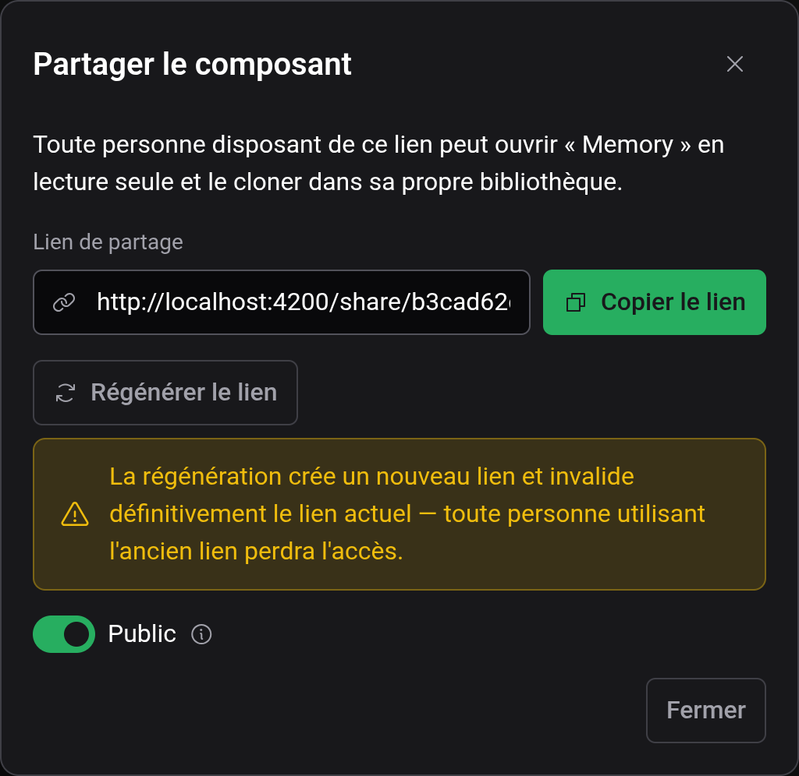

# Cloud et partage

Votre compte Logigator conserve projets et composants dans le cloud, accessibles depuis n'importe quel appareil — et vous permet de les partager avec un lien. Tout dans l'éditeur fonctionne sans compte ; la connexion ajoute le stockage cloud et le partage.

## Se connecter et votre compte

Ouvrez le menu de compte dans le coin supérieur droit. Lorsque vous êtes déconnecté, il propose **Se connecter** ; lorsque vous êtes connecté, il affiche votre **Compte** et une option **Se déconnecter**, aux côtés des paramètres **Thème** et **Langue** (voir [Paramètres et apparence](docs:settings)).

Se connecter vous donne :

- Le **stockage cloud** pour les projets et composants personnalisés, disponible sur chaque appareil depuis lequel vous vous connectez.
- Des **liens de partage** pour vos projets et composants cloud.

Se déconnecter efface votre bibliothèque cloud de cette session ; vos projets locaux (du navigateur) restent en place.

## Stockage local vs. cloud

Chaque projet et composant personnalisé réside dans l'un de deux endroits :

- **Local** — stocké dans le navigateur que vous utilisez. Rapide et sans compte, mais lié à ce seul navigateur et non sauvegardé.
- **Cloud** — stocké dans votre compte. Accessible depuis n'importe quel appareil une fois connecté.

La puce à côté du nom du projet indique lequel des deux le projet ouvert utilise (**Local**, **Cloud**, ou **Brouillon** s'il n'a pas encore été enregistré). Voir [Enregistrement et fichiers](docs:saving-and-files) pour le déroulement de l'enregistrement.

La boîte de dialogue **Fichier → Ouvrir** garde les deux séparés dans des onglets distincts — **Projets locaux** et **Projets cloud** — plus un onglet **À partir d'un fichier** pour importer un fichier de circuit. Si vous êtes déconnecté, l'onglet Projets cloud vous invite à vous connecter.

## Déplacer un travail vers le cloud

Il y a deux façons d'amener un projet dans votre bibliothèque cloud :

1. **Enregistrer un Brouillon directement dans le cloud** — lorsque vous enregistrez un nouveau projet pour la première fois, choisissez **Destination : Cloud** dans la boîte de dialogue d'enregistrement.
2. **Téléverser un projet local existant** — avec un projet Local enregistré ouvert, choisissez **Fichier → Téléverser vers le cloud**. Vous pouvez aussi téléverser un projet depuis la liste dans la boîte de dialogue **Ouvrir**.

Le téléversement _déplace_ le projet du stockage local vers votre bibliothèque cloud. Si le projet utilise des composants personnalisés locaux, ceux-ci sont publiés dans votre bibliothèque cloud en même temps que lui — un projet cloud ne peut contenir que des composants cloud, si bien que chacun est d'abord téléversé puis référencé. La boîte de dialogue de téléversement liste exactement quels composants seront publiés avant que vous ne confirmiez.

Les composants personnalisés peuvent être déplacés vers le cloud de la même façon, depuis leur action dans le panneau de paramètres.

## Partager un projet

Une fois qu'un projet est dans le cloud, **Fichier → Partager** ouvre la boîte de dialogue de partage. (Le partage n'est disponible que pour les projets cloud ; téléversez d'abord un projet local.)

- **Qui peut l'ouvrir** — **Toi uniquement** (personne d'autre ne peut l'ouvrir, et son lien n'est pas affiché), **Toute personne avec le lien** (quiconque détient le lien peut ouvrir votre projet **en lecture seule** et **le cloner dans sa propre bibliothèque**) ou **Tout le monde** (dans les listes communautaires et indexé par les moteurs de recherche).
- **Lien de partage** — la page du projet sur le site, que le destinataire ouvre. Utilisez **Copier le lien** pour le récupérer. Un projet privé garde son lien : la ligne explique pourquoi il n'est pas affiché, et dès que vous choisissez **Toute personne avec le lien**, c'est la même adresse qui sert de nouveau.
- **Régénérer le lien** — remplace le lien immédiatement. Toute personne utilisant encore l'ancien perd l'accès. L'action n'est proposée que lorsque le projet est sur **Toute personne avec le lien** : l'adresse d'une page publiée _est_ ce lien, et un projet privé n'affiche pas son lien du tout — repassez donc d'abord sur **Toute personne avec le lien**.

Les composants personnalisés cloud peuvent être partagés de la même façon depuis le panneau de paramètres.

### Ce que voit le destinataire

Quelqu'un qui ouvre votre lien de partage obtient une copie en **lecture seule** — la puce indique **Partagé** et il ne peut ni enregistrer de modifications par-dessus les vôtres ni l'exporter vers un fichier. Pour se l'approprier, il le **clone** dans sa bibliothèque, ce qui lui donne une copie complète et modifiable qu'il peut enregistrer et modifier librement. Son clone est indépendant ; les modifications ultérieures d'un côté ou de l'autre n'affectent pas l'autre.

## Paramètres de cookies et de consentement

Lorsque Logigator est servi avec sa bannière de consentement, vous pouvez revoir vos préférences de cookies et de consentement à tout moment depuis **Aide → Paramètres des cookies**. (Cette entrée n'apparaît que là où la bannière de consentement est disponible.)

## Voir aussi

- [Enregistrement et fichiers](docs:saving-and-files) — enregistrer localement, fichiers `.lgix` et export d'image
- [Composants personnalisés](docs:custom-components) — les pièces réutilisables qui voyagent avec un projet partagé
- [Paramètres et apparence](docs:settings) — thème, langue et paramètres de compte
