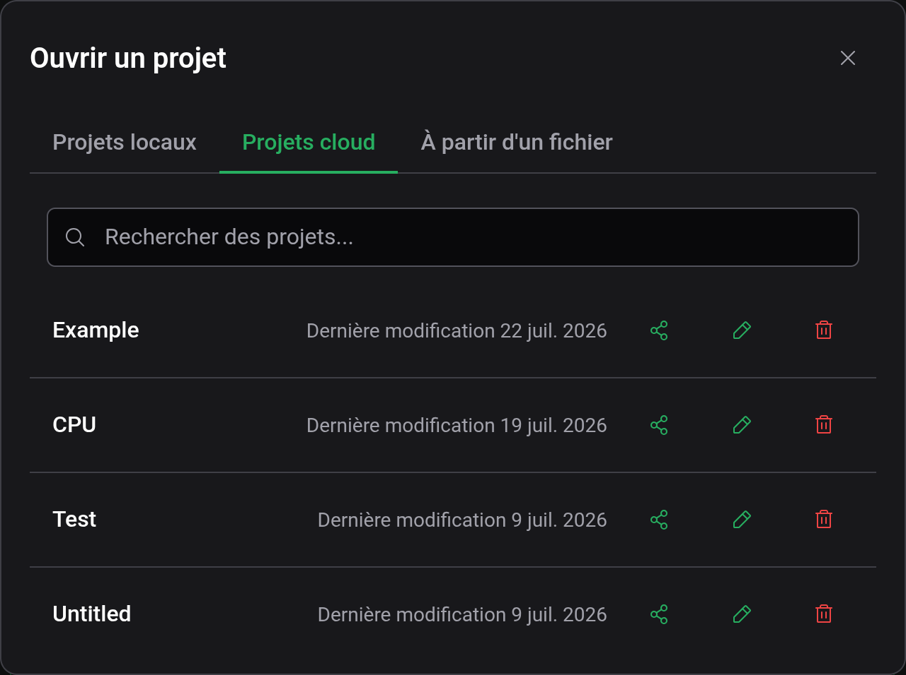
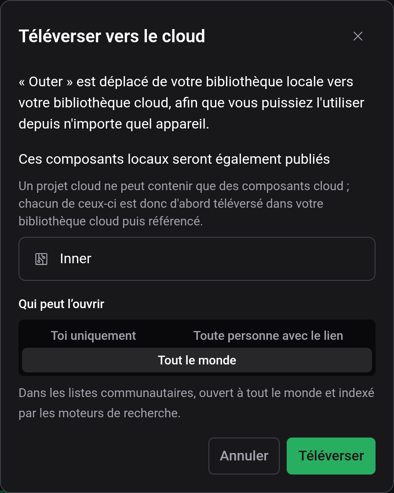
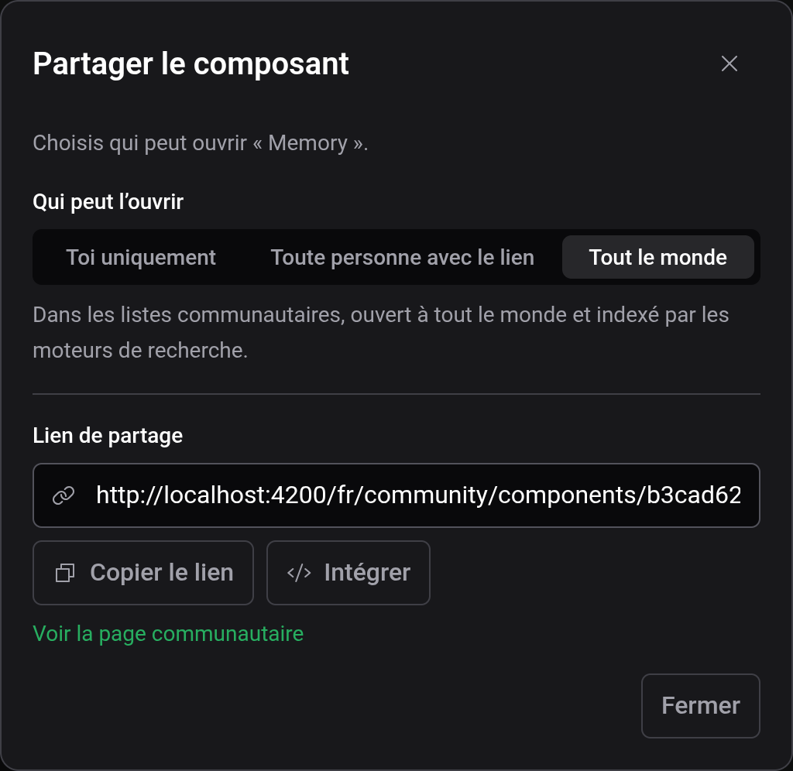

# Cloud et partage

Avec un compte Logigator, projets et composants personnalisés sont stockés dans le cloud et s'ouvrent sur tout appareil où vous êtes connecté. Les documents cloud peuvent être partagés par lien ou publiés dans la communauté sur le site Logigator. Tout le reste de l'éditeur fonctionne sans compte.

## Se connecter et se déconnecter

Le menu du compte, à l'extrémité droite de la barre de titre, affiche « Se connecter » et « S'inscrire » tant que vous n'êtes pas connecté. Les deux ouvrent le site Logigator dans un nouvel onglet, et l'éditeur remarque de lui-même que vous vous y êtes connecté. Une fois connecté, le menu affiche « Compte », qui ouvre votre page de compte sur le site, et « Se déconnecter ».

Si un projet ou un composant cloud a des modifications non enregistrées au moment de la déconnexion, l'éditeur demande s'il faut d'abord enregistrer : « Enregistrer et se déconnecter », « Se déconnecter sans enregistrer » ou « Annuler ». Après la déconnexion, un projet cloud ouvert est remplacé par un brouillon vide, et les onglets des composants cloud se ferment. Les projets et composants locaux ne sont pas touchés.

## Local et cloud

Les documents locaux vivent dans ce navigateur et disparaissent si ses données de site sont effacées. Les documents cloud vivent dans votre compte. L'étiquette à côté du nom du projet indique lequel des deux est ouvert, et Fichier → Ouvrir les liste dans des onglets séparés, Projets locaux et Projets cloud. Si vous êtes connecté, la fenêtre s'ouvre sur Projets cloud.

Sur le site, Mes projets et Mes composants listent aussi vos documents cloud. Vous pouvez les y créer, renommer, partager, supprimer et les ouvrir dans l'éditeur.

## Téléverser vers le cloud

Pour déplacer un projet local enregistré vers votre compte, choisissez Fichier → Téléverser vers le cloud, ou le bouton de téléversement sur sa ligne dans la fenêtre « Ouvrir un projet ». Pour enregistrer directement un brouillon dans le cloud, choisissez Cloud dans la fenêtre « Enregistrer ». Pour un composant personnalisé local, utilisez « Téléverser vers le cloud » dans sa carte de paramètres.

Un projet cloud ne peut utiliser que des composants cloud. Si le vôtre en utilise des locaux, la fenêtre les liste et les téléverse avec lui. Elle demande aussi qui peut ouvrir ce que vous téléversez, Tout le monde étant présélectionné, et le même choix s'applique aux composants téléversés. Téléverser déplace les documents : les copies locales sont supprimées.

## Partager

Fichier → Partager ouvre la fenêtre de partage d'un projet cloud. Le bouton « Partager » sur une ligne de l'onglet Projets cloud fait de même, et un composant cloud a « Partager » dans sa carte de paramètres. Les documents locaux doivent d'abord être téléversés.

« Qui peut l'ouvrir » propose trois choix, et chaque changement s'applique immédiatement :

| Choix                       | Qui peut l'ouvrir                                                                                                              |
| --------------------------- | ------------------------------------------------------------------------------------------------------------------------------ |
| Toi uniquement              | Personne d'autre. Le lien n'est pas affiché.                                                                                   |
| Toute personne avec le lien | Quiconque a le lien. Le document reste hors des listes de la communauté et des moteurs de recherche.                           |
| Tout le monde               | Tout le monde. Le document figure dans la communauté et peut être trouvé par les moteurs de recherche, dès qu'il a du contenu. |

Le lien de partage mène à la page du document sur le site Logigator. Le bouton « Partager » le transmet au menu de partage de votre appareil, ou le copie s'il n'y en a pas. « Intégrer » fournit un extrait en Markdown, HTML ou BBCode, avec une image du circuit renvoyant vers sa page, à coller dans un message de forum ou un wiki. « Voir la page communautaire » ouvre cette page.

« Régénérer le lien » remplace le lien, et l'ancien cesse aussitôt de fonctionner pour tous ceux qui l'ont. Ce n'est proposé que pour « Toute personne avec le lien » : l'adresse d'un document publié est son lien, et un document privé n'affiche pas de lien. Passer un document de « Toute personne avec le lien » à « Toi uniquement » puis revenir garde le même lien.

## Ouvrir le lien de quelqu'un d'autre

Un lien de partage ouvre la page du document sur le site, avec « Ouvrir dans l'éditeur » et « Enregistrer une copie ». « Enregistrer une copie » vous demande de vous connecter, copie le document dans votre bibliothèque cloud et ouvre la copie. Pour les documents réglés sur Tout le monde, la page permet aussi d'ajouter une étoile.

Dans l'éditeur, un document partagé porte l'étiquette Partagé. Vous pouvez le modifier et l'essayer, mais ni l'enregistrer ni l'exporter. Fichier → Cloner vers mes projets, ou Cloner vers mes composants pour un composant, enregistre une copie dans votre bibliothèque cloud. La copie est faite à partir de la version enregistrée par son propriétaire, sans vos modifications, et commence en « Toute personne avec le lien ». Les modifications ultérieures d'un côté n'affectent pas l'autre.

## Voir aussi

- [Enregistrement et fichiers](docs:saving-and-files) : enregistrement, fichiers et export d'image
- [Composants personnalisés](docs:custom-components) : les composants qui voyagent avec un projet
- [Paramètres](docs:settings) : le menu du compte
