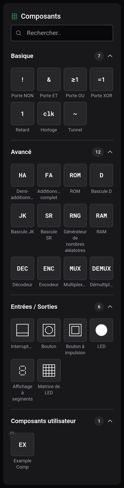
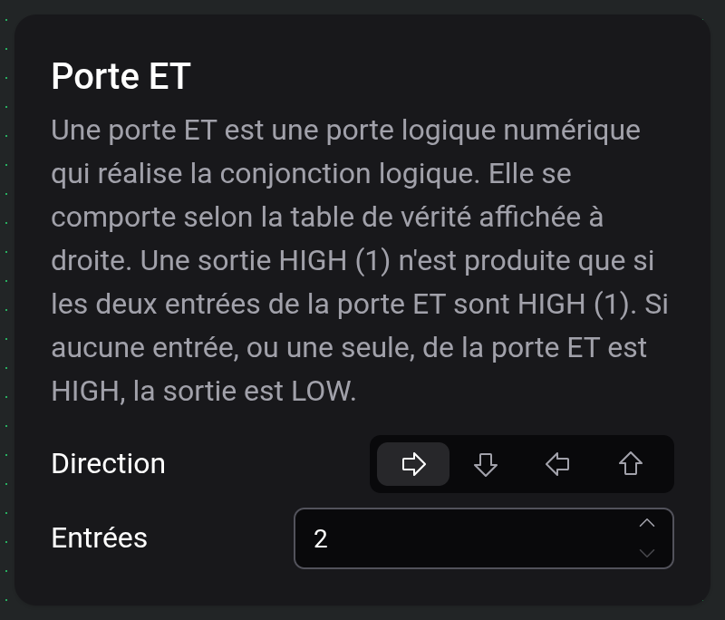

# Composants et options

Les composants sont les pièces dont un circuit est fait : portes, mémoires, entrées et affichages. Vous les choisissez dans la palette à gauche et réglez leurs options dans la carte de paramètres.

## La palette

Le champ de recherche en haut filtre la palette par nom. Les catégories sont Basique, Avancé et Entrées / Sorties, plus Composants utilisateur dès que vous avez construit un [composant personnalisé](docs:custom-components). Un clic sur l'en-tête d'une catégorie la replie. Le placement est décrit dans [Plan de travail et outils](docs:board-and-tools).

Chaque composant met un tick à transmettre un changement à sa sortie. Les tableaux indiquent les options de chaque composant en plus de Direction, que tous possèdent.

### Basique

| Composant | Rôle                                                                                                                              | Options                          |
| --------- | --------------------------------------------------------------------------------------------------------------------------------- | -------------------------------- |
| Porte NON | Inverse son entrée.                                                                                                               |                                  |
| Porte ET  | Donne 1 quand toutes les entrées sont à 1.                                                                                        | Entrées, 2 à 64                  |
| Porte OU  | Donne 1 quand au moins une entrée est à 1.                                                                                        | Entrées, 2 à 64                  |
| Porte XOR | Donne 1 quand un nombre impair d'entrées est à 1.                                                                                 | Entrées, 2 à 64                  |
| Retard    | Transmet son entrée telle quelle, un tick plus tard.                                                                              |                                  |
| Horloge   | Envoie une impulsion d'un tick, reste à 0 pendant Retard ticks, puis recommence. Tant que son entrée STP est à 1, elle reste à 0. | Retard, à partir de 1            |
| Tunnel    | Relié sans fil à tous les autres tunnels portant la même étiquette. Voir [Fils et connexions](docs:wires-and-connections).        | Étiquette, 10 caractères au plus |

### Avancé

| Composant                        | Rôle                                                                                                                                    | Options                                                            |
| -------------------------------- | --------------------------------------------------------------------------------------------------------------------------------------- | ------------------------------------------------------------------ |
| Demi-additionneur                | Additionne A et B. S est le bit de somme, C la retenue.                                                                                 |                                                                    |
| Additionneur complet             | Additionne A, B et la retenue entrante Cin. S est le bit de somme, C la retenue.                                                        |                                                                    |
| ROM                              | Donne le mot stocké à l'adresse présente sur ses entrées. Elle n'a pas d'horloge.                                                       | Taille de mot 1 à 64, Taille d'adresse 1 à 11, Modifier le contenu |
| Bascule D                        | Mémorise D sur le front montant de CLK. Q est le bit mémorisé, !Q son inverse.                                                          |                                                                    |
| Bascule JK                       | Sur le front montant de CLK, J met le bit à 1, K le remet à 0, et les deux ensemble l'inversent.                                        |                                                                    |
| Bascule SR                       | Sur le front montant de CLK, S met le bit à 1 et R le remet à 0.                                                                        |                                                                    |
| Générateur de nombres aléatoires | Place une nouvelle valeur aléatoire sur ses sorties à chaque front montant de CLK.                                                      | Sorties, 1 à 64                                                    |
| RAM                              | Sur le front montant de CLK, lit le mot à l'adresse vers les sorties, ou y enregistre les entrées de données tant que WE est à 1.       | Taille de mot 1 à 64, Taille d'adresse 1 à 16                      |
| Décodeur                         | Active la seule sortie dont le numéro correspond à la valeur binaire des entrées.                                                       | Entrées, 1 à 6                                                     |
| Encodeur                         | Donne le numéro de l'entrée la plus haute qui est à 1.                                                                                  | Sorties, 1 à 6                                                     |
| Multiplexeur                     | Transmet à sa sortie l'entrée de données choisie par les lignes de sélection. Avec n lignes de sélection, il y a 2ⁿ entrées de données. | Lignes de sélection, 1 à 6                                         |
| Démultiplexeur                   | Transmet l'entrée I à la sortie choisie par les lignes de sélection.                                                                    | Lignes de sélection, 1 à 6                                         |

### Entrées / Sorties

| Composant            | Rôle                                                                                                                                                                                          | Options                                               |
| -------------------- | --------------------------------------------------------------------------------------------------------------------------------------------------------------------------------------------- | ----------------------------------------------------- |
| Interrupteur         | Bascule entre 0 et 1 à chaque clic pendant une simulation.                                                                                                                                    |                                                       |
| Bouton               | Donne 1 tant que vous le maintenez enfoncé.                                                                                                                                                   |                                                       |
| Bouton à impulsion   | Donne une impulsion d'un tick par clic.                                                                                                                                                       |                                                       |
| LED                  | S'allume tant que son entrée est à 1.                                                                                                                                                         |                                                       |
| Affichage à segments | Affiche le nombre binaire présent sur ses entrées, l'entrée 0 étant le bit de poids faible.                                                                                                   | Entrées 1 à 16, Base décimale, hexadécimale ou octale |
| Matrice de LED       | Une grille carrée de LED. Sur le front montant de CLK, les entrées de données sont écrites dans la ligne choisie par les entrées d'adresse. En 16 × 16, chaque adresse couvre une demi-ligne. | Largeur/Hauteur 4, 8 ou 16                            |

## La carte de paramètres

Quand vous sélectionnez un seul composant, ou en choisissez un à placer, sa carte de paramètres apparaît à côté du plan de travail : le nom, une description et les options. Direction a quatre boutons fléchés qui tournent le composant. Une direction choisie pendant le placement est conservée pour le composant suivant du même type. Pendant une simulation, la carte est masquée.

Modifier Entrées, Sorties ou une option de taille change immédiatement le nombre de ports.

Pour une ROM, « Modifier le contenu » ouvre un éditeur hexadécimal pour les mots stockés. Taille de mot fixe le nombre de bits par mot et Taille d'adresse le nombre d'entrées d'adresse : une ROM avec une taille d'adresse de 4 contient donc 16 mots. Le contenu est enregistré avec le circuit.

## Inverser un port

Avec l'outil fil, appuyez sur un port d'entrée ou de sortie pour y ajouter une bulle d'inversion. Le signal qui traverse ce port est alors inversé, sans retard supplémentaire. Appuyez de nouveau sur la bulle pour la retirer. Au survol d'un port, l'outil fil montre l'effet qu'aurait un appui. Une bulle sur l'entrée CLK d'une bascule la fait réagir au front descendant.

Les tunnels, les fiches Entrée et Sortie et les ports d'un composant personnalisé placé ne peuvent pas être inversés.

## Étiquettes de texte

Le texte ne figure pas dans la palette. Avec l'outil Texte (`T`), cliquez sur le plan de travail pour poser une étiquette « [insert text] ». « Modifier le texte » dans sa carte de paramètres ouvre une fenêtre pour le texte, qui peut tenir sur plusieurs lignes, et Taille de police va de 2 à 128. Les fils traversent les étiquettes sans s'y connecter. Un clic sur un fil passant sous une étiquette sélectionne le fil.

## Voir aussi

- [Fils et connexions](docs:wires-and-connections) : relier des ports
- [Composants personnalisés](docs:custom-components) : construire vos propres pièces
- [Simulation](docs:simulation) : utiliser interrupteurs et boutons
- [Plan de travail et outils](docs:board-and-tools) : placer, déplacer et tourner
