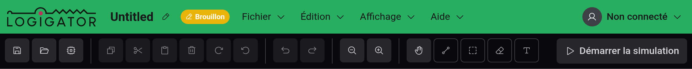

# Prise en main

Bienvenue sur Logigator — un éditeur et simulateur open source de circuits logiques numériques qui fonctionne entièrement dans votre navigateur.

## Qu'est-ce que Logigator ?

Logigator vous permet de dessiner des circuits logiques numériques — d'une simple porte ET à un processeur complet — puis de les exécuter pour voir les signaux circuler. Vous placez des composants sur une grille, câblez leurs ports ensemble et appuyez sur lecture pour simuler.

Vous pouvez :

- Construire des circuits à partir de portes logiques, bascules, mémoires, multiplexeurs, afficheurs et plus encore
- Câbler des composants en réseaux et voir les fils alimentés s'illuminer pendant la simulation
- Empaqueter un circuit terminé dans votre propre [composant personnalisé](docs:custom-components) réutilisable
- Enregistrer votre travail dans ce navigateur, [l'exporter vers un fichier](docs:saving-and-files) ou le conserver dans votre [compte Logigator dans le cloud](docs:cloud)

Tout fonctionne sans compte. La connexion ajoute le stockage cloud et les liens de partage.

## Visite guidée de l'éditeur

L'éditeur est organisé en quelques zones fixes autour du plan de travail central :

- **Le plan de travail** — la grille au centre où vous placez les composants et tracez les fils. Faites défiler pour zoomer et faites glisser pour vous déplacer.
- **La barre d'outils** (en haut) — les actions rapides à gauche (enregistrer, ouvrir, copier/coller, annuler/rétablir, zoom) et les outils de dessin à droite (déplacement, fil, sélection, gomme, texte). Le bouton **Démarrer la simulation** se trouve tout à droite.
- **La barre de menus** (en haut à gauche) — les menus **Fichier**, **Édition**, **Affichage** et **Aide**. Chaque commande s'y trouve, la plupart avec un raccourci clavier affiché à côté.
- **La palette de composants** (panneau de gauche) — tous les composants que vous pouvez placer, regroupés en catégories. Voir [Composants et options](docs:components-and-options).
- **La barre d'état** (en bas) — un indice sur une ligne pour l'outil actif, la position de votre curseur sur la grille, si le projet comporte des modifications non enregistrées, et combien d'éléments sont sélectionnés.
- **La minicarte** (en bas à droite) — un petit aperçu de tout le circuit que vous pouvez réduire.

Le nom du projet figure à côté des menus en haut ; cliquez dessus pour renommer le projet, et la puce à côté indique où le projet est stocké (**Local**, **Cloud**, **Brouillon** ou **Partagé**).

## Le tutoriel guidé

Le moyen le plus rapide d'apprendre les bases est le tutoriel intégré, qui vous accompagne dans la construction d'un petit circuit fonctionnel en une minute environ.

La première fois que vous ouvrez l'éditeur, une carte apparaît près du haut du plan de travail : **« Nouveau ici ? Construisez votre premier circuit dans un tutoriel rapide. »** Choisissez **Démarrer le tutoriel** pour commencer, ou **Ignorer** pour le passer. Vous pouvez ignorer le tutoriel à tout moment une fois qu'il a démarré.

Pour le relancer plus tard — ou faire revenir les conseils contextuels décrits ci-dessous — ouvrez **Aide → Afficher à nouveau les conseils**.

## Conseils au bon moment

Lorsque vous utilisez un outil pour la première fois, Logigator affiche un court conseil expliquant son fonctionnement — par exemple, comment l'[outil fil](docs:wires-and-connections) trace et bascule les connexions, ou ce que fait la sélection coupante aux ciseaux. Chaque conseil peut être ignoré et ne reviendra pas une fois que vous l'avez vu.

Pour désactiver entièrement les conseils, ouvrez le menu de compte en haut à droite et désactivez **Afficher les conseils d'intégration** dans les **Paramètres de l'éditeur**, ou choisissez **Désactiver tous les conseils** depuis n'importe quel conseil. Voir [Paramètres et apparence](docs:settings).

## Se tenir au courant des changements

Logigator est mis à jour régulièrement. Ouvrez **Aide → Nouveautés** pour voir un résumé de ce qui a changé dans les versions récentes. La première fois qu'une nouvelle version introduit quelque chose d'important à connaître, cela apparaît automatiquement.

## Signaler un problème

Vous avez trouvé un bug ? Utilisez le bouton **Signaler un bug** dans le coin inférieur droit du plan de travail. Décrivez ce que vous faisiez au moment où il s'est produit — votre projet actuel, les détails de votre navigateur et votre activité récente sont joints pour aider à localiser le problème. Si une erreur inattendue vous interrompt, la même fenêtre de rapport s'ouvre d'elle-même.

## Informations sur la version et la licence

**Aide → À propos** affiche la version exacte que vous utilisez, ainsi que les détails de compilation, la licence (Logigator est un logiciel libre sous **GNU AGPL v3**) et des liens vers le dépôt source et la politique de confidentialité.

## Voir aussi

- [Plan de travail et outils](docs:board-and-tools) — se déplacer, placer des composants, sélectionner et effacer
- [Composants et options](docs:components-and-options) — les blocs de construction et comment les configurer
- [Fils et connexions](docs:wires-and-connections) — connecter les composants en circuits fonctionnels
- [Simulation](docs:simulation) — exécuter votre circuit et interagir avec lui
- [Raccourcis clavier](docs:shortcuts) — tous les raccourcis et comment les modifier
