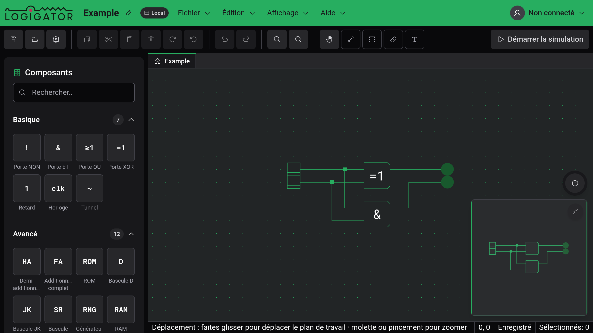

# Prise en main

Logigator est un simulateur de circuits logiques qui fonctionne dans le navigateur. Vous placez des portes sur une grille, tracez des fils entre elles et cliquez sur « Démarrer la simulation » pour voir les signaux parcourir le circuit. Un circuit terminé peut être enregistré comme [composant personnalisé](docs:custom-components) et utilisé comme un seul bloc dans un circuit plus grand.

Aucun compte n'est nécessaire. Sans compte, vous enregistrez vos projets dans le navigateur ou les [exportez dans un fichier](docs:saving-and-files). Une fois connecté, vous disposez en plus du [stockage cloud et des liens de partage](docs:cloud).

## La fenêtre de l'éditeur

- Le plan de travail, au centre, est la grille sur laquelle vous construisez. La molette de la souris zoome, et un glisser avec le bouton droit ou central déplace la vue.
- La barre de titre affiche le nom du projet et l'endroit où il est stocké (Brouillon, Local, Cloud ou Partagé), puis les menus Fichier, Édition, Affichage et Aide. Le crayon à côté du nom renomme le projet.
- La barre d'outils contient les boutons pour enregistrer et ouvrir, le presse-papiers, la rotation, l'annulation et le zoom, puis les cinq [outils](docs:board-and-tools), et « Démarrer la simulation » tout à droite.
- La palette de composants, à gauche, liste toutes les pièces que vous pouvez placer.
- La barre d'état, en bas, affiche une indication sur l'outil actif, la position du curseur sur la grille, « Enregistré » ou « Modifications non enregistrées », et le nombre d'éléments sélectionnés.
- La minicarte et le bouton « Signaler un bug » se trouvent dans le coin inférieur droit du plan de travail.

Lorsque vous modifiez un composant personnalisé, une barre d'onglets apparaît au-dessus du plan de travail, avec le projet principal et un onglet par composant ouvert.

Dans une fenêtre de 1024 px de large ou moins, l'éditeur passe à une disposition tactile aux commandes différentes. Voir [Téléphones et tablettes](docs:phones-and-tablets).

## Tutoriel et conseils

Lors de votre première visite, une carte au-dessus du plan de travail propose un tutoriel qui construit une porte ET avec deux interrupteurs et une LED. Il prend environ une minute. « Démarrer le tutoriel » le lance, le ✕ ferme la carte, et « Ignorer le tutoriel » l'arrête à n'importe quelle étape.

La première fois que vous utilisez certains outils, comme l'outil fil ou la découpe au bord de la sélection, un court conseil les explique. Chaque conseil n'apparaît qu'une fois. « Désactiver tous les conseils » dans un conseil, ou le paramètre « Afficher les conseils d'intégration », les coupe. Aide → Afficher à nouveau les conseils les réactive, réaffiche ceux déjà vus et fait revenir la carte du tutoriel.

## Le menu Aide

- Nouveautés liste les changements de chaque version. Il s'ouvre de lui-même une fois après chaque mise à jour.
- Documentation ouvre ces pages dans l'éditeur.
- À propos affiche la version utilisée, la licence (GNU AGPL v3) et des liens vers le code source, la politique de confidentialité et les mentions légales.
- Paramètres des cookies rouvre la fenêtre de consentement. Cette entrée n'existe que lorsque l'éditeur fonctionne avec le bandeau de cookies.

## Signaler un problème

Le bouton en forme d'insecte, dans le coin inférieur droit, ouvre « Signaler un problème ». Décrivez ce que vous faisiez avant l'erreur. Votre projet actuel, des informations sur le navigateur et l'activité récente sont joints au rapport. Si l'éditeur rencontre une erreur inattendue, le même formulaire s'ouvre de lui-même, avec les détails de l'erreur.

## Voir aussi

- [Plan de travail et outils](docs:board-and-tools) : se déplacer, placer, sélectionner et effacer
- [Composants et options](docs:components-and-options) : toutes les pièces et leurs options
- [Simulation](docs:simulation) : faire fonctionner un circuit
- [Raccourcis clavier](docs:shortcuts) : tous les raccourcis et comment les modifier
