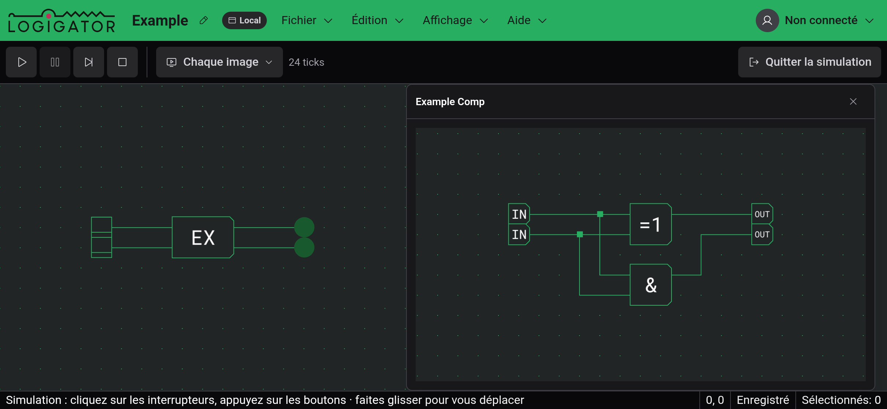
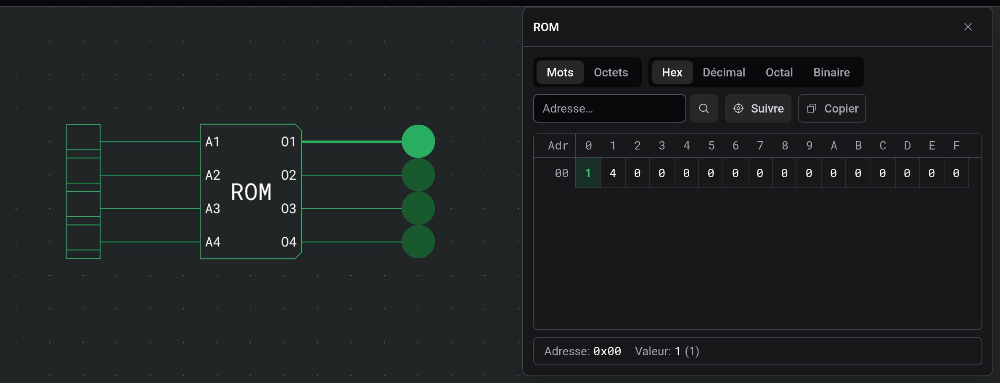

# Inspection et surveillances

Pendant une [simulation](docs:simulation), en cours ou en pause, deux sortes de composants peuvent être ouverts pour voir à l'intérieur. Un clic sur une ROM affiche son contenu, avec le mot en cours de lecture en surbrillance. Un clic sur un composant personnalisé ouvre une surveillance, une vue en direct de son circuit interne.

Sur ordinateur, chaque vue s'ouvre dans une fenêtre que vous pouvez déplacer et redimensionner. Un nouveau clic sur le composant ramène sa fenêtre au premier plan. En [disposition tactile](docs:phones-and-tablets), les vues de ROM partagent un panneau en bas de l'écran, et une surveillance occupe tout l'écran. Quitter la simulation les ferme toutes.

## Contenu d'une ROM

La vue est en lecture seule ; le contenu se modifie pendant l'édition, dans les paramètres de la ROM. Le mot à l'adresse actuelle est en surbrillance, et avec « Suivre » (activé par défaut) le tableau défile quand l'adresse change. La ligne du bas affiche l'adresse et la valeur de la cellule en surbrillance. Un clic sur une autre cellule affiche celle-ci jusqu'au prochain changement d'adresse.

Les boutons au-dessus du tableau choisissent Mots ou Octets et la base : Hex, Décimal, Octal ou Binaire. Pour aller à une adresse, tapez-la en hexadécimal dans le champ « Adresse… ». « Copier » place tout le tableau dans le presse-papiers sous forme de texte, dans la vue et la base choisies.

## Surveillances

Une surveillance dessine le circuit interne du composant avec les mêmes fils allumés que le plan de travail. Vous pouvez y déplacer la vue, zoomer et utiliser les interrupteurs et boutons qu'il contient. Ils pilotent la vraie simulation, donc le reste du circuit réagit.

Un clic sur un composant personnalisé à l'intérieur d'une surveillance ouvre son circuit dans la même fenêtre, et le titre montre le chemin, par exemple Outer › Inner. Cliquez sur un nom précédent pour remonter. Une ROM à l'intérieur d'une surveillance ouvre sa propre vue.

Si la surveillance signale que le circuit interne ne correspond pas à la simulation compilée, le composant a été modifié après le démarrage de la simulation. Quittez la simulation et relancez-la.

## Voir aussi

- [Simulation](docs:simulation) : faire fonctionner un circuit
- [Composants personnalisés](docs:custom-components) : construire les composants que vous surveillez
- [Composants et options](docs:components-and-options) : options et contenu d'une ROM
