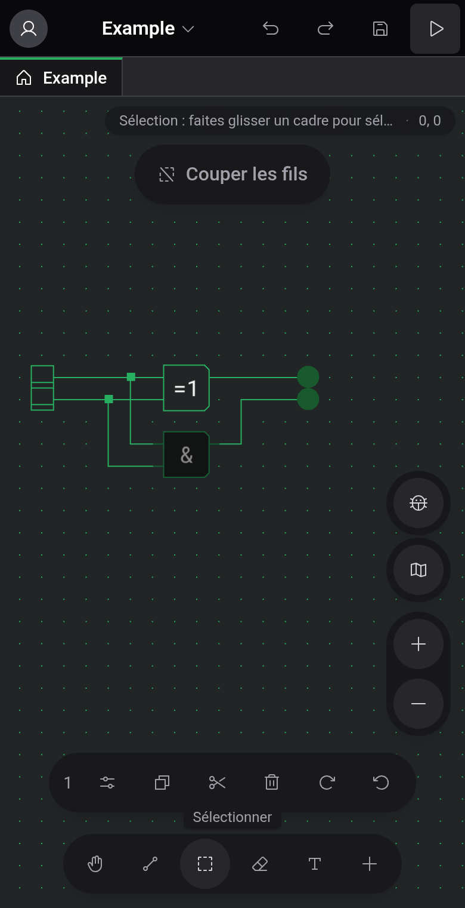

# Téléphones et tablettes

Quand la fenêtre fait 1024 px de large ou moins, l'éditeur passe à une disposition tactile : la barre de menus, la barre d'outils, la palette et la barre d'état laissent place à des commandes flottantes autour du plan de travail. Cela concerne les téléphones, la plupart des tablettes en mode portrait et les fenêtres de bureau étroites. Le reste de cette documentation décrit la disposition large. Cette page montre ce qui change.

## Où trouver quoi

- En haut à gauche, votre avatar ouvre le panneau Compte avec le thème, la langue, les paramètres de l'éditeur et la connexion ou déconnexion.
- Un appui sur le nom du projet ouvre le menu du projet : Nouveau projet, Nouveau composant, Ouvrir, Téléverser vers le cloud ou Partager, Exporter vers un fichier, Générer une image, Réparer les fils et les entrées du menu Aide.
- Annuler, Rétablir, Enregistrer et Démarrer la simulation sont des boutons en haut à droite.
- Une pastille dans le coin supérieur droit affiche l'indication de l'outil actif et la position sur la grille.
- La barre du bas contient les cinq outils et un bouton + qui ouvre le panneau Composants. Pendant que vous modifiez un composant personnalisé, un bouton Ports s'y ajoute.
- Les boutons de zoom, le bouton insecte et la minicarte sont sur le bord droit. La minicarte est d'abord repliée.

Cette disposition n'a pas de barre d'état, donc l'indicateur « Enregistré » / « Modifications non enregistrées » et l'étiquette de stockage à côté du nom du projet manquent. Les raccourcis clavier fonctionnent toujours avec un clavier branché, mais vous ne pouvez les modifier que dans la disposition large.

## Gestes

Faites glisser avec deux doigts pour déplacer la vue et pincez pour zoomer. L'effet d'un glisser à un doigt dépend de l'outil : il trace un fil, un cadre de sélection ou un coup de gomme, et ne déplace la vue qu'avec Déplacement.

Pour placer un composant, appuyez sur +, choisissez-le dans le panneau et appuyez sur le plan de travail à l'endroit voulu.

## Sélection et presse-papiers

Quand quelque chose est sélectionné, une barre au-dessus des outils indique le nombre d'éléments, avec des boutons pour Copier, Couper, Supprimer et les deux rotations, plus Coller dès que le presse-papiers contient quelque chose. Si un seul composant est sélectionné, un bouton Paramètres ouvre ses options dans un panneau.

Après une copie, la barre reste affichée avec Coller, même sans sélection. Son ✕ vide le presse-papiers et ferme la barre. Les éléments collés arrivent au milieu de la vue : faites-les glisser vers une place libre et levez le doigt pour les poser, ou appuyez ailleurs pour annuler.

## Simulation et inspection

Le bouton lecture en haut démarre la simulation. Les commandes apparaissent alors dans une barre le long du bord inférieur, et en haut le bouton pour quitter remplace Annuler, Rétablir et Enregistrer.

Un appui sur une ROM ouvre son affichage dans un panneau en bas de l'écran. Le plan de travail au-dessus reste utilisable, et plusieurs affichages partagent le panneau sous forme d'onglets. La surveillance d'un composant personnalisé occupe tout l'écran, et sa flèche de retour ramène au plan de travail. Voir [Inspection et surveillances](docs:inspection).

## Voir aussi

- [Plan de travail et outils](docs:board-and-tools) : ce que fait chaque outil
- [Simulation](docs:simulation) : commandes et vitesse
- [Paramètres](docs:settings) : thème, langue et paramètres de l'éditeur
