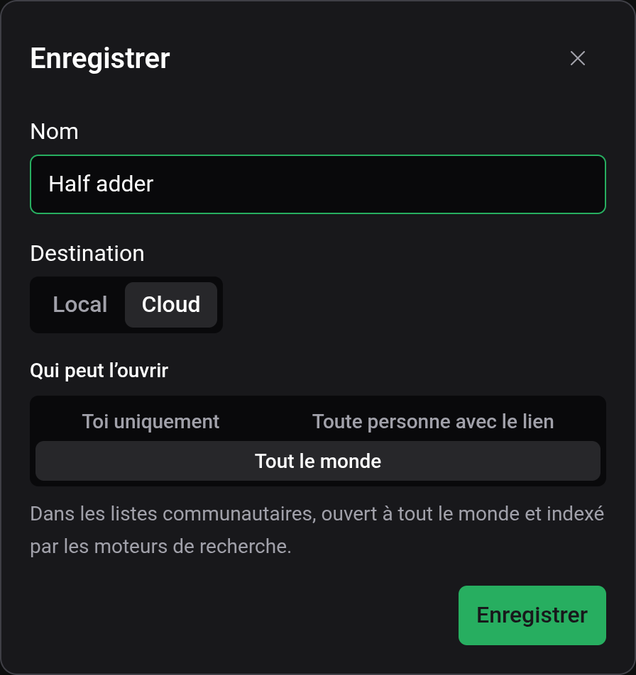
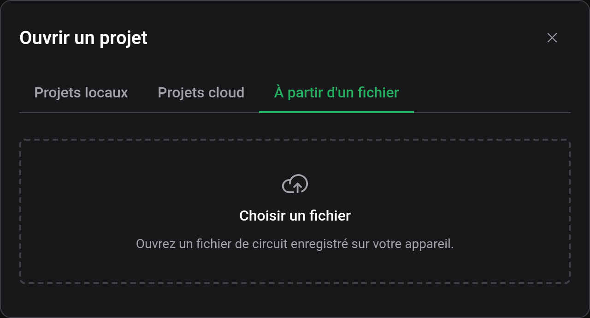
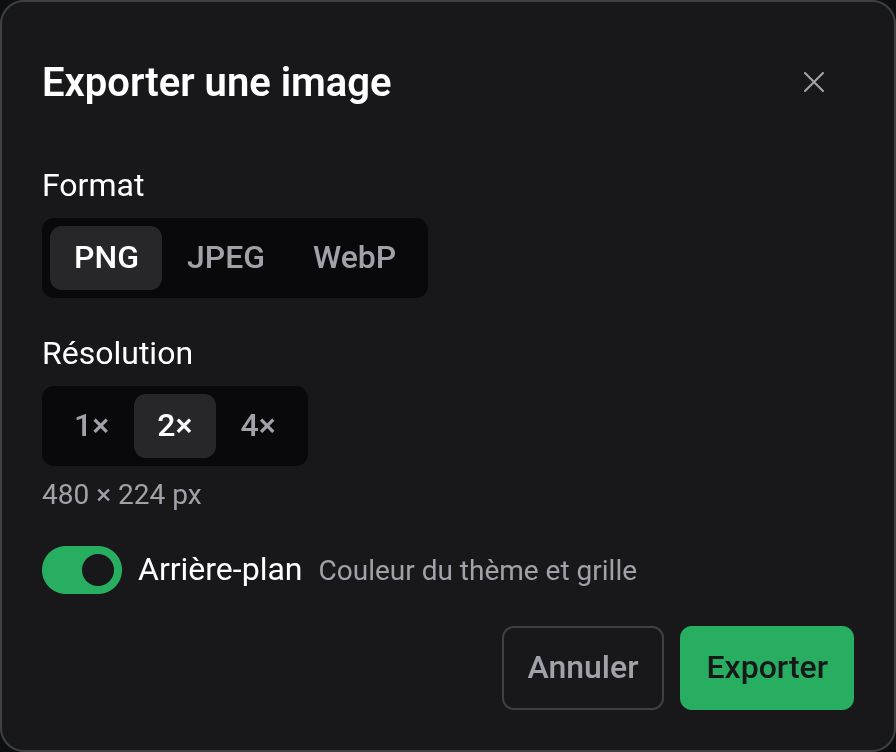

# Enregistrement et fichiers

Un projet est stocké à l'un de deux endroits : dans ce navigateur (Local) ou dans votre compte Logigator (Cloud). Les fichiers sur votre appareil servent à exporter et importer, pas de troisième lieu de stockage. L'éditeur n'enregistre pas automatiquement.

## Enregistrer un projet

Fichier → Enregistrer, le bouton d'enregistrement de la barre d'outils ou `Ctrl+S` enregistre le projet ouvert. Un nouveau projet reste un brouillon jusqu'au premier enregistrement, qui ouvre la fenêtre « Enregistrer » :

- Nom, 20 caractères au plus.
- Destination, Local ou Cloud. Cloud nécessite d'être connecté et est alors présélectionné.
- Qui peut l'ouvrir, pour Cloud uniquement. Tout le monde est présélectionné : le projet apparaît alors dans la communauté et peut être trouvé par les moteurs de recherche. Choisissez « Toi uniquement » pour le garder privé. Voir [Cloud et partage](docs:cloud).

Les enregistrements suivants retournent directement au même endroit. Seule exception : un projet cloud qui utilise des composants personnalisés locaux. L'enregistrer ouvre d'abord la fenêtre « Téléverser vers le cloud », car un projet cloud ne peut utiliser que des composants cloud.

Les projets locaux restent dans le navigateur qui les a enregistrés. Comme l'indique la fenêtre, ils ne sont pas conservés d'un appareil à l'autre et peuvent être perdus si les données du site sont effacées. Enregistrez dans le cloud ou exportez dans un fichier ce que vous voulez garder.

## Où un projet est stocké

L'étiquette à côté du nom du projet indique où se trouve le projet ouvert :

| Étiquette | Signification                                                                        |
| --------- | ------------------------------------------------------------------------------------ |
| Brouillon | Pas encore enregistré.                                                               |
| Local     | Enregistré dans ce navigateur.                                                       |
| Cloud     | Enregistré dans votre compte.                                                        |
| Partagé   | Ouvert depuis le lien de partage de quelqu'un d'autre. Vous ne pouvez pas l'écraser. |

Une étiquette Fork à côté signifie que le projet a été copié à partir de celui de quelqu'un d'autre. Survolez-la pour voir de qui.

La barre d'état affiche « Enregistré » ou « Modifications non enregistrées ». Ouvrir un autre projet ou en commencer un nouveau avec des modifications non enregistrées demande s'il faut les abandonner, et le navigateur vous avertit avant de fermer l'onglet.

## Ouvrir, renommer et supprimer

Fichier → Ouvrir (`Ctrl+O`) a trois onglets : Projets locaux, Projets cloud et À partir d'un fichier. Chaque liste peut être filtrée par recherche, et chaque ligne a des boutons pour renommer ou supprimer le projet. Les lignes locales peuvent aussi être téléversées vers le cloud, et les lignes cloud partagées.

Le crayon à côté du nom du projet, dans la barre de titre, renomme le projet ouvert.

## Fichiers de circuit

Fichier → Exporter vers un fichier télécharge le projet ouvert sous forme de fichier `.lgix`. Le fichier contient le plan de travail et une copie de chaque composant personnalisé utilisé, il s'ouvre donc complet sur n'importe quel ordinateur. Il est compressé mais ni chiffré ni signé : n'importe qui peut le lire. Exporter ne change pas l'endroit où le projet est enregistré.

Pour importer, ouvrez Fichier → Ouvrir → À partir d'un fichier et choisissez un fichier. L'éditeur lit les fichiers `.lgix` et les fichiers `.json` exportés par l'ancien éditeur Logigator. L'import est aussitôt enregistré comme nouveau projet local.

Un projet ouvert depuis un lien de partage ne peut pas être exporté. Clonez-le d'abord (voir [Cloud et partage](docs:cloud)).

## Exporter une image

Fichier → Générer une image ouvre la fenêtre « Exporter une image » :

- Format : PNG, JPEG ou WebP.
- Résolution : 1×, 2× ou 4×, 2× étant présélectionné. Si l'image dépassait ce que votre appareil peut afficher, elle est réduite et la fenêtre le signale.
- Arrière-plan : activé, il dessine la couleur de fond du thème et la grille. Désactivé, il donne un PNG ou WebP transparent, ou un JPEG blanc.
- Qualité, de 10 à 100 %, pour JPEG et WebP. PNG est sans perte.

La fenêtre affiche la taille finale en pixels avant l'export. Si l'onglet d'un composant personnalisé est ouvert, un champ « Projet » choisit le circuit à exporter.

## Voir aussi

- [Cloud et partage](docs:cloud) : téléverser, partager et cloner
- [Composants personnalisés](docs:custom-components) : les composants qu'un fichier emporte
- [Raccourcis clavier](docs:shortcuts) : changer les touches d'enregistrement et d'ouverture
